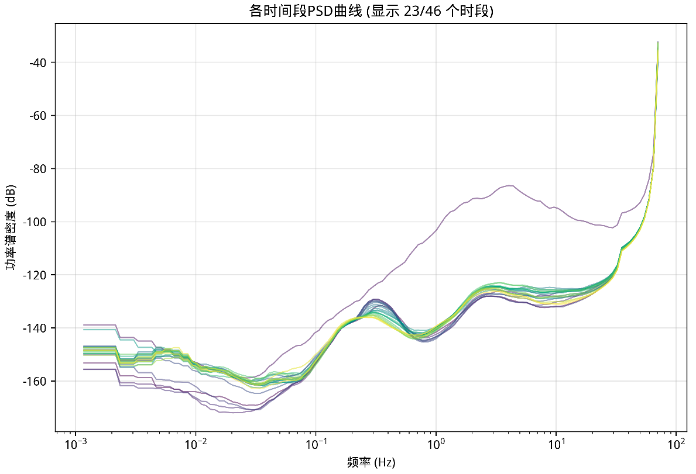
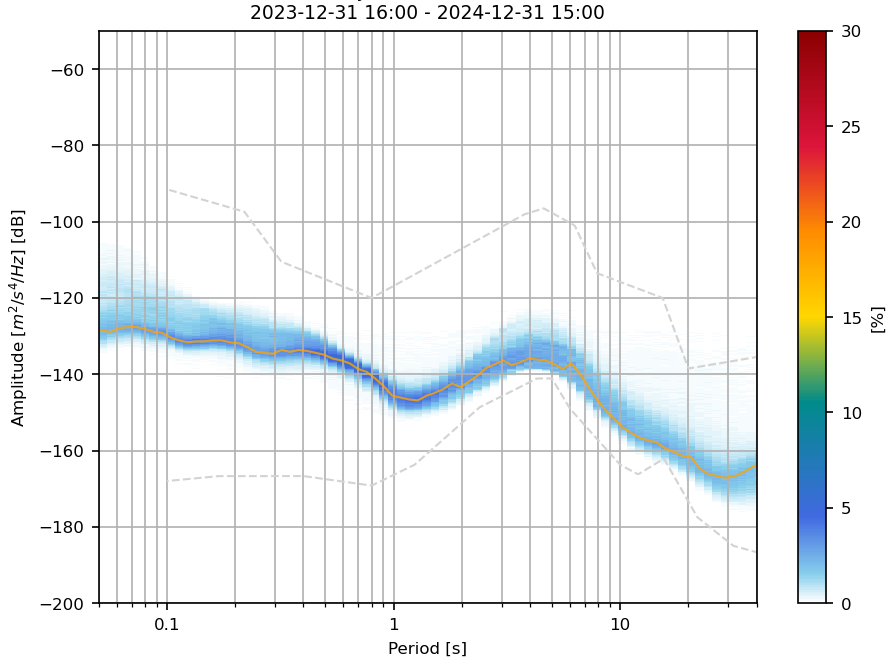
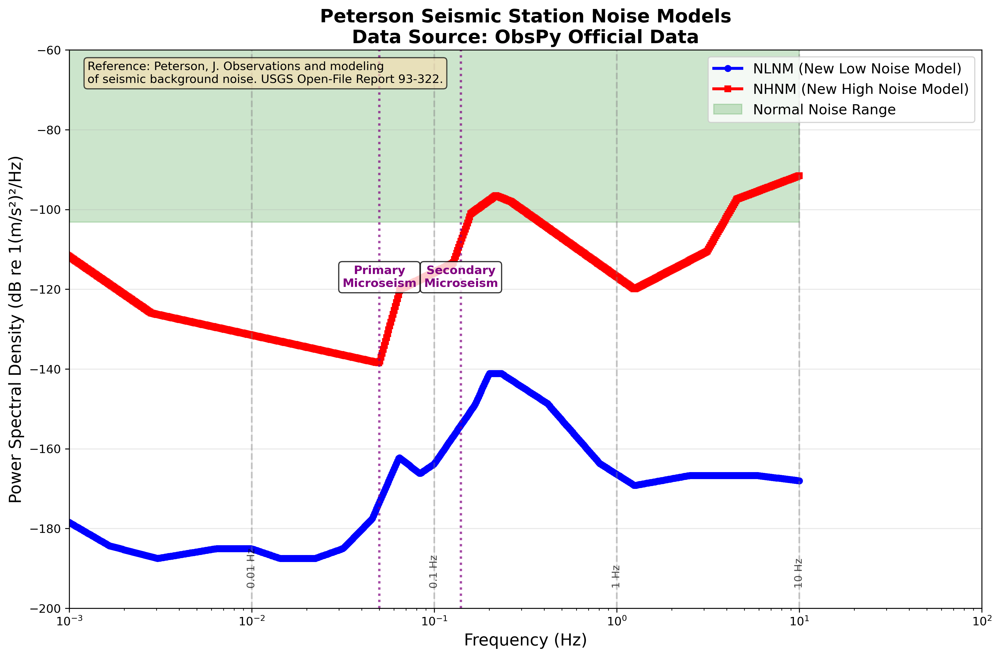
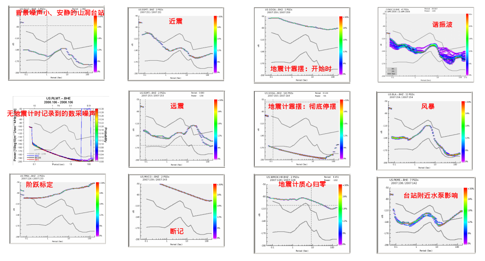

# 项目原理与算法

## 1. PPSD 原理概述
PPSD（Probabilistic Power Spectral Density，概率功率谱密度）是地震学中用于统计信号在不同频率上功率分布概率的常用方法，广泛应用于噪声分析、台站噪声评价、仪器性能对比等场景。

PPSD方法最初由McNamara & Buland (2004) 提出，基于Peterson (1993) 在USGS Open-File Report 93-322中建立的全球地震噪声模型，为地震台站噪声的标准化分析提供了重要工具。

---

## 2. 功率谱密度（PSD）

### 2.1 PSD基本原理与数学基础

#### 2.1.1 概念定义
功率谱密度（Power Spectral Density, PSD）是描述信号功率在频率域分布的核心工具，表征信号在单位频率带宽内的平均功率。在地震学中，PSD被广泛应用于背景噪声分析、地震事件识别、台站性能评估和仪器响应校正等领域。

#### 2.1.2 数学基础：维纳-辛钦定理
PSD的物理意义基于维纳-辛钦定理（Wiener-Khinchin Theorem），该定理指出对于广义平稳随机过程，其功率谱密度是自相关函数的傅里叶变换：

**自相关函数**：
```
R(τ) = lim(T→∞) (1/2T) ∫[-T,T] x(t)x(t+τ)dt
```

**PSD与自相关函数的关系**：
```
S(ω) = ∫[-∞,∞] R(τ)e^(-iωτ)dτ
```

其中：
- R(τ)：自相关函数，衡量信号在时间延迟τ下的相关性
- S(ω)：功率谱密度（角频率域）
- ω：角频率（ω = 2πf）

#### 2.1.3 离散傅里叶变换（DFT）公式详解
**基本DFT公式**：
```
X[k] = Σ(n=0 to N-1) x[n] · e^(-j2πkn/N)
```

**PSD计算公式**：
```
PSD[k] = (1/(N·fs)) · |X[k]|²
```

**参数详细解释**：
- **x[n]**：离散时间信号的第n个采样点（如地震仪记录的振幅值）
- **N**：总采样点数（如1小时3600秒，采样率100Hz，则N=360,000）
- **fs**：采样频率（Hz，如100 Hz表示每秒采样100次）
- **k**：频率索引（k=0,1,2,...,N-1）
- **X[k]**：频率k对应的复数频谱值
- **|X[k]|²**：频谱幅值的平方（功率）

**频率对应关系**：
```
频率值 f[k] = k · fs/N  (Hz)
```

**实际计算示例**：
```python
# 假设：采样率100Hz，时间长度1小时
fs = 100  # Hz
T = 3600  # 秒
N = fs * T = 360,000  # 总采样点数

# 频率分辨率
df = fs/N = 100/360,000 ≈ 0.00028 Hz

# 各频率索引对应的实际频率
f[0] = 0 Hz        # 直流分量
f[1] = 0.00028 Hz  # 最低频率
f[k] = k × 0.00028 Hz
f[50,000] = 14 Hz  # 某中频分量
```

**物理意义解释**：
1. **时域到频域转换**：DFT将时域的振幅变化转换为频域的频率成分
2. **频率分辨率**：Δf = fs/N，时间窗口越长，频率分辨率越高
3. **功率归一化**：除以(N·fs)确保PSD单位为功率/频率
4. **奈奎斯特频率**：最高可分析频率为fs/2

#### 2.1.4 单边谱与双边谱
- **双边谱密度**：定义在整个频率域（-∞ < f < ∞），对于实值信号具有偶函数性质：S(f) = S(-f)
- **单边谱密度**：定义在非负频率域（f ≥ 0），满足关系：
  ```
  G(f) = 2S(f)  (f > 0)
  G(0) = S(0)   (f = 0)
  ```

**信号总功率计算**：
```
P = ∫[0,∞] G(f)df = ∫[-∞,∞] S(f)df
```

#### 2.1.5 PSD单位与物理意义
- **时域信号单位**：U（如m/s²表示加速度）
- **功率单位**：U²（如(m/s²)²）
- **PSD单位**：U²/Hz（如(m/s²)²/Hz）
- **对数表示**：dB相对于参考值（地震学中常用1(m/s²)²/Hz作为加速度谱参考）

### 2.2 PSD计算方法与算法实现

#### 2.2.1 Welch平均周期图法
地震学中最常用的PSD估计方法，通过分段、加窗和平均处理显著降低估计方差：

**算法步骤**：
1. **数据分段**：将长时序数据分割成K段重叠数据段
   ```python
   # 50%重叠分段
   segment_length = N_fft
   overlap = N_fft // 2
   segments = [x[i:i+segment_length] for i in range(0, len(x)-segment_length+1, overlap)]
   ```

2. **窗函数处理**：减少频谱泄漏
   ```python
   # Hanning窗（地震学常用）
   window = 0.5 * (1 - cos(2*π*n/(N-1)))
   x_windowed = x * window
   ```

3. **FFT变换与功率计算**：
   ```python
   X = fft(x_windowed)
   periodogram = (1/(fs*N)) * |X|²
   ```

4. **谱平均**：
   ```python
   PSD_welch = (1/K) * Σ[k=1,K] periodogram_k
   ```

#### 2.2.2 常用窗函数特性对比

| 窗函数 | 主瓣宽度 | 最大旁瓣(dB) | 旁瓣滚降率(dB/oct) | 地震学应用场景 |
|--------|----------|--------------|-------------------|----------------|
| 矩形窗 | 1.0 | -13 | -6 | 瞬态信号分析，需要最佳频率分辨率 |
| Hanning窗 | ~2.0 | -32 | -18 | 背景噪声PSD，随机信号分析（**推荐**） |
| Hamming窗 | ~2.0 | -43 | -6 | 强信号旁瓣抑制 |
| Blackman窗 | ~3.0 | -58 | -18 | 高动态范围要求，弱信号检测 |

#### 2.2.3 数据预处理流程
```python
def preprocess_seismic_data(trace):
    """地震数据PSD预处理标准流程"""
    # 1. 去均值和去趋势
    trace.detrend('linear')
    trace.detrend('constant')
    
    # 2. 仪器响应校正
    trace.remove_response(inventory, pre_filt=[f1, f2, f3, f4], 
                         output='ACC', water_level=60)
    
    # 3. 带通滤波（可选）
    trace.filter('bandpass', freqmin=0.01, freqmax=45.0, corners=4)
    
    # 4. 数据质量检查
    if trace.stats.npts * trace.stats.delta < min_length:
        raise ValueError("数据长度不足")
    
    return trace
```

### 2.3 PSD在地震学中的关键应用

#### 2.3.1 地震背景噪声分析
**主要噪声源识别**：

1. **微震（Microseisms）**：
   - **一次微震**：周期10-20秒（0.05-0.1 Hz），海浪与海岸直接作用
   - **二次微震**：周期3-10秒（0.1-0.3 Hz），对向海浪相互作用，通常最强
   - **地球嗡鸣**：周期30-1000秒，深海次重力波激发

2. **人文噪声**：
   - **高频段（>1 Hz）**：交通、工业、建筑活动
   - **特征频率**：50/60Hz电力线干扰及其谐波
   - **时变特征**：明显的昼夜和工作日/周末变化

3. **仪器噪声**：
   - **电子噪声**：相对平坦的"白噪声"或"粉红噪声"谱形
   - **机械共振**：特定频率的尖锐峰值
   - **故障特征**：数据间断表现为+20dB/decade斜率

#### 2.3.2 地震事件频域特征分析
**震源谱分析（Brune模型）**：
```
Ω(f) = Ω₀ / (1 + (f/fc)²)
```
其中：
- Ω₀：低频平台水平，与地震矩M₀成正比
- fc：拐角频率，与震源尺度成反比
- 高频衰减：f⁻²斜率

**应用实例**：
- **地震矩估算**：M₀ ∝ Ω₀
- **应力降计算**：Δσ ∝ M₀fc³
- **震源尺度**：r ∝ fc⁻¹

#### 2.3.3 台站性能评估与质量控制
**评估指标**：
1. **噪声水平**：与Peterson模型（NLNM/NHNM）比较
2. **频谱完整性**：各频段数据质量和连续性
3. **稳定性分析**：长期噪声水平变化趋势
4. **异常检测**：仪器故障和环境变化识别

### 2.4 PSD结果解读与诊断

#### 2.4.1 标准PSD图谱特征
**坐标系统**：
- **X轴**：频率（Hz）或周期（s），对数刻度
- **Y轴**：功率谱密度，通常以dB为单位
- **参考线**：Peterson NLNM/NHNM曲线

**典型谱形特征**：
1. **谱峰识别**：
   - 微震峰：0.05-0.1 Hz和0.1-0.3 Hz
   - 单频干扰：电力线频率及谐波
   - 共振峰：仪器或建筑物固有频率

2. **谱斜率意义**：
   - f⁰（平坦）：白噪声特征
   - f⁻²：Brune震源模型
   - +20dB/decade：数据间断特征
   - 自定义斜率：特定噪声源或传播效应

#### 2.4.2 台站质量分类标准
基于PSD与Peterson模型的比较：

| 台站等级 | 噪声水平特征 | 监测能力 | 应用适用性 |
|----------|--------------|----------|------------|
| 优秀 | 主要频段接近NLNM | 全球微弱远震检测 | 科研级监测 |
| 良好 | NLNM和NHNM之间 | 区域地震监测 | 台网常规观测 |
| 一般 | 部分频段超过NHNM | 近震和强震监测 | 预警系统 |
| 较差 | 大部分频段超过NHNM | 仅强震记录 | 需要改进 |

### 2.5 高级PSD分析技术

#### 2.5.1 多锥度法（Multitaper Method）
用于提高PSD估计的偏差-方差权衡：
```python
def multitaper_psd(x, fs, NW=4, K=7):
    """
    多锥度PSD估计
    NW: 时间-带宽积
    K: 锥度数量
    """
    # 计算Slepian序列（离散脯氨酸球面波函数）
    tapers = dpss(N, NW, K)
    # 对每个锥度计算周期图并平均
    psds = [periodogram_taper(x, taper, fs) for taper in tapers]
    return np.mean(psds, axis=0)
```

#### 2.5.2 自适应PSD分析
针对非平稳信号的时变谱分析：
```python
def adaptive_psd_analysis(trace, window_length=3600, overlap=0.5):
    """
    自适应PSD分析，动态调整参数
    """
    # 信号平稳性检验
    stationarity = test_stationarity(trace)
    
    if stationarity:
        # 标准Welch方法
        return welch_psd(trace, window_length, overlap)
    else:
        # 短时傅里叶变换或小波分析
        return stft_psd(trace, adaptive_window=True)
```

#### 2.5.3 频率域平滑
地震学中常用的1/N倍频程平滑：
```python
def octave_smoothing(freqs, psd, octave_fraction=8):
    """
    1/N倍频程平滑处理
    octave_fraction: 倍频程分数（8表示1/8倍频程）
    """
    # 对数频率网格
    f_smooth = np.logspace(np.log10(freqs[0]), np.log10(freqs[-1]), 
                          num=len(freqs)//octave_fraction)
    
    psd_smooth = []
    for fc in f_smooth:
        # 频率窗口
        df = fc / octave_fraction
        mask = (freqs >= fc - df/2) & (freqs <= fc + df/2)
        # 几何平均
        psd_smooth.append(np.exp(np.mean(np.log(psd[mask]))))
    
    return f_smooth, np.array(psd_smooth)
```

### 2.6 实际应用案例与最佳实践

#### 2.6.1 标准化计算参数
基于地震学最佳实践的推荐参数：

```python
# PSD计算标准参数
PSD_PARAMS = {
    'ppsd_length': 3600,      # 1小时窗口长度（秒）
    'overlap': 0.5,           # 50%重叠
    'period_smoothing_width_octaves': 1.0,  # 周期平滑宽度
    'period_step_octaves': 0.125,           # 1/8倍频程步长
    'period_limits': (0.01, 1000),          # 周期范围（秒）
    'db_bins': (-200, 20, 0.25),           # dB分箱：(最小值, 最大值, 步长)
    'ppsd_dir': './output/npz',             # 输出目录
    'plot_dir': './output/plots'            # 图片目录
}
```

#### 2.6.2 质量控制流程
```python
def psd_quality_control(trace, psd, freqs):
    """
    PSD结果质量控制检查
    """
    issues = []
    
    # 1. 数据完整性检查
    if np.any(np.isnan(psd)) or np.any(np.isinf(psd)):
        issues.append("PSD包含NaN或Inf值")
    
    # 2. 动态范围检查
    dynamic_range = np.max(psd) - np.min(psd)
    if dynamic_range < 20:  # dB
        issues.append("动态范围过小，可能存在数据问题")
    
    # 3. 谱形异常检查
    # 检查异常尖峰
    psd_smooth = savgol_filter(psd, 11, 3)
    spikes = np.where(np.abs(psd - psd_smooth) > 10)[0]  # >10dB差异
    if len(spikes) > len(psd) * 0.1:
        issues.append("检测到过多异常尖峰")
    
    # 4. 与Peterson模型比较
    nlnm_violation = np.sum(psd < nlnm_interp(freqs)) / len(psd)
    if nlnm_violation > 0.3:
        issues.append("大量数据低于NLNM，可能存在仪器问题")
    
    return issues
```

### 2.7 实例图


*图1：多台站功率谱密度(PSD)对比分析图。横轴为频率（Hz，对数刻度），纵轴为功率谱密度（dB相对于1(m/s²)²/Hz），不同颜色曲线代表不同台站。图中清晰显示了：(1) 0.1-0.3 Hz二次微震峰，(2) 0.05-0.1 Hz一次微震峰，(3) >1 Hz高频人文噪声差异，(4) 台站间噪声水平的显著差异，反映了不同的场地条件和环境影响。*

**PSD图专业解读要点**：

1. **频率域分析**：
   - **0.01-0.1 Hz**：长周期段，主要反映区域地球噪声、大气扰动和仪器长周期响应
   - **0.1-1 Hz**：中频段，海洋微震和环境噪声的主导频段，二次微震峰最为显著
   - **1-10 Hz**：短周期段，人文噪声（交通、工业）和局地噪声的主要频段
   - **>10 Hz**：高频段，仪器噪声和近源干扰，对台站安装质量敏感

2. **台站性能差异化分析**：
   - **优质台站特征**：曲线平滑，微震峰清晰，高频噪声低，整体接近NLNM
   - **环境噪声影响**：高频段(>1Hz)曲线分离明显，反映不同台站的人文环境差异
   - **仪器性能指标**：低频段平坦度反映仪器长周期响应质量

3. **地球物理信息提取**：
   - **微震峰强度变化**：反映全球海洋活动和季节性变化
   - **区域噪声基线**：为该地区台站部署和数据质量评估提供参考标准
   - **异常识别能力**：通过对比分析快速识别仪器故障或环境变化

---

## 3. 概率功率谱密度（PPSD, PDF）
### 3.1 计算原理

#### 3.1.1 基本概念与理论基础
概率功率谱密度（Probabilistic Power Spectral Density, PPSD）是地震学中用于表征地震台站长期噪声统计特性的重要工具，由McNamara和Buland（2004）提出并推广。其核心思想是通过对长时间序列数据进行统计分析，获得台站背景噪声在不同频率点的概率分布特征。

**PPSD的物理意义**：
- **时域统计**：将时域连续信号分割为多个固定长度的数据段
- **频域变换**：对每个数据段进行PSD计算，获得其频谱特征
- **概率分布**：统计每个频率点的PSD值分布，形成概率密度函数

**相对于传统PSD的优势**：
1. **客观性**：无需人为选择"安静"时段，处理全部数据
2. **稳健性**：通过统计方法自然区分背景噪声与偶发事件
3. **全面性**：提供噪声的完整统计特征，包括众数、变异范围等
4. **时间稳定性**：能够识别噪声特性的长期变化趋势

#### 3.1.2 数学基础：PDF of PSDs方法

**基本数学模型**：
对于连续记录信号x(t)，PPSD计算可表示为：

```
1. 数据分段：x(t) → {x₁(t), x₂(t), ..., xₙ(t)}
2. PSD计算：xᵢ(t) → PSDᵢ(f)  
3. 统计分布：{PSD₁(f), PSD₂(f), ..., PSDₙ(f)} → PDF(PSD|f)
```

**概率密度函数计算**：
```
PDF(P|f) = lim(ΔP→0) P(P ≤ PSD(f) ≤ P+ΔP) / ΔP
```

其中：
- P：功率谱密度值
- f：特定频率
- PDF(P|f)：在频率f处，PSD值为P的概率密度

**离散化实现**：
```
PDF_discrete(Pⱼ|fᵢ) = N(PSD ∈ [Pⱼ-ΔP/2, Pⱼ+ΔP/2] | fᵢ) / N_total
```

其中：
- N(·)：满足条件的数据段数量
- N_total：总数据段数
- ΔP：功率区间宽度（通常0.25 dB）

#### 3.1.3 详细计算流程

**第一步：数据预处理与分段**

**步骤意义**：
- **时间统计基础**：PPSD的核心在于统计分析，需要大量独立的样本点
- **平稳性假设**：将长时间非平稳信号分割为相对平稳的短时间段
- **计算效率**：避免对过长时间序列进行FFT，减少计算复杂度
- **存储管理**：合理的数据段长度便于内存管理和并行处理

**物理意义**：
1小时窗口长度是地震学的标准选择，基于以下考虑：
- **频率分辨率**：确保0.001 Hz以上频率的有效分析
- **统计独立性**：相邻1小时段的噪声特征相对独立
- **环境周期性**：捕获日变化但避免长期趋势影响

```python
# 标准参数设置
PPSD_LENGTH = 3600      # 1小时窗口长度（秒）
OVERLAP = 0.5           # 50%重叠率
SAMPLING_RATE = 100     # 采样率（Hz）

# 数据分段算法
def segment_data(trace, ppsd_length, overlap):
    """
    将连续数据分割为重叠的时间窗口
    
    作用解析：
    1. 时间序列离散化：连续信号→离散样本集合
    2. 增加样本数量：50%重叠提供更多统计样本
    3. 边界效应减轻：重叠处理减少窗口边界信息损失
    """
    step = int(ppsd_length * (1 - overlap))
    segments = []
    
    for i in range(0, len(trace) - ppsd_length, step):
        segment = trace[i:i + ppsd_length]
        segments.append(segment)
    
    return segments
```

**重叠处理的重要性**：
- **统计样本增加**：50%重叠使样本数量翻倍，提高统计可靠性
- **时间连续性**：保持时间序列的连续性信息
- **方差减小**：更多样本点降低统计估计的方差

---

**第二步：数据质量控制**

**步骤意义**：
- **数据纯净性**：确保统计样本的质量和代表性
- **物理一致性**：剔除非背景噪声的干扰信号
- **统计有效性**：保证概率分布反映真实的噪声特征
- **结果可靠性**：避免异常数据污染最终的概率分布

**质量控制的必要性**：
PPSD旨在表征台站的**背景噪声**特征，任何非噪声信号（地震、异常干扰）都会扭曲概率分布，导致错误的台站评估。

```python
def quality_control(segment):
    """
    数据质量检查和筛选
    
    多层质控体系的作用：
    1. 数据完整性 → 确保FFT计算的有效性
    2. 地震事件检测 → 排除瞬态强信号影响
    3. 异常值检测 → 识别仪器故障或强干扰
    """
    # 1. 数据完整性检查
    # 作用：确保有足够的有效数据进行频谱分析
    # 意义：数据缺失会导致频谱失真和功率估计偏差
    if np.count_nonzero(~np.isnan(segment)) / len(segment) < 0.9:
        return False, "数据缺失率过高"
    
    # 2. STA/LTA地震事件检测
    # 作用：识别并排除地震事件时段
    # 意义：地震信号功率远高于噪声，会严重偏移概率分布
    # 物理基础：地震P波/S波到时会产生能量突变
    sta_lta = calculate_sta_lta(segment, sta_len=5, lta_len=30)
    if np.max(sta_lta) > 3.0:
        return False, "检测到地震事件"
    
    # 3. 异常值检测
    # 作用：识别仪器故障、数据尖峰、强干扰等
    # 意义：异常值会在功率谱中产生虚假的高能量成分
    # 统计基础：正常噪声应符合一定的统计分布
    z_scores = np.abs(stats.zscore(segment))
    if np.sum(z_scores > 5) > len(segment) * 0.01:
        return False, "异常值过多"
    
    return True, "数据质量合格"
```

**STA/LTA检测原理**：
- **短时窗(STA)**：捕获突发信号能量
- **长时窗(LTA)**：代表背景噪声水平  
- **比值阈值**：>3.0通常表示地震事件到达

---

**第三步：单段PSD计算**

**步骤意义**：
- **频域转换核心**：将时域噪声信号转换为频域功率分布
- **物理量化**：量化不同频率成分的能量强度
- **标准化处理**：统一单位和参考基准，便于比较
- **仪器校正**：消除仪器响应影响，获得真实地面运动

**Welch方法的优势**：
- **方差减小**：通过平均多个子段的周期图减小估计方差
- **频谱泄漏控制**：窗函数处理减少频谱泄漏效应
- **计算效率**：相比其他谱估计方法计算效率更高

```python
def calculate_segment_psd(segment, sampling_rate):
    """
    计算单个数据段的功率谱密度
    
    每一步的物理意义：
    1. 预处理 → 消除非物理趋势，减少频谱泄漏
    2. Welch计算 → 稳健的功率谱估计
    3. 仪器校正 → 获得真实地面运动
    4. 单位转换 → 标准化表示，便于比较
    """
    # 1. 预处理
    # 作用：去除信号中的线性趋势和直流分量
    # 意义：趋势项会在低频产生虚假的高能量
    segment = signal.detrend(segment)  # 去趋势
    
    # 作用：减少时域截断引起的频谱泄漏
    # 意义：汉宁窗将信号边界平滑到零，减少旁瓣影响
    segment = segment * signal.windows.hann(len(segment))  # 加窗
    
    # 2. Welch方法计算PSD
    # 作用：通过分段平均获得更稳定的功率谱估计
    # 意义：8个子段平均可将方差降低到原来的1/8
    freqs, psd = signal.welch(
        segment, 
        fs=sampling_rate,
        nperseg=len(segment)//8,  # 8个子段
        noverlap=len(segment)//16,  # 50%重叠
        nfft=None,
        window='hann'
    )
    
    # 3. 仪器响应校正（示例）
    # 作用：消除地震仪频率响应的影响
    # 意义：获得真实的地面运动功率谱，而非仪器记录的功率谱
    # 物理基础：仪器响应R(f)修改了真实信号的频谱特征
    psd_corrected = remove_instrument_response(freqs, psd, response)
    
    # 4. 单位转换（转换为dB）
    # 作用：对数标度表示，便于处理大动态范围
    # 意义：dB单位使得不同数量级的功率值都能清晰显示
    # 参考基准：通常为1 (m/s²)²/Hz，符合地震学标准
    psd_db = 10 * np.log10(psd_corrected / reference_psd)
    
    return freqs, psd_db
```

**仪器响应校正的重要性**：
- **物理真实性**：获得真实地面运动，而非仪器响应
- **台站比较**：消除不同仪器类型的响应差异
- **标准符合**：与Peterson模型等标准参考一致

---

**第四步：频率分组与功率离散化**

**步骤意义**：
- **统计网格建立**：为二维概率分布创建标准化的坐标系统
- **频率标准化**：统一不同PSD计算的频率采样点
- **分辨率权衡**：在频率分辨率和统计精度间找到平衡
- **存储优化**：合理的分箱策略控制数据存储需求

**对数频率分组的物理基础**：
- **地震学惯例**：地震信号能量在对数频率轴上分布更均匀
- **人耳感知模型**：与人类听觉的频率感知特性一致
- **倍频程分析**：1/8倍频程是音响学和振动学的标准

```python
def setup_bins():
    """
    设置频率和功率的分箱参数
    
    分箱策略的设计原理：
    1. 对数频率 → 适应地震信号的自然分布特征
    2. 等间隔功率 → 保持概率统计的均匀性
    3. 标准分辨率 → 平衡精度与计算效率
    """
    # 对数频率分组（1/8倍频程）
    # 作用：创建地震学标准的频率网格
    # 意义：1/8倍频程提供足够精度的同时保持计算效率
    # 物理基础：地震波能量在对数频率域分布更为均匀
    period_min, period_max = 0.01, 1000  # 秒
    period_bins = np.logspace(
        np.log10(period_min), 
        np.log10(period_max), 
        num=int(8 * np.log2(period_max/period_min))
    )
    freq_bins = 1.0 / period_bins[::-1]  # 转换为频率
    
    # 功率分箱（0.25 dB间隔）
    # 作用：创建功率轴的离散化网格
    # 意义：0.25 dB精度足以区分不同的噪声水平
    # 实用考虑：过细分箱会导致统计不充分，过粗会损失精度
    power_min, power_max = -200, 20  # dB
    power_bins = np.arange(power_min, power_max + 0.25, 0.25)
    
    return freq_bins, power_bins
```

**分箱参数的选择依据**：
- **频率范围**：0.01-1000秒周期覆盖地震学关心的全部频段
- **功率范围**：-200到20 dB涵盖从最安静到最嘈杂台站的全部情况
- **分辨率平衡**：既保证统计精度又控制计算复杂度

---

**第五步：统计累积与概率计算**

**步骤意义**：
- **概率分布构建**：将离散的PSD样本转换为连续的概率密度函数
- **统计稳健性**：通过大样本统计获得稳定的噪声特征
- **异常自动识别**：低概率区域自然对应异常噪声事件
- **定量比较基础**：标准化的概率分布便于台站间比较

**统计学原理**：
- **大数定律**：足够多的样本使得概率趋于稳定
- **中心极限定理**：多个独立样本的统计量趋于正态分布
- **频率主义概率**：通过相对频次估计真实概率

```python
def accumulate_statistics(all_psds, freq_bins, power_bins):
    """
    累积统计并计算概率分布
    
    统计累积的核心作用：
    1. 频次统计 → 量化每个功率水平的出现次数
    2. 概率归一化 → 转换为标准的概率密度函数
    3. 异常识别 → 低概率区域指示异常噪声
    4. 特征提取 → 高概率区域代表典型噪声状态
    """
    # 初始化累积矩阵
    # 作用：创建二维统计矩阵存储频次信息
    # 意义：矩阵的每个元素记录特定频率-功率组合的出现次数
    hist_matrix = np.zeros((len(freq_bins), len(power_bins)))
    
    for psd_freqs, psd_values in all_psds:
        # 插值到标准频率网格
        # 作用：将不同PSD计算的频率点统一到标准网格
        # 意义：确保所有样本在相同的频率点进行统计
        psd_interp = np.interp(freq_bins, psd_freqs, psd_values)
        
        # 在每个频率点进行功率分箱
        # 作用：将连续的功率值离散化到预定义的功率区间
        # 意义：实现从连续变量到离散统计的转换
        for i, power_val in enumerate(psd_interp):
            power_idx = np.digitize(power_val, power_bins) - 1
            if 0 <= power_idx < len(power_bins):
                hist_matrix[i, power_idx] += 1
    
    # 归一化为概率密度
    # 作用：将绝对频次转换为相对概率
    # 意义：使不同时间长度的数据集具有可比性
    # 数学基础：P(x) = N(x) / N_total，满足∑P(x) = 1
    pdf_matrix = hist_matrix / hist_matrix.sum(axis=1, keepdims=True)
    
    return pdf_matrix
```

**概率归一化的重要性**：
- **标准化比较**：不同台站、不同时间段的数据具有可比性
- **概率解释**：结果可以直接解释为概率密度值
- **统计有效性**：满足概率密度函数的数学要求

**整体流程的协同作用**：
这五个步骤构成了一个完整的信号处理→统计分析链条：
1. **分段**提供统计样本
2. **质控**确保样本纯净性  
3. **PSD**实现频域量化
4. **分箱**建立统计框架
5. **累积**生成概率分布

每一步都是不可缺少的，共同保证了PPSD结果的**科学性**、**客观性**和**可靠性**。



*图2.3a：PPSD多段处理流程示意图。该图展示了PPSD算法对长时间序列数据进行分段处理的核心流程，包括数据分割、质量控制、PSD计算和统计累积的完整处理链，突出了多段处理在提高统计稳健性方面的重要作用。*


*图2.3b：PPSD多段处理关键控制节点图。该图详细展示了多段处理过程中的关键控制点和参数设置，包括窗口长度选择、重叠比例设定、质量控制阈值和频率分箱策略，为理解PPSD算法的技术细节提供了可视化参考。*

#### 3.1.4 核心算法实现
```python
class PPSD_Calculator:
    """
    PPSD计算器完整实现
    """
    def __init__(self, ppsd_length=3600, overlap=0.5, 
                 period_limits=(0.01, 1000), db_bins=(-200, 20, 0.25)):
        self.ppsd_length = ppsd_length
        self.overlap = overlap
        self.period_limits = period_limits
        self.db_bins = db_bins
        
        self._setup_bins()
    
    def _setup_bins(self):
        """设置频率和功率分箱"""
        # 实现前面的setup_bins()逻辑
        pass
    
    def calculate_ppsd(self, stream):
        """
        计算PPSD的主函数
        """
        # 1. 数据分段
        segments = self._segment_stream(stream)
        
        # 2. 质量控制和PSD计算
        valid_psds = []
        for segment in segments:
            if self._quality_control(segment):
                freqs, psd = self._calculate_psd(segment)
                valid_psds.append((freqs, psd))
        
        # 3. 统计累积
        self.pdf_matrix = self._accumulate_statistics(valid_psds)
        
        # 4. 计算统计量
        self._calculate_statistics()
        
        return self.pdf_matrix
    
    def _calculate_statistics(self):
        """计算各种统计量"""
        # 众数（最高概率对应的功率值）
        self.mode = np.array([
            self.power_bins[np.argmax(self.pdf_matrix[i, :])]
            for i in range(len(self.freq_bins))
        ])
        
        # 百分位数
        self.percentiles = {}
        for p in [10, 50, 90]:
            self.percentiles[p] = self._calculate_percentile(p)
```

#### 3.1.5 与传统方法的对比

| 特征 | 传统PSD | PPSD方法 |
|------|---------|----------|
| **数据选择** | 人工选择"安静"时段 | 处理全部数据 |
| **客观性** | 主观性强 | 完全客观 |
| **统计特性** | 单一曲线 | 完整概率分布 |
| **异常检测** | 依赖经验 | 自动统计识别 |
| **长期监测** | 困难 | 天然适用 |
| **标准化** | 难以比较 | 高度标准化 |

**PPSD方法的理论优势**：
1. **统计稳健性**：基于大样本统计，减少偶然性影响
2. **物理意义明确**：高概率区域代表台站典型噪声状态
3. **全面信息**：不仅提供平均水平，还包含变异性信息
4. **时间适应性**：能够追踪噪声特性的长期演化

这种基于概率分布的方法，将传统的"一条PSD曲线"扩展为"二维概率云图"，为地震台站的精细化噪声分析提供了强大的工具。

### 3.2 PPSD算法详细步骤

#### 3.2.1 时间窗口分割
```python
# 窗口参数设置
ppsd_length = 3600  # 秒，1小时窗口
overlap = 0.5       # 50%重叠
```

#### 3.2.2 数据质量控制
1. **STA/LTA检测**：识别并排除地震事件窗口
   ```
   STA/LTA = short_term_average / long_term_average
   # 通常阈值：STA/LTA < 3.0
   ```

2. **数据完整性检查**：要求每个窗口数据完整率 > 90%

3. **异常值检测**：使用统计方法识别异常功率值

#### 3.2.3 频率分组和功率离散化
```python
# 对数频率分组（1/8倍频程）
freq_bins = np.logspace(log10(freq_min), log10(freq_max), num_bins)

# 功率离散化（通常为0.25 dB间隔）
power_bins = np.arange(power_min, power_max, 0.25)
```

#### 3.2.4 统计累积和概率计算
对每个频率-功率组合计算出现次数，然后归一化得到概率密度：
```python
PDF[freq_bin, power_bin] = count[freq_bin, power_bin] / total_windows
```

### 3.3 具体用途
- 统计台站噪声的概率分布，识别异常噪声事件
- 评估台站长期噪声水平的稳定性
- 作为台站选址、仪器选型的重要依据

### 3.4 实例图



*图2：典型的PPSD概率分布图示例（来源：ObsPy官方文档）。横轴为周期（Period in s），纵轴为功率谱密度（Power in dB relative to (m/s²)²/Hz），颜色表示概率密度分布。暖色（红/黄色）表示高概率区域，冷色（蓝/紫色）表示低概率区域。图中灰色曲线为Peterson低噪声模型(NLNM)和高噪声模型(NHNM)参考线。*

**PPSD概率分布图详细解读：**

1. **概率密度解释**：
   - **暖色区域（红色/橙色）**：表示该频率-功率组合出现概率最高，代表台站的典型噪声水平
   - **中等色彩（黄色/绿色）**：中等概率区域，反映噪声水平的常见变化范围
   - **冷色区域（蓝色）**：低概率区域，代表异常高或异常低的噪声事件

2. **频率域特征分析**：
   - **低频段（<0.1Hz）**：概率分布相对集中，反映地球噪声的稳定性
   - **中频段（0.1-1Hz）**：概率分布较分散，海浪和环境噪声变化较大
   - **高频段（>1Hz）**：文化噪声和仪器噪声，概率分布模式取决于台站环境

3. **Peterson曲线参考**：
   - **NLNM曲线**：大部分概率分布应位于NLNM之上，如果大量数据在NLNM以下可能存在仪器问题
   - **NHNM曲线**：正常台站的噪声分布应主要在NHNM以下，超出部分表示异常高噪声

4. **台站质量评估指标**：
   - **概率集中度**：高质量台站的概率分布应相对集中，避免过度分散
   - **相对位置**：优秀台站的主要概率分布应接近NLNM，远离NHNM
   - **异常检测**：长期PPSD可识别设备故障、环境变化或异常事件

#### 3.4.1 累积概率分布图


*图2.1：PPSD累积概率分布图示例（来源：ObsPy官方文档）。该图显示每个频率点上概率的累积分布，有助于理解噪声水平的分位数分布。*

**累积概率分布图的物理意义与应用价值：**

累积概率分布图（Cumulative Distribution Function, CDF）是PPSD分析中的重要补充工具，它从统计学角度提供了噪声功率水平的定量化分析框架。

**(1) 数学意义与统计学基础**

累积概率分布函数定义为：
```
CDF(x) = P(X ≤ x) = ∫_{-∞}^{x} PDF(t)dt
```

在PPSD上下文中，对于特定频率f，其累积概率分布表示：
- **横轴**：功率谱密度值（dB relative to 1(m/s²)²/Hz）
- **纵轴**：累积概率值（0-1 或 0%-100%）
- **物理含义**：在该频率点上，观测到的噪声功率小于或等于某个特定值的概率

**(2) 分位数解读的地震学意义**

- **5%分位数（P05）**：表示台站最安静时刻的噪声水平，常用于评估台站理论探测能力的上限
  - 物理意义：仅有5%的时间噪声水平低于此值，代表台站的最佳观测条件
  - 应用：微震检测阈值设定、弱信号识别能力评估

- **50%分位数（P50，中位数）**：表示台站典型的噪声水平，是台站噪声特征的代表值
  - 物理意义：一半时间高于此值，一半时间低于此值，不受极端值影响的稳健统计量
  - 应用：台站间噪声水平对比、长期噪声趋势分析

- **95%分位数（P95）**：表示台站在恶劣条件下的噪声水平，用于评估极端噪声事件的影响
  - 物理意义：仅有5%的时间噪声水平高于此值，代表异常高噪声条件
  - 应用：台站动态范围评估、异常事件检测阈值设定

**(3) 噪声源物理过程的定量化分析**

通过分析累积概率分布的形态特征，可以深入理解不同噪声源的物理过程：

- **陡峭的累积分布**：表明噪声水平相对稳定，主要由单一主导噪声源控制
  - 典型案例：深井台站的仪器本底噪声、稳定的地球背景噪声
  - 物理解释：噪声产生机制相对简单，变异性较小

- **缓慢的累积分布**：表明噪声水平变化较大，受多种噪声源或时变因素影响
  - 典型案例：城市台站的文化噪声、海岸台站的海浪噪声
  - 物理解释：多源噪声叠加，或噪声源本身具有显著的时间变异性

- **多段式累积分布**：可能指示存在多种不同的噪声状态或运行模式
  - 典型案例：昼夜噪声差异显著的台站、季节性噪声变化明显的地区
  - 物理解释：台站环境具有明显的周期性变化特征

**(4) 台站性能量化评估的客观指标**

累积概率分布提供了比简单平均更为全面的台站性能评估体系：

- **噪声稳定性评估**：通过P95-P05的差值评估噪声变异范围
  ```python
  noise_variability = P95 - P05  # dB
  # 小值表示噪声稳定，大值表示噪声变化剧烈
  ```

- **台站可用性分析**：基于分位数评估不同信噪比要求下的台站可用时间
  ```python
  # 计算满足特定SNR要求的时间百分比
  usability_time = 1 - CDF(signal_level - required_SNR)
  ```

- **异常事件影响评估**：通过尾部概率评估极端噪声事件的发生频率
  ```python
  extreme_event_probability = 1 - CDF(threshold_level)
  ```

**(5) 工程应用中的决策支持**

- **仪器选型指导**：根据累积分布的P05值确定传感器的动态范围需求
- **数据质量控制**：基于P95值设定自动数据质量评估的警报阈值
- **网络优化设计**：通过对比不同台站的累积分布特征，指导台网布设优化

**(6) 与Peterson模型的定量化比较**

累积概率分布使得台站噪声与Peterson标准模型的比较更为精确：
```python
# 定量评估台站噪声相对于Peterson模型的偏移
nlnm_exceedance = CDF(NLNM_level)  # 超过NLNM的时间百分比
nhnm_exceedance = 1 - CDF(NHNM_level)  # 超过NHNM的时间百分比
```

这种定量化比较为台站质量分级、网络性能评估提供了客观、标准化的评估指标，避免了主观判断的不确定性，提高了地震台网管理和数据质量控制的科学性和精确性。

#### 3.4.2 时间演化图


*图2.2：选定周期的PPSD时间演化图（来源：ObsPy官方文档）。图中显示了特定周期（0.1s、1s、10s）在时间上的功率变化，有助于识别噪声的时间变化模式。*

**时间演化图的物理意义与应用价值：**

PPSD时间演化图是从时间域角度分析地震台站噪声特性变化的重要工具，它将特定频率（或周期）的功率谱密度值随时间的变化以时间序列的形式展现，为理解噪声源的时间变化规律和台站环境的动态特征提供了直观的可视化手段。

**(1) 时间序列分析的地震学基础**

时间演化图的数学表达为：
```
PSD_evolution(f₀, t) = PSD(f₀, t₁), PSD(f₀, t₂), ..., PSD(f₀, tₙ)
```

其中：
- **f₀**：选定的特征频率（如0.1Hz、1Hz、10Hz）
- **t**：时间轴，通常以小时、天或月为单位
- **PSD(f₀, tᵢ)**：在时刻tᵢ、频率f₀处的功率谱密度值

**物理意义解析：**
- **横轴（时间）**：连续的观测时间序列，展现噪声的时间演化过程
- **纵轴（功率谱密度）**：特定频率上的能量水平，反映该频率成分的强弱变化
- **曲线形态**：揭示噪声源的时间变化规律和环境因素的影响模式

**(2) 不同时间尺度的噪声变化模式**

**短时变化（小时-天尺度）：**
- **日周期变化**：反映人类活动和自然环境的昼夜节律
  - 高频噪声（>1Hz）：白天交通、工业活动导致的显著抬升
  - 中频噪声（0.1-1Hz）：风力、温度变化引起的周期性波动
  - 物理机制：人文噪声源的作息规律和自然环境的日变化

- **潮汐效应**：地球固体潮和海洋潮汐的影响
  - 长周期（>10s）：表现为12小时和24小时的准周期性变化
  - 物理机制：月球-太阳引力作用下的地球形变和海水运动

**中期变化（周-月尺度）：**
- **气象影响**：风暴、季风、气压变化的影响
  - 微震频段（5-20s）：海洋风暴活动的季节性变化
  - 高频段：局地风力和降水的影响
  - 物理机制：大气-海洋-固体地球的耦合作用

- **仪器维护周期**：设备检修、标定引起的周期性变化
  - 表现为规律性的功率水平跳跃或暂时性异常
  - 重要性：区分自然噪声变化和人为操作影响

**长期变化（季节-年际尺度）：**
- **季节性噪声模式**：
  - 冬季：风暴活动增强，微震能量显著升高
  - 夏季：相对安静，但可能伴有雷暴活动的短期扰动
  - 物理机制：全球大气环流和海洋动力学的季节变化

- **长期趋势变化**：
  - 城市化进程：高频文化噪声的逐年增长
  - 气候变化：极端天气事件频率和强度的变化
  - 仪器老化：系统性的噪声水平漂移

**(3) 噪声源识别和物理过程解析**

**频率特征分析：**
- **高频噪声时间演化（>1Hz）**：
  - 典型模式：明显的日周期和周周期变化
  - 物理意义：主要受人类活动控制，工作日高于周末
  - 应用价值：评估台站文化噪声污染程度

- **微震频段时间演化（0.05-0.3Hz）**：
  - 典型模式：季节性变化明显，与全球风暴活动相关
  - 物理意义：反映地球固体与海洋-大气系统的耦合强度
  - 应用价值：监测全球海洋动力学变化

- **长周期噪声演化（<0.05Hz）**：
  - 典型模式：潮汐周期性和气压变化的叠加
  - 物理意义：地球自由振荡和大尺度地球物理过程
  - 应用价值：研究地球内部结构和大气-固体地球相互作用

**(4) 异常事件检测和分析**

**地震事件识别：**
```python
def detect_seismic_events(psd_timeseries, threshold_factor=3):
    """
    基于功率谱密度时间序列检测地震事件
    """
    baseline = np.median(psd_timeseries)
    std_dev = np.std(psd_timeseries)
    threshold = baseline + threshold_factor * std_dev
    
    events = psd_timeseries > threshold
    return events, threshold
```

**仪器故障诊断：**
- **突变型异常**：功率水平的突然跳跃，可能指示仪器故障或环境改变
- **漂移型异常**：长期的系统性变化，可能反映仪器老化或环境恶化
- **周期性异常**：规律性的异常模式，可能与维护操作或外部干扰源相关

**(5) 台站性能动态评估**

**噪声稳定性量化：**
```python
def noise_stability_metrics(psd_timeseries):
    """
    计算噪声时间稳定性指标
    """
    # 变异系数：相对变异性度量
    cv = np.std(psd_timeseries) / np.mean(psd_timeseries)
    
    # 趋势分析：长期变化趋势
    time_points = np.arange(len(psd_timeseries))
    slope, intercept = np.polyfit(time_points, psd_timeseries, 1)
    
    return {'cv': cv, 'trend_slope': slope}
```

**动态可用性评估：**
- **实时监测**：基于当前噪声水平评估台站的实时监测能力
- **预测性维护**：通过噪声趋势预测仪器维护需求
- **优化配置**：基于噪声时间特征优化数据采集和处理策略

**(6) 多台站网络分析应用**

**区域噪声相关性：**
```python
def regional_noise_correlation(station_timeseries):
    """
    分析多台站噪声时间演化的相关性
    """
    correlation_matrix = np.corrcoef(station_timeseries)
    # 识别共同噪声源和区域性环境影响
    return correlation_matrix
```

**台网性能优化：**
- **冗余分析**：识别噪声特征高度相关的台站，优化台网布局
- **互补性评估**：寻找噪声特征互补的台站组合，提高整体监测效果
- **质量控制**：建立基于多台站噪声相关性的自动质量控制系统

**(7) 科学研究应用价值**

**地球物理现象研究：**
- **海洋动力学**：通过微震时间演化研究全球海洋波浪活动
- **大气科学**：利用大气压变化引起的噪声变化研究天气系统
- **固体地球**：通过长周期噪声演化研究地球自由振荡和潮汐变形

**气候变化监测：**
- **极端事件**：识别和量化极端天气事件对地震噪声的影响
- **长期趋势**：监测气候变化对地球噪声环境的长期影响
- **预警系统**：基于噪声异常模式建立自然灾害早期预警

时间演化图将静态的频域分析扩展到动态的时频域分析，为地震学研究从描述性观测转向预测性科学提供了重要的数据基础和分析工具。


*图2.2b：PPSD时间演化实际应用示例。该图展示了某地震台站在特定周期的功率谱密度随时间的变化规律，清晰显示了噪声的日周期性变化、**仪器设备更换后的影响**，为台站性能评估提供了直观的可视化分析工具。*

#### 3.4.3 频谱图


*图2.3：PPSD频谱图显示（来源：ObsPy官方文档）。类似于传统频谱图的显示方式，横轴为时间，纵轴为周期，颜色表示功率谱密度值。*

**PPSD频谱图的物理意义与应用价值：**

PPSD频谱图是时频域分析的综合表示方法，将功率谱密度的时间演化和频率分布同时呈现在一个二维图像中。这种可视化方式能够直观地展现地震台站噪声环境的完整时频特征，为深入理解噪声源的时空分布规律和动态演化过程提供了强有力的分析工具。

**(1) 时频域分析的数学基础**

PPSD频谱图的数学表达为二维函数：
```
PPSD_spectrogram(f, t) = PSD(f, t)
```

其中：
- **横轴（t）**：时间轴，展现噪声的时间演化
- **纵轴（f或T）**：频率轴（或周期轴），展现噪声的频率构成
- **颜色强度**：PSD功率值，表示特定时频点的能量密度

**坐标系转换关系：**
```python
def time_frequency_mapping(psd_matrix, time_array, frequency_array):
    """
    时频域映射函数
    """
    # 时间-频率-功率的三维数据结构
    # 压缩到二维可视化空间
    return psd_matrix[frequency_index, time_index]
```

**物理意义解析：**
- **颜色梯度**：从冷色（蓝色，低功率）到暖色（红色，高功率）的变化
- **时频分辨率**：受Heisenberg不确定性原理约束，时间分辨率与频率分辨率存在权衡
- **动态范围**：颜色映射范围反映台站噪声的动态变化幅度

**(2) 时频域噪声模式识别**

**瞬态事件特征：**
- **地震事件**：表现为宽频带的强功率条带，持续时间相对较短
  - 近震：高频能量丰富，呈现垂直条带状
  - 远震：低频能量主导，主要集中在长周期段
  - 面波：呈现频散特征，不同频率成分到达时间不同

- **雷暴活动**：高频段的短时强功率脉冲
  - 典型特征：>1Hz频段的点状或短线状高功率区域
  - 物理机制：雷电放电产生的宽带电磁脉冲

**持续性噪声模式：**
- **微震噪声带**：在相应频段呈现持续的中等功率背景
  - 一次微震：10-20秒周期的持续性功率带
  - 二次微震：5-10秒周期的更强功率带
  - 季节变化：冬季功率明显高于夏季

- **文化噪声模式**：
  - 日周期性：工作时间功率升高，夜间相对降低
  - 周周期性：工作日与周末的差异模式
  - 频段特征：主要集中在>1Hz的高频段

**(3) 异常信号检测与诊断**

**自动异常检测算法：**
```python
def anomaly_detection_2d(spectrogram, threshold_factor=3):
    """
    二维频谱图异常检测
    """
    # 计算背景噪声基线
    baseline = np.median(spectrogram, axis=1, keepdims=True)
    
    # 计算标准差
    std_dev = np.std(spectrogram, axis=1, keepdims=True)
    
    # 异常检测阈值
    threshold = baseline + threshold_factor * std_dev
    
    # 异常事件标识
    anomalies = spectrogram > threshold
    
    return anomalies, threshold
```

**仪器故障模式识别：**
- **数据间断**：在时间轴上呈现垂直的功率跳跃线
  - 特征：所有频率同时出现功率异常
  - 诊断意义：数据采集系统故障或维护操作

- **谐波干扰**：特定频率的水平条带
  - 50/60Hz电力线干扰：呈现固定频率的持续性条带
  - 机械共振：在共振频率处的周期性功率增强

- **仪器响应异常**：全频段的系统性功率变化
  - 灵敏度漂移：整体功率水平的缓慢变化
  - 响应函数错误：特定频段的系统性偏移

**(4) 地球物理现象的时频特征分析**

**海洋动力学过程：**
```python
def microseism_analysis(spectrogram, primary_band=(0.05, 0.1), 
                       secondary_band=(0.1, 0.3)):
    """
    微震时频特征分析
    """
    # 提取微震频段功率
    primary_power = extract_frequency_band(spectrogram, primary_band)
    secondary_power = extract_frequency_band(spectrogram, secondary_band)
    
    # 计算微震活动指数
    microseism_index = secondary_power / primary_power
    
    return microseism_index
```

- **风暴路径追踪**：通过微震功率的时空变化追踪海洋风暴移动
- **海况监测**：微震强度与全球海浪活动的相关性分析
- **季节性变化**：北半球冬季风暴季的微震增强现象

**大气科学应用：**
- **气压波动**：长周期段的功率变化与天气系统相关
- **温度梯度**：日温差引起的地面倾斜在长周期段的表现
- **风力影响**：中频段功率与局地风速的相关性

**(5) 台站环境监测与评估**

**环境噪声时频特征：**
```python
def environmental_noise_assessment(spectrogram):
    """
    环境噪声时频评估
    """
    # 计算不同频段的时变功率
    cultural_noise = np.mean(spectrogram[freq > 1.0], axis=0)
    wind_noise = np.mean(spectrogram[(freq > 0.2) & (freq <= 1.0)], axis=0)
    ocean_noise = np.mean(spectrogram[(freq > 0.05) & (freq <= 0.2)], axis=0)
    
    # 评估噪声稳定性
    stability_metrics = {
        'cultural_cv': np.std(cultural_noise) / np.mean(cultural_noise),
        'wind_cv': np.std(wind_noise) / np.mean(wind_noise),
        'ocean_cv': np.std(ocean_noise) / np.mean(ocean_noise)
    }
    
    return stability_metrics
```

**台站性能动态评估：**
- **频段可用性**：不同频段在不同时间的监测能力评估
- **信噪比变化**：特定信号的检测能力随时间的变化
- **动态范围**：台站在不同环境条件下的性能表现

**(6) 多维数据挖掘与模式识别**

**机器学习应用：**
```python
def spectral_pattern_classification(spectrogram_data):
    """
    频谱模式自动分类
    """
    from sklearn.cluster import KMeans
    from sklearn.preprocessing import StandardScaler
    
    # 特征提取
    features = extract_spectral_features(spectrogram_data)
    
    # 标准化
    scaler = StandardScaler()
    features_scaled = scaler.fit_transform(features)
    
    # 聚类分析
    kmeans = KMeans(n_clusters=5)
    labels = kmeans.fit_predict(features_scaled)
    
    return labels, kmeans.cluster_centers_
```

**特征提取方法：**
- **频率域特征**：谱峰位置、带宽、形状参数
- **时间域特征**：持续时间、变化率、周期性
- **统计特征**：均值、方差、偏度、峰度

**(7) 高级时频分析技术**

**小波变换应用：**
```python
def wavelet_ppsd_analysis(data, wavelet='morlet'):
    """
    基于小波变换的PPSD分析
    """
    import pywt
    
    # 连续小波变换
    coefficients, frequencies = pywt.cwt(data, 
                                        scales=np.arange(1, 128), 
                                        wavelet=wavelet)
    
    # 功率谱密度计算
    power = np.abs(coefficients) ** 2
    
    return power, frequencies
```

**Hilbert-Huang变换（HHT）：**
- **经验模态分解（EMD）**：将复杂信号分解为本征模态函数
- **瞬时频率分析**：追踪信号频率的瞬时变化
- **非平稳信号处理**：适用于地震等非平稳信号的分析

**(8) 实时监测与预警应用**

**实时频谱监测系统：**
```python
def realtime_spectral_monitoring(stream_data, alert_threshold):
    """
    实时频谱监测与预警
    """
    # 实时计算短时频谱
    current_spectrum = compute_realtime_psd(stream_data)
    
    # 异常检测
    anomaly_score = compare_with_baseline(current_spectrum)
    
    # 预警判断
    if anomaly_score > alert_threshold:
        trigger_alert(anomaly_score, current_spectrum)
    
    return current_spectrum, anomaly_score
```

**智能预警系统：**
- **自适应阈值**：基于历史数据动态调整预警阈值
- **多参数融合**：结合时域、频域、时频域多种特征
- **分级预警**：根据异常程度设置不同级别的预警响应

**(9) 科学研究前沿应用**

**地球系统科学：**
- **固体地球-大气-海洋耦合**：研究不同地球圈层间的相互作用
- **全球变化监测**：利用噪声时频特征监测气候变化影响
- **自然灾害研究**：通过异常噪声模式研究地震、火山、滑坡等灾害前兆

**技术方法创新：**
- **深度学习应用**：利用卷积神经网络自动识别频谱图中的复杂模式
- **大数据分析**：处理全球台网的海量时频数据
- **云计算平台**：实现分布式的实时频谱分析和监测

PPSD频谱图作为时频域分析的核心工具，不仅为传统的地震学研究提供了新的视角，更为跨学科的地球系统科学研究开辟了广阔的应用前景。它将复杂的多维地球物理信息压缩在直观的二维图像中，使得研究者能够快速把握噪声环境的全貌，发现隐藏的时频规律，并为自动化、智能化的地球物理监测系统提供了重要的技术基础。

---

## 4. 皮特森曲线（Peterson Curves）
皮特森曲线（Peterson Noise Models）是地震学中用于衡量地球噪声极限的标准曲线，包括高噪声模型（NHNM）和低噪声模型（NLNM），由 Peterson (1993) 在USGS Open-File Report 93-322中提出。

### 4.1 皮特森噪声模型算法

#### 4.1.1 NLNM（New Low Noise Model）
低噪声模型描述全球最安静台站的噪声下限：
```
NLNM(T) = A + B*log10(T)  (对于不同周期段使用不同系数)
```

主要分段：
- 0.1-0.17秒：代表高频文化噪声
- 0.17-0.4秒：海浪噪声
- 0.4-2.5秒：海浪噪声
- 2.5-25秒：大气噪声
- 25-1000秒：长周期地球噪声

#### 4.1.2 NHNM（New High Noise Model）
高噪声模型描述全球最嘈杂台站的噪声上限，反映不同频段的主要噪声源：

**主要噪声源频段分析：**
- **0.4-1 Hz**：文化噪声（交通、工业活动）
- **0.2-0.4 Hz**：风噪声、建筑物振动
- **0.05-0.2 Hz**：海浪噪声（海岸线影响）
- **0.01-0.05 Hz**：大气扰动、温度变化
- **0.001-0.01 Hz**：地球潮汐、大气潮汐

### 4.2 噪声模型在PPSD中的应用
```python
# 台站噪声水平评估
def assess_station_noise(ppsd_data, percentile=50):
    """
    基于Peterson模型评估台站噪声水平
    """
    median_noise = np.percentile(ppsd_data, percentile, axis=1)
    
    # 与Peterson曲线比较
    nlnm_comparison = median_noise - nlnm_curve
    nhnm_comparison = median_noise - nhnm_curve
    
    return nlnm_comparison, nhnm_comparison
```

### 4.3 皮特森曲线实例图



*图3：Peterson 地震台站噪声模型曲线。蓝色曲线为 NLNM（新低噪声模型），红色曲线为 NHNM（新高噪声模型），绿色区域为正常噪声范围。紫色虚线标记了一次和二次微震峰的典型频率位置。该图为PPSD分析中噪声水平评估的重要参考标准。*

---

## 5. 时间-频率分析扩展算法

### 5.1 时变PPSD
对于监测噪声源的时间变化，可以实现时变PPSD：
```python
def temporal_ppsd(data, time_resolution='1D'):
    """
    计算时变PPSD，监测噪声水平的时间演化
    """
    # 按时间段分组计算PPSD
    # 生成噪声水平时间序列
```

### 5.2 多台站PPSD对比
```python
def multi_station_ppsd_comparison(stations_data):
    """
    多台站PPSD对比分析
    识别区域性噪声特征和台站特异性噪声
    """
    # 计算台站间噪声相关性
    # 生成台站噪声等级评估报告
```

### 5.3 频段特定噪声分析
基于不同频段的物理机制，进行针对性分析：

```python
frequency_bands = {
    'cultural': (1.0, 20.0),      # 文化噪声
    'wind': (0.2, 1.0),           # 风噪声  
    'ocean': (0.05, 0.2),         # 海浪噪声
    'atmospheric': (0.01, 0.05),  # 大气噪声
    'earth': (0.001, 0.01)        # 地球噪声
}
```

---

## 6. 质量控制与数据验证

### 6.1 数据质量指标
1. **时间覆盖率**：有效数据时间比例
2. **频谱完整性**：各频段数据质量
3. **异常检测**：基于统计方法的异常识别



*图4：地震台站噪声分类示意图。该图展示了不同类型噪声源在频率域的分布特征，包括文化噪声、风噪声、海洋噪声、大气噪声和地球噪声等主要噪声类别，为PPSD数据质量评估和噪声源识别提供了重要参考。*

### 6.2 PPSD可靠性评估
```python
def ppsd_reliability_metrics(ppsd):
    """
    PPSD结果可靠性评估
    """
    # 计算样本数充分性
    # 评估统计显著性
    # 计算置信区间
    return reliability_score
```

---

## 7. 参考与扩展
- **核心参考文献**：
  - Peterson, J. (1993). Observations and modeling of seismic background noise. U.S. Geological Survey Open-File Report 93-322. (OFR-1438)
  - McNamara, D.E. and R.P. Buland (2004). Ambient noise levels in the continental United States. Bulletin of the Seismological Society of America, 94, 1517-1527.

- **技术文档**：
  - ObsPy PPSD API: https://docs.obspy.org/packages/autogen/obspy.signal.spectral_estimation.PPSD.html#obspy.signal.spectral_estimation.PPSD
  - [ObsPy 官方教程实例图](https://docs.obspy.org/tutorial/code_snippets/probabilistic_power_spectral_density.html)

- **算法实现标准**：
  - 窗口长度：推荐1小时（3600秒）
  - 重叠率：50%
  - 频率分辨率：1/8倍频程
  - 功率分辨率：0.25 dB
  - 数据质量阈值：STA/LTA < 3.0
