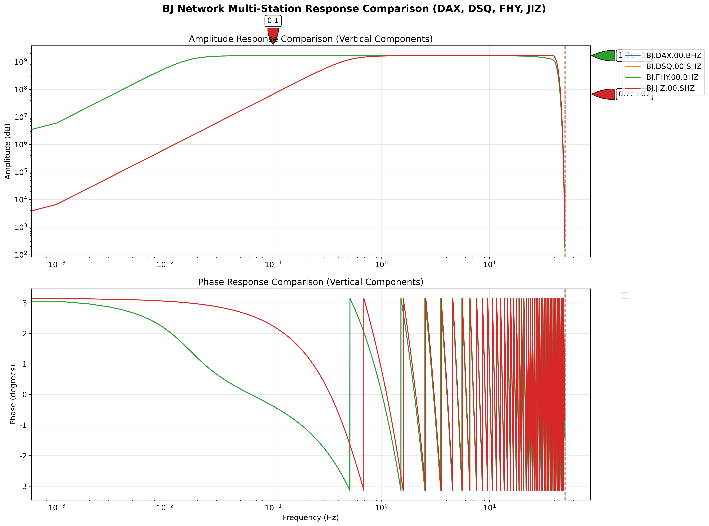

# BJ台网台站仪器响应图

## 数据来源
- **Inventory文件**: `input/BJ.XML`  
- **参考文档**: [ObsPy Inventory.plot_response](https://docs.obspy.org/master/packages/autogen/obspy.core.inventory.inventory.Inventory.plot_response.html)

## 技术说明

### 响应图内容
每个响应图包含两个子图：
- **上图：幅度响应** - 显示仪器在不同频率下的幅度增益特性 (dB)
- **下图：相位响应** - 显示仪器在不同频率下的相位延迟特性 (度)

### 频率范围
- **最低频率**: 0.001 Hz (1000秒周期)
- **最高频率**: 根据仪器Nyquist频率自动确定

### 输出参数
- **响应类型**: VEL (速度响应)
- **单位**: m/s
- **坐标系**: 对数频率轴
- **分量**: 对比图仅显示垂直分量(*Z)

## 台站详细信息

### DAX台站 (宽频带)
- **通道**: BJ.DAX.00.BHE, BJ.DAX.00.BHN, BJ.DAX.00.BHZ
- **仪器类型**: 宽频带地震仪 (BH通道)
- **特点**: 适合记录远震和区域地震

### DSQ台站 (短周期)  
- **通道**: BJ.DSQ.00.SHE, BJ.DSQ.00.SHN, BJ.DSQ.00.SHZ
- **仪器类型**: 短周期地震仪 (SH通道)
- **特点**: 高频响应，适合近震和工程地震学

### FHY台站 (宽频带)
- **通道**: BJ.FHY.00.BHE, BJ.FHY.00.BHN, BJ.FHY.00.BHZ
- **仪器类型**: 宽频带地震仪 (BH通道)
- **特点**: 与DAX类似的宽频响应特性

### JIZ台站 (短周期)
- **通道**: BJ.JIZ.00.SHE, BJ.JIZ.00.SHN, BJ.JIZ.00.SHZ
- **仪器类型**: 短周期地震仪 (SH通道)  
- **特点**: 与DSQ类似的高频响应特性

## 应用场景

### 数据质量控制
- 检查仪器响应是否正常
- 识别异常的频率响应特性
- 验证仪器校准状态

### 台站比较分析
- 宽频带 vs 短周期仪器特性对比
- 同类型台站响应一致性检查
- 台网整体性能评估

### 地震信号处理
- 确定合适的滤波频率范围
- 进行仪器响应去除
- 地震记录振幅校正

## 多台站响应图

### 副频曲线图分析



该对比图包含BJ台网四个台站（DAX、DSQ、FHY、JIZ）的垂直分量仪器响应，分为**幅度响应**和**相位响应**两个子图。

### 幅度响应分析（上图）

#### **台站类型特征差异**

**宽频带台站 (DAX, FHY - BH通道):**
- **低频响应**: 在0.008-0.01 Hz以下开始下降
- **通带特征**: 0.01-10 Hz范围内相对平坦的响应
- **高频滚降**: 通常在20-40 Hz开始显著衰减
- **动态范围**: 较大，适合记录宽频谱地震信号

**短周期台站 (DSQ, JIZ - SH通道):**
- **低频限制**: 在0.05-0.1 Hz以下快速滚降
- **最佳频段**: 1-50 Hz范围内优化设计
- **高频扩展**: 在高频段保持更好的响应
- **专业用途**: 优化用于近震和工程地震学

#### **频率响应区间特性**
- **<0.01 Hz**: 所有台站均显示低频下降，宽频带台站下降更缓
- **0.01-1 Hz**: 宽频带台站的优势频段，短周期台站响应较弱
- **1-10 Hz**: 所有台站的良好响应区间
- **>10 Hz**: 短周期台站保持较好响应，宽频带台站开始衰减

### 相位响应分析（下图）

#### **相位延迟特征**
- **线性相位区**: 表示仪器的群延迟特性
- **相位跳跃**: 在滤波器转折频率处的急剧相位变化
- **相位一致性**: 同类型台站间的相位响应相似度

#### **群延迟影响**
- **时间延迟**: 相位斜率决定信号的时间延迟
- **频散效应**: 不同频率成分的到达时间差异
- **波形保真度**: 影响地震波形的精确度

### 技术注意事项

#### **仪器响应去除**
在数据处理时必须正确应用仪器响应函数进行去卷积，以获得真实的地面运动。

#### **频率选择原则**
根据研究目标选择合适的频率范围和台站，避免在台站响应较差的频段进行分析。

### 台站技术规格对比

| 台站 | 类型 | 最佳频段  | 响应特点 |
|------|------|----------|----------|
| DAX  | 宽频带 | 0.008-20 Hz | 低频延伸好 |
| FHY  | 宽频带 | 0.008-20 Hz | 与DAX一致性好 |
| DSQ  | 短周期 | 0.05-50 Hz | 高频响应优秀 |
| JIZ  | 短周期 | 0.05-50 Hz | 与DSQ特性相似 |

## 生成工具

```bash
# 英文版本（推荐，无字体问题）
cd tests
python3 plot_station_response_english.py

# 中文版本（有字体警告）
cd tests
python3 plot_station_response_final.py

# 改进版本
cd tests
python3 plot_station_response_improved.py

# 基础版本
cd tests
python3 plot_station_response.py
```

## 技术参数

- **图像分辨率**: 300 DPI
- **图像格式**: PNG  
- **背景**: 白色
- **字体**: DejaVu Sans (英文版本)
- **绘图库**: Matplotlib + ObsPy integration
- **数据处理**: ObsPy 1.4.2
- **频率轴**: 对数刻度
- **工作目录**: 需要从tests目录运行

