# 软件说明文档：PDF计算软件

## 1. 概述

本文档详细说明了`run_cp_ppsd.py`主入口脚本和`cp_ppsd/cp_psd.py`核心模块中PPSD（Probabilistic Power Spectral Density）函数的使用方法。该工具专门用于地震学中的背景噪声分析，基于ObsPy库实现，支持通过TOML配置文件进行批量地动噪声PPSD计算和可视化。

**重要更新 (2025年6月5日)**：
- **temporal图像绘制功能完善**: 新增`temporal_linewidth`和`temporal_marker_size`参数，允许精确控制时间演化图中线条宽度和标记大小
- **配置文件结构优化**: 完善了分组结构配置文件格式，改进了参数组织和关联性管理
- **文件名时间信息优化**: 输出文件名中的时间信息现在支持开始时间和结束时间范围，确保文件名能准确反映数据的实际时间范围
- **special_handling参数完全支持**: 程序现在完全支持None、"ringlaser"、"hydrophone"三种模式，包括自动从StationXML提取sensitivity
- **多格式仪器响应文件支持**: 验证支持StationXML (.xml) 和 dataless SEED (.dataless) 格式

**主要应用场景**：
- 地震台站背景噪声水平评估
- 台站选址质量分析
- 地震仪器性能评价
- 环境噪声源识别与分析
- 台站网络噪声水平对比

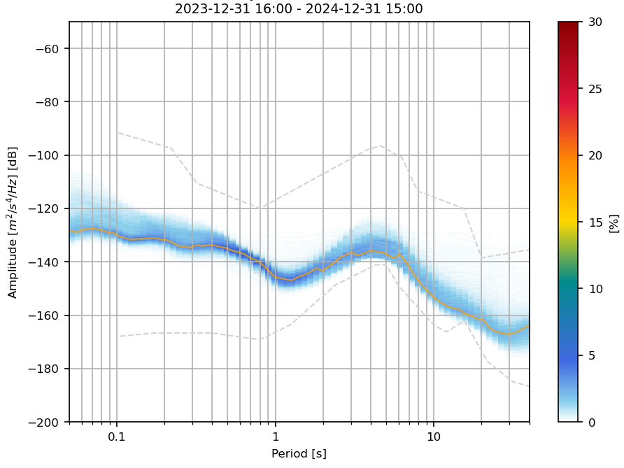

*图1：PPSD分析软件主要功能展示图。该图展示了软件的核心输出结果，包括概率密度颜色图（显示不同周期下功率谱密度的概率分布）、Peterson噪声模型参考曲线（蓝色NLNM和红色NHNM）、以及百分位数统计线，为用户提供地震台站背景噪声的全面分析视图。*

## 2. 程序工作流程

`run_cp_ppsd.py` 脚本遵循以下基本工作流程来处理地震数据并生成PPSD结果：

1.  **加载配置与识别操作意图**:
    *   脚本启动时，会读取用户在命令行中指定的一个或多个TOML配置文件。
    *   **操作意图的确定**: 脚本的主要操作模式根据传递的配置文件名或类型进行推断：
        *   如果提供了类似 `config.toml` 或以 `_calc.toml` 结尾的**计算型配置文件**，脚本的主要任务是PPSD计算。这将始终尝试生成并保存 `.npz` 数据文件。
        *   如果提供了类似 `config_plot.toml` 或以 `_plot.toml` 结尾的**绘图型配置文件**，脚本的主要任务是PPSD绘图。这将始终尝试加载PPSD数据（通常是预计算的NPZ文件）并生成图像。
        *   如果同时提供了计算型和绘图型配置文件 (例如 `python run_cp_ppsd.py config.toml config_plot.toml`)，脚本将首先响应计算型配置（执行计算、保存NPZ），然后使用这些结果并响应绘图型配置（加载数据、绘图）。
    *   解析所提供配置文件中的所有参数，包括日志级别、文件路径以及PPSD计算和绘图的特定参数。

2.  **设置日志系统**:
    *   根据活动配置文件中的 `log_level` 和 `output_dir` 参数（通常取第一个配置文件或特定规则定义的配置文件的设置），初始化日志系统。
    *   日志信息会同时输出到控制台和指定输出目录下的日志文件。

3.  **PPSD数据处理 (计算阶段 - 由计算型配置文件驱动)**:
    *   **数据准备**: 根据计算型配置文件中的 `mseed_pattern` 和 `inventory_path` 定位输入文件。
    *   **核心计算**: 
        *   当响应计算型配置文件时，脚本执行PPSD核心计算。这包括读取地震波形数据、应用仪器校正、进行谱估计等。计算会使用计算型配置文件 `[args]` 部分的参数。
        *   计算完成后，PPSD结果将**始终**保存为 `.npz` 文件。文件名由计算型配置文件中的 `output_npz_filename_pattern` (如果提供) 或默认规则确定。

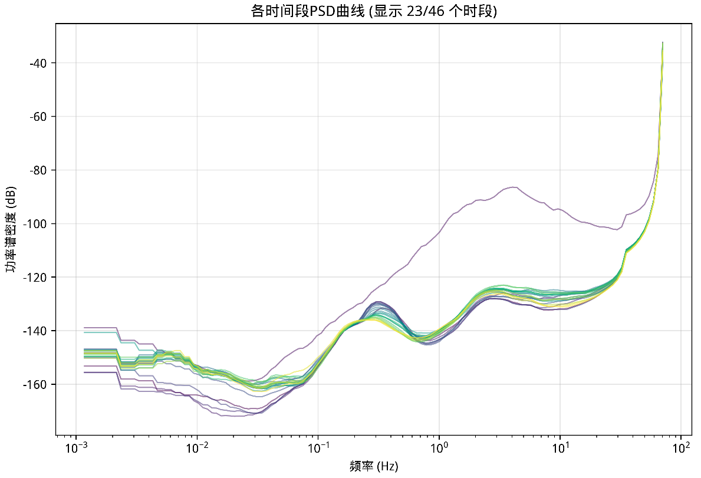

*图2：PPSD多段数据处理工作流程图。该图展示了软件如何将长时间序列地震数据分割成多个时间窗口，对每个窗口进行质量控制、PSD计算和统计累积的完整处理链。多段处理策略能够有效提高PPSD结果的统计稳健性和可靠性。图中最上方的紫色PSD曲线对应的原始波形包含两个地震事件。通过多段PSD曲线的统计分析，可以有效识别异常信号、评估数据质量，并构台站噪声基线模型。*

4.  **PPSD结果可视化 (绘图阶段 - 由绘图型配置文件驱动)**:
    *   当响应绘图型配置文件时：
        *   脚本会尝试加载PPSD数据。如果之前在同一脚本运行中已通过计算型配置文件生成了数据，则优先使用该内存中的数据；否则，它会尝试从绘图型配置文件中指定的路径（如 `input_npz_dir` 或基于 `output_dir` 的约定）加载预计算的 `.npz` 文件。
        *   根据绘图型配置文件中的 `plot_type` 和其他 `[args]` 下的绘图参数生成图像，图像将**始终**被保存。文件名由绘图型配置文件中的 `output_filename_pattern` (如果提供) 或默认规则确定。

5.  **完成与退出**:
    *   所有请求的操作完成后，记录相应的日志信息，脚本正常退出。
    *   如果过程中发生错误，会记录详细错误信息到日志，并尝试优雅退出。

这个流程允许用户通过选择和组合不同的配置文件来灵活控制计算和绘图任务。

## 2.1 实际应用案例展示

为了帮助用户更好地理解软件的实际分析能力和输出效果，以下展示了基于真实数据的PPSD分析案例：

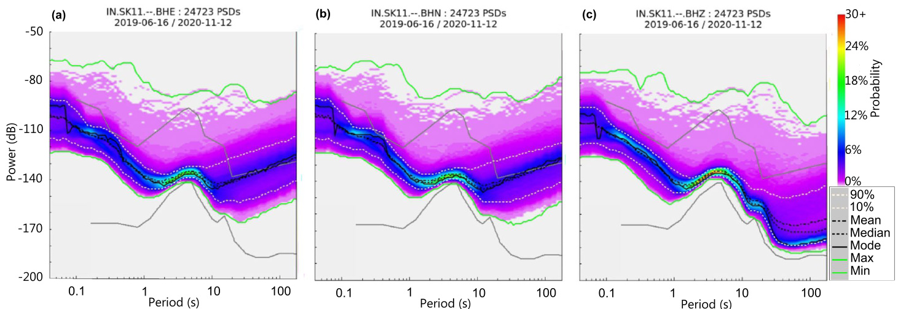

*图2.2：多通道PPSD综合分析案例图。该图展示了同一台站不同通道（BHE、BHN、BHZ）的PPSD分析结果对比，包括标准PPSD图、时间演化特征以及频谱特性。通过多通道对比分析可以评估台站的整体性能、识别方向性噪声源以及验证仪器工作状态的一致性，为地震台站的综合评估提供全面的技术依据。*

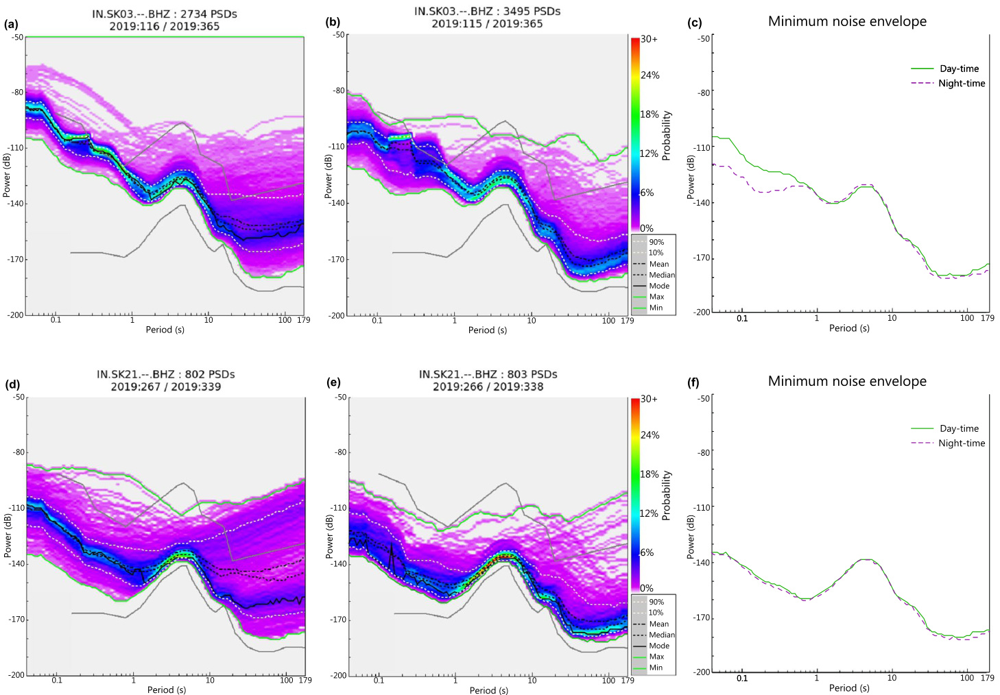

*图2.3：长期噪声监测趋势分析案例图。该图展示了某台站在较长时间尺度上的噪声变化规律，包括季节性波动、异常事件识别以及噪声水平的长期演化趋势。这种长期监测分析对于台站维护、环境影响评估以及数据质量控制具有重要的实际应用价值。*

## 3. 配置文件格式

`run_cp_ppsd.py` 脚本使用TOML格式的配置文件。为了更清晰地分离计算和绘图任务的参数，推荐使用两个独立的配置文件：
-   `config.toml`: 专注于PPSD核心计算和数据导出（如CSV）的参数。
-   `config_plot.toml`: 专注于PPSD结果可视化（绘图）的参数。

两个文件共享一些通用参数（如全局控制、输入/输出路径），但其核心任务 (`command`) 和特定功能参数会有所不同。

### 3.1 完整配置参数结构

以下是推荐的 `config.toml` 和 `config_plot.toml` 文件结构。

#### 3.1.1 计算配置文件示例 (`config.toml`)

```toml
# PPSD 计算配置文件 - 计算专用
# 使用方法：python run_cp_ppsd.py config.toml
# 此配置文件将始终尝试计算PPSD并保存NPZ文件。
# 如果定义了CSV导出相关参数（如[args]下的percentiles），则也会导出CSV。

# === 1. 全局操作控制 ===
# command 参数已移除。
log_level = "DEBUG" # 日志级别："DEBUG", "INFO", "WARNING", "ERROR", "CRITICAL"

# === 2. 输入数据与输出路径 ===
# mseed_pattern 可以是glob模式 (如 "./data/*.mseed") 或一个目录路径 (如 "./data_directory/")。
# 如果是目录路径，脚本将递归搜索该目录下的所有miniseed文件（执行效率会慢）。
mseed_pattern = "./data_directory/"      # 地震数据文件目录或glob模式
inventory_path = "./data/inventory.xml"  # 仪器响应文件路径
output_dir = "./ppsd_results"            # 输出目录

# === 3. 输出生成控制 (隐式) ===
# NPZ文件将总是被创建。
# output_npz_filename_pattern 定义了生成NPZ数据文件名的规则。
#   时间信息 (来自MiniSEED数据的开始/结束时间):
#     开始时间: {start_year}, {start_month}, {start_day}, {start_hour}, {start_minute}, {start_second}, {start_julday}
#     {start_datetime} (例如 YYYYMMDDHHMM 格式的紧凑开始时间戳)
#     结束时间: {end_year}, {end_month}, {end_day}, {end_hour}, {end_minute}, {end_second}, {end_julday}
#     {end_datetime} (例如 YYYYMMDDHHMM 格式的紧凑结束时间戳)
#     兼容性: {datetime}, {year}, {month}, {day}, {hour}, {minute}, {second}, {julday} (等同于开始时间)
#   台站信息: {network}, {station}, {location}, {channel}
#     例如: "PPSD_{start_datetime}_{end_datetime}_{network}.{station}.{location}.{channel}.npz"
# 如果未设置或为空，脚本将使用默认命名规则。
output_npz_filename_pattern = "PPSD_{start_datetime}_{end_datetime}_{network}.{station}.{location}.{channel}.npz"

# === 4. PPSD核心计算参数 ([args]表内) ===
[args]
# --- 时间分段与窗口 ---
ppsd_length = 3600                    # 时间窗口长度（秒），标准1小时。
overlap = 0.5                         # 窗口重叠比例，50%重叠。

# --- 频率/周期域参数 ---
period_limits = [0.01, 1000.0]        # PPSD计算的周期范围（秒）。
period_smoothing_width_octaves = 1.0  # 周期平滑宽度（倍频程）。
period_step_octaves = 0.125           # 周期步长（1/8倍频程）。

# --- 振幅域参数 (功率分箱) ---
db_bins = [-200.0, -50.0, 0.25]       # dB分箱：[最小值, 最大值, 步长]。

# --- 数据质量与选择 ---
skip_on_gaps = false                  # 是否跳过有数据缺失的窗口。
                                      # McNamara2004 通过补零合并含间断的trace，这会在PPSD图中产生可识别的异常PSD线。
                                      # 设置为true则不补零，可能导致短于ppsd_length的数据段不被使用。

# Stream.merge()方法参数 - 控制如何合并同一通道的多个trace段
merge_method = 0                      # 合并方法：0=标准, 1=插值, -1=清理
                                      # 0: 标准合并，重叠部分取平均值
                                      # 1: 使用插值处理重叠
                                      # -1: 仅清理，不处理重叠

merge_fill_value = "None"             # 间隙填充值，默认None使用masked array
                                      # None: 使用numpy.ma.masked_array保留间隙信息
                                      # 数值: 用指定值填充间隙
                                      # "latest": 使用间隙前的最后一个值
                                      # "interpolate": 线性插值填充

# special_handling = "None"           # 特殊仪器处理。可选值: "ringlaser", "hydrophone", "None"。
                                      # "ringlaser": 不进行仪器校正，仅除以metadata中的sensitivity。
                                      # "hydrophone": 仪器校正后不做微分操作。
# 以下相关参数用于脚本层面的外部事件剔除逻辑，在数据送入PPSD对象前使用，非PPSD.__init__直接参数。
# time_of_weekday = [1, 2, 3, 4, 5]     # 分析的星期几（1=周一，7=周日），工作日。用于预先筛选Trace对象，非PPSD直接参数。
# processing_time_window = ["2023-01-01T00:00:00", "2023-01-31T23:59:59"] # (可选) 指定处理数据的绝对时间窗口 [开始时间, 结束时间]，ISO 8601格式。用于预筛选Trace，非PPSD直接参数。
# daily_time_window = ["01:00:00", "05:00:00"] # (可选) 指定每天处理数据的时间窗口 [开始时间, 结束时间]，HH:MM:SS格式。用于预筛选Trace，非PPSD直接参数。
# enable_external_stalta_filter = false # 是否启用外部STA/LTA事件剔除预处理流程。
# sta_length = 120                    # (外部STA/LTA) 短时平均长度（秒）。
# lta_length = 600                    # (外部STA/LTA) 长时平均长度（秒）。
# stalta_thresh_on = 2.5              # (外部STA/LTA) 触发阈值上限。
# stalta_thresh_off = 1.5             # (外部STA/LTA) 触发阈值下限。
```

#### 3.1.2 `config.toml` 参数详解

本节详细解释 `config.toml` (计算配置文件) 中可用的各项参数。

##### A. 全局操作控制 (顶层参数)

-   **`log_level`** (字符串)
    *   **作用**: 控制日志信息的详细程度。日志会同时输出到控制台和 `output_dir` 中生成的日志文件 (文件名通常包含时间戳，如 `ppsd_processing_YYYYMMDD_HHMMSS.log`)。
    *   **可选值**:
        *   `"DEBUG"`: 输出最详细的日志信息，用于开发和调试。
        *   `"INFO"`: 输出一般性的过程信息，如脚本启动、文件加载、主要步骤完成等。推荐用于常规运行。
        *   `"WARNING"`: 输出警告信息，表示可能存在的问题但不影响当前操作完成。
        *   `"ERROR"`: 输出错误信息，表示某些操作失败但脚本可能仍能继续处理其他部分。
        *   `"CRITICAL"`: 输出严重错误信息，通常表示脚本无法继续执行。
    *   **示例**: `log_level = "DEBUG"`
    *   **默认行为**: 如果未指定，脚本可能会使用如 "INFO" 这样的默认级别。

##### B. 输入数据与输出路径 (顶层参数)

-   **`mseed_pattern`** (字符串)
    *   **作用**: 指定输入地震波形数据文件的路径。
        *   如果提供的是 **glob模式** (例如 `"./data/*.mseed"`)：脚本将按照该模式匹配文件。
        *   如果提供的是 **目录路径** (例如 `"./data_directory/"`)：脚本将递归地搜索该目录及其所有子目录，查找具有常见MiniSEED扩展名（如 `.mseed`, `.msd`, `.seed`，具体列表由脚本内部定义）的数据文件。所有找到的符合条件的文件都将被处理。
        *   **注意**: 递归搜索目录可能会比使用精确的glob模式慢，尤其是在目录层级深或文件数量庞大时。
    *   **示例**: `mseed_pattern = "./data_directory/"`

-   **`inventory_path`** (字符串)
    *   **作用**: 指定仪器响应文件（元数据）的路径。该文件包含了台站坐标、仪器灵敏度、响应函数等关键信息，对于将原始记录数据转换为实际的地面运动单位至关重要。此参数在PPSD计算时用于进行仪器校正。
    *   **支持格式**: ObsPy支持的多种格式，如 FDSN StationXML (`.xml`) 或 dataless SEED (`.dataless`)。程序已验证支持这两种主要格式。
    *   **示例**: `inventory_path = "./data/inventory.xml"` 或 `inventory_path = "./data/BJ.dataless"`
     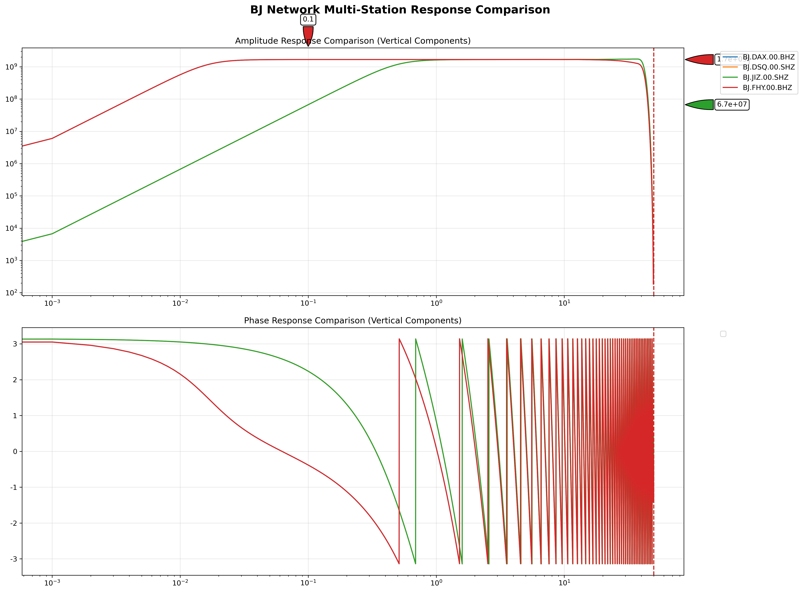

*图2.1：多台站仪器响应特性对比图。该图展示了不同地震台站的仪器响应函数特征，包括振幅响应和相位响应随频率的变化。通过对比分析可以了解不同台站仪器的频率响应特性差异，为PPSD结果的正确解释和台站间数据对比提供重要的技术基础。准确的仪器响应校正是获得可靠PPSD结果的关键前提。*

-   **`output_dir`** (字符串)
    *   **作用**: 指定所有输出文件（主要是计算生成的 `.npz` PPSD数据文件和 `.log` 日志文件）的根目录。如果目录不存在，脚本会尝试创建它。
    *   **示例**: `output_dir = "./ppsd_results"`

##### C. 输出生成控制 (顶层参数, 隐式)

-   **`output_npz_filename_pattern`** (字符串, 可选)
    *   **作用**: 定义生成 NPZ 数据文件的动态命名规则。当脚本执行PPSD计算并保存NPZ文件时（计算型配置总是会保存NPZ），会使用此模式。
    *   **可用占位符**:
        *   时间信息 (来自MiniSEED数据的开始时间，而非处理时间): `{year}`, `{month}`, `{day}`, `{hour}`, `{minute}`, `{second}`, `{julday}`, `{datetime}` (例如 YYYYMMDDHHMM 格式的紧凑时间戳)
        *   台站信息: `{network}`, `{station}`, `{location}`, `{channel}`
    *   **示例**: `output_npz_filename_pattern = "PPSD_{datetime}_{network}-{station}-{location}-{channel}.npz"`
    *   **默认行为**: 如果此参数未设置或为空，脚本将使用内部定义的默认命名规则。

##### D. PPSD核心计算参数 (`[args]` 表内)

这些参数直接传递给ObsPy的`PPSD`对象初始化或影响其计算过程。

-   **`ppsd_length`** (整数)
    *   **作用**: 单个PSD估计所使用的时间窗口长度（秒）。标准的PPSD分析通常使用3600秒（1小时）。
    *   **ObsPy对应**: `PPSD.__init__(ppsd_length=...)`
    *   **示例**: `ppsd_length = 3600`

-   **`overlap`** (浮点数, 0.0 到 1.0 之间)
    *   **作用**: 相邻时间窗口之间的重叠比例。例如，0.5表示50%的重叠。
    *   **ObsPy对应**: `PPSD.__init__(overlap=...)`
    *   **示例**: `overlap = 0.5`

-   **`period_limits`** (列表/元组, 包含两个数值 `[min_period, max_period]`)
    *   **作用**: PPSD计算的周期范围（秒）。定义了PPSD对象将分析的周期界限。
    *   **ObsPy对应**: `PPSD.__init__(period_limits=...)`
    *   **示例**: `period_limits = [0.01, 1000.0]`

-   **`period_smoothing_width_octaves`** (浮点数)
    *   **作用**: 在倍频程单位下，用于平滑PSD估计的周期（或频率）平滑窗口的宽度。这是PPSD计算中的关键参数，控制频率域平滑的程度。**详细解释请参见第3.4节"PSD平滑窗口宽度概念详解"**。
    *   **ObsPy对应**: `PPSD.__init__(period_smoothing_width_octaves=...)`
    *   **示例**: `period_smoothing_width_octaves = 1.0`
    *   **典型值**: 1.0倍频程是地震学中的标准选择，在频率分辨率和统计稳定性之间取得平衡

-   **`period_step_octaves`** (浮点数)
    *   **作用**: PPSD对象内部表示周期的步长，以倍频程为单位。例如，0.125表示1/8倍频程。**详细解释请参见第3.5节"period_step_octaves参数详解"**。
    *   **ObsPy对应**: `PPSD.__init__(period_step_octaves=...)`
    *   **示例**: `period_step_octaves = 0.125`

-   **`db_bins`** (列表/元组, 格式 `[min_db, max_db, step_db]`)
    *   **作用**: 定义用于对功率谱密度值进行分箱的dB范围和步长。格式为 `[最小值, 最大值, 步长]`。
    *   **ObsPy对应**: `PPSD.__init__(db_bins=...)`
    *   **示例**: `db_bins = [-200.0, -50.0, 0.25]`
    *   **详细说明**: 
        *   **分箱概念**: 分箱（Binning）是将连续的功率谱密度值离散化到预定义区间的过程，类似于制作直方图。每个分箱代表一个dB范围，用于统计PSD值的分布。
        *   **参数解析**: 以 `[-200.0, -50.0, 0.25]` 为例：
            - 最小值：-200.0 dB（最低功率谱密度）
            - 最大值：-50.0 dB（最高功率谱密度）  
            - 步长：0.25 dB（分箱精度）
            - 分箱数量：((-50.0) - (-200.0)) / 0.25 = 600个分箱
            - 总动态范围：150 dB
        *   **分箱边界**: 分箱边界为 [-200.0, -199.75, -199.5, ..., -50.25, -50.0]，共601个边界点，形成600个分箱区间
        *   **PSD值分配**: 每个计算得到的PSD值会被分配到相应的分箱中：
            - PSD值 -120.3 dB → 分箱索引 281 → 分箱中心 -120.125 dB
            - 超出范围的值会被分配到边界分箱（第一个或最后一个）
        *   **PPSD矩阵构建**: 
            - 行（频率轴）：不同频率/周期点
            - 列（振幅轴）：600个dB分箱  
            - 矩阵元素：每个(频率,dB)组合的出现概率
        *   **分箱精度影响**:
            - 步长越小（如0.25 dB）→ 分辨率越高，能捕捉细微的PSD变化
            - 步长越大（如1.0 dB）→ 分辨率较低，但计算更快，存储更少
        *   **典型设置建议**:
            - 高精度分析：0.25 dB步长（当前设置）
            - 标准分析：0.5 dB步长  
            - 快速分析：1.0 dB步长
            - 地震噪声通常在 -180 到 -90 dB范围内

-   **`skip_on_gaps`** (布尔值: `true` / `false`)
    *   **作用**: 控制在处理包含数据间断 (gaps) 的时间窗口时的行为。
        *   `false` (默认): McNamara & Buland (2004) 的方法建议通过补零来合并包含间断的trace段。这可能在PPSD图中产生可识别的异常PSD线，但会利用所有数据。
        *   `true`: 如果设置为true，则不进行补零，任何短于 `ppsd_length` 的数据段（由于间断造成）将不被用于PPSD计算。这可以产生更"纯净"的PPSD，但可能会丢弃部分数据。
    *   **ObsPy对应**: `PPSD.__init__(skip_on_gaps=...)`
    *   **示例**: `skip_on_gaps = false`
  
-   **`merge_method`** (整数, 可选)
    *   **作用**: 控制ObsPy的Stream.merge()方法如何合并同一通道的多个trace段。这是单文件模式中的重要参数，影响数据间隙的处理方式。
    *   **可选值**:
        *   `0`: 标准合并方法，重叠部分取平均值
        *   `1`: 使用插值方法处理重叠部分
        *   `-1`: 仅进行清理操作，不处理重叠部分
    *   **ObsPy对应**: `Stream.merge(method=...)`
    *   **示例**: `merge_method = 0`
    *   **默认行为**: 如果未设置，使用ObsPy默认的合并方法

-   **`merge_fill_value`** (可选, 多类型)
    *   **作用**: 控制数据间隙的填充策略。这是处理数据不连续性的关键参数，与`skip_on_gaps = false`配合使用。
    *   **可选值**:
        *   `None` (默认): 使用numpy.ma.masked_array保留间隙信息，不进行填充
        *   数值（如`0`）: 用指定的数值填充间隙
        *   `"latest"`: 使用间隙前的最后一个有效值填充
        *   `"interpolate"`: 使用线性插值方法填充间隙
    *   **ObsPy对应**: `Stream.merge(fill_value=...)`
    *   **示例**: `merge_fill_value = 0` (注释掉表示使用默认None值)
    *   **与其他参数关系**: 当`skip_on_gaps = false`时，此参数决定如何处理合并后的间隙  

-   **`special_handling`** (字符串)
    *   **作用**: 为特殊类型的仪器数据指定处理方式。程序完全支持Python None值和字符串值。
    *   **可选值**:
        *   `"None"` 或 `None`: 标准处理，应用完整的仪器校正。程序支持字符串"None"到Python None值的自动转换。
        *   `"ringlaser"`: 适用于环形激光陀螺仪等主要输出旋转速率的仪器。不进行完整的仪器校正，仅将数据除以从StationXML中提取的灵敏度(sensitivity)。程序会自动从仪器响应文件中提取sensitivity值。
        *   `"hydrophone"`: 适用于水听器。数据在经过仪器校正后，不进行通常地震仪数据会执行的微分操作（如果响应是位移，则不转换为速度）。
    *   **ObsPy对应**: `PPSD.__init__(special_handling=...)`
    *   **示例**: `special_handling = "None"` 或直接注释掉该行使用默认值

##### E. 外部数据预筛选参数 (`[args]` 表内, 非PPSD直接参数)
以下参数用于在数据送入PPSD对象进行核心计算之前，在脚本层面进行外部的事件剔除或时间窗口筛选。这些不是`PPSD.__init__`的直接参数，而是由`cp_ppsd/cp_psd.py`核心模块自身实现的逻辑使用。

-   **`time_of_weekday`** (整数列表, 可选)
    *   **作用**: (用于预筛选Trace) 指定一周中的哪几天的数据需要被分析。星期一为1，星期日为7。如果提供，则仅处理指定星期几的数据。
    *   **示例**: `time_of_weekday = [1, 2, 3, 4, 5]` (仅处理周一到周五的数据)
    *   **默认行为**: 如果未注释掉且未提供或为空列表，则默认处理一周七天所有数据。

-   **`processing_time_window`** (字符串列表, `[startTime, endTime]`, 可选)
    *   **作用**: (用于预筛选Trace) 指定一个绝对的时间窗口来处理数据。只有落在这个时间窗口内的数据段才会被考虑。时间格式为ISO 8601 (例如, `"YYYY-MM-DDTHH:MM:SS"`)。
    *   **示例**: `processing_time_window = ["2023-01-01T00:00:00", "2023-01-31T23:59:59"]`
    *   **默认行为**: 如果未注释掉且未提供或为空列表，则处理所有时间范围内的数据。

-   **`daily_time_window`** (字符串列表, `[startTime, endTime]`, 可选)
    *   **作用**: (用于预筛选Trace) 指定一个每天的时间窗口来处理数据。只有在每天这个时间段内的数据才会被考虑。时间格式为 "HH:MM:SS"。
    *   **示例**: `daily_time_window = ["01:00:00", "05:00:00"]` (仅处理每天凌晨1点到5点之间的数据)
    *   **默认行为**: 如果未注释掉且未提供或为空列表，则处理一天24小时所有数据。

-   **`enable_external_stalta_filter`** (布尔值, 可选)
    *   **作用**: (用于预筛选Trace) 控制是否启用外部的STA/LTA (Short-Term Average / Long-Term Average) 事件剔除预处理流程。如果为 `true`，则在数据送入PPSD计算前，会使用STA/LTA算法识别并尝试移除包含地震事件或其他瞬态信号的时间段。
    *   **示例**: `enable_external_stalta_filter = false`
    *   **依赖参数**: 若为 `true`，则下面的 `sta_length`, `lta_length`, `stalta_thresh_on`, `stalta_thresh_off` 参数将生效。

-   **`sta_length`** (整数, 可选)
    *   **作用**: (外部STA/LTA) 短时平均 (STA) 的窗口长度（秒）。仅当 `enable_external_stalta_filter = true` 时有效。
    *   **示例**: `sta_length = 120`

-   **`lta_length`** (整数, 可选)
    *   **作用**: (外部STA/LTA) 长时平均 (LTA) 的窗口长度（秒）。仅当 `enable_external_stalta_filter = true` 时有效。
    *   **示例**: `lta_length = 600`

-   **`stalta_thresh_on`** (浮点数, 可选)
    *   **作用**: (外部STA/LTA) STA/LTA比率的触发阈值上限。当STA/LTA值超过此阈值时，认为事件开始。仅当 `enable_external_stalta_filter = true` 时有效。
    *   **示例**: `stalta_thresh_on = 2.5`

-   **`stalta_thresh_off`** (浮点数, 可选)
    *   **作用**: (外部STA/LTA) STA/LTA比率的触发阈值下限。当STA/LTA值低于此阈值时，认为事件结束。仅当 `enable_external_stalta_filter = true` 时有效。
    *   **示例**: `stalta_thresh_off = 1.5`

#### 3.2.1 绘图配置文件示例 (`config_plot.toml`)

```toml
# PPSD 绘图配置文件 - 改进的分组结构
# 使用方法：python run_cp_ppsd.py config_plot.toml
# 此配置文件采用精细分组结构，解决参数关联性问题，特别是百分位数和皮特森曲线参数的分组管理
# 配置文件用于从指定目录加载一个或多个PPSD数据 (.npz 文件) 并执行绘图操作。
# NPZ文件应已通过计算型配置文件 (如 config.toml) 生成。

# ========================================
# 1. 全局设置
# ========================================
[global]
log_level = "DEBUG"                          # 日志级别："DEBUG", "INFO", "WARNING", "ERROR", "CRITICAL"
description = "PPSD绘图配置文件 - 分组结构版本"  # 配置文件描述信息
version = "2.0"                              # 配置文件版本号

# ========================================
# 2. 输入输出配置
# ========================================
[paths]
# NPZ文件必须预先存在且有效，否则脚本应报错退出。
# input_npz_dir 指定了包含一个或多个预先计算好的PPSD数据 (.npz) 文件的目录。
# 脚本将尝试处理该目录下的所有 .npz 文件。
input_npz_dir = "./output/npz/"         # 指定存放NPZ文件的目录路径
inventory_path = "./input/BJ.XML"       # 仪器响应文件路径 (可能需要用于绘图时的元数据，如台站名)
output_dir = "./output/plots/"          # 输出目录 (图像保存于此)

# output_filename_pattern 定义了生成图像文件名的规则。
# 可以使用以下占位符:
#   绘图类型(在绘图时确定): {plot_type} （plot_type="standard", "temporal", "spectrogram"）
#   时间信息 (来自PPSD数据的开始/结束时间):
#     开始时间: {start_year}, {start_month}, {start_day}, {start_hour}, {start_minute}, {start_second}, {start_julday}
#     {start_datetime} (例如 YYYYMMDDHHMM 格式的紧凑开始时间戳)
#     结束时间: {end_year}, {end_month}, {end_day}, {end_hour}, {end_minute}, {end_second}, {end_julday}
#     {end_datetime} (例如 YYYYMMDDHHMM 格式的紧凑结束时间戳)
#     兼容性: {datetime}, {year}, {month}, {day}, {hour}, {minute}, {second}, {julday} (等同于开始时间)
#   台站信息: {network}, {station}, {location}, {channel}
#     例如: "{plot_type}_{start_datetime}_{end_datetime}_{network}.{station}.{location}.{channel}.png"
# 如果此参数未设置或为空，脚本将使用基于NPZ文件名的默认命名规则。
output_filename_pattern = "{plot_type}_{start_datetime}_{end_datetime}_{network}.{station}.{location}.{channel}.png"

# ========================================
# 3. 绘图基本设置
# ========================================
[plotting]
# 绘图类型：可以是单个字符串如 "standard", "temporal", "spectrogram",
# 或包含这些值的列表，例如 ["standard", "temporal", "spectrogram"]。
plot_type = ["standard", "temporal", "spectrogram"]

# --- NPZ合并策略 ---
npz_merge_strategy = true                 # 合并策略控制如何处理多个NPZ文件:
                                          # true: 自动按SEED ID分组并使用add_npz()方法合并，
                                          #       适用于同一台站不同时间段的数据，可显示长期趋势
                                          # false: 每个NPZ文件单独绘图，适用于独立分析每个时间段

# ========================================
# 4. 标准图配置
# ========================================
[standard]
# --- 基本显示控制 ---
show_histogram = true                   # 是否绘制2D直方图本身（PPSD的核心内容）
                                        # true: 显示彩色的概率密度分布
                                        # false: 仅显示统计线条和模型曲线

show_percentiles = true                # 是否显示百分位数线
                                        # true: 在图上绘制指定百分位数的PSD曲线
                                        # 具体百分位数在 [standard.percentiles] 部分配置

show_noise_models = true                # 是否显示全球噪声模型（皮特森曲线）
                                        # true: 显示NLNM（新低噪声模型）和NHNM（新高噪声模型）
                                        # 这些曲线是地震学中的标准参考模型

show_mode = true                        # 是否显示众数PSD曲线
                                        # true: 绘制每个频率点的众数（最常出现的PSD值）
                                        # 众数代表最典型的噪声水平

show_mean = false                       # 是否显示均值PSD曲线
                                        # true: 绘制每个频率点的平均PSD值
                                        # 均值可能受极值影响，通常众数更具代表性

# --- 绘图样式控制 ---
standard_grid = true                    # 是否在直方图上显示网格线
                                        # true: 显示网格，便于读取数值
                                        # false: 不显示网格，图像更简洁

period_lim = [0.02, 50.0]               # PPSD标准图绘图显示的周期范围（秒）
                                        # 如果 xaxis_frequency=true，此处应为频率范围（Hz）
                                        # 建议根据分析目标调整：微震分析用较短周期，长周期噪声分析用较长周期

xaxis_frequency = true                # PPSD标准图X轴显示模式
                                        # false: 显示周期（秒），地震学传统表示法
                                        # true: 显示频率（Hz），工程学常用表示法

cumulative_plot = false                 # 是否显示累积直方图模式
                                        # false: 标准概率密度图（推荐）
                                        # true: 累积概率图，显示低于某PSD值的概率分布
                                        # show_histogram = true 时，cumulative_plot = true 会绘制累积直方图

cumulative_number_of_colors = 25        # 累积直方图的离散颜色级别数量
                                        # 仅在 cumulative_plot=true 时生效
                                        # 控制累积图的颜色分级精度：
                                        # 10-15: 粗糙分级，适合快速预览
                                        # 25: 标准分级，适合大多数用途
                                        # 40-50: 精细分级，适合科学发表

standard_cmap = "hot_r_custom"          # PPSD图的颜色映射方案
                                        # 可选值见 [colors] 部分的 available_cmaps
                                        # "hot_r_custom": 热图反向配色，科学标准，优化PDF显示
                                        # 不同配色方案适合不同的显示媒介和用途

# 标准图样式子分组
# --- 百分位数线配置 ---
[standard.percentiles]
values = [10, 50, 90]                   # 要显示的百分位数列表
color = "lightgray"                     # 百分位数线颜色
linewidth = 1.0                         # 百分位数线宽度
linestyle = "--"                        # 百分位数线样式 ("-", "--", "-.", ":")
alpha = 0.8                             # 百分位数线透明度 (0.0-1.0)

# --- 皮特森曲线配置 ---
[standard.peterson]
nlnm_color = "lightgray"                # NLNM（New Low Noise Model）曲线颜色
nhnm_color = "lightgray"                # NHNM（New High Noise Model）曲线颜色
linewidth = 1.0                         # 皮特森曲线线宽
linestyle = "--"                        # 皮特森曲线线型 ("-", "--", "-.", ":")
alpha = 1.0                             # 皮特森曲线透明度 (0.0-1.0)

# --- 众数线配置 ---
[standard.mode]
color = "orange"                        # 众数线颜色
linewidth = 1.0                         # 众数线宽度
linestyle = "-"                         # 众数线样式 ("-", "--", "-.", ":")
alpha = 0.9                             # 众数线透明度 (0.0-1.0)

# --- 均值线配置 ---
[standard.mean]
color = "red"                           # 均值线颜色
linewidth = 1.0                         # 均值线宽度
linestyle = "--"                        # 均值线样式 ("-", "--", "-.", ":")
alpha = 0.6                             # 均值线透明度 (0.0-1.0)

# ========================================
# 5. 时间演化图配置
# ========================================
[temporal]
# 绘制PSD值随时间演化曲线的特定周期（秒）
# 选择具有代表性的周期点来观察噪声的时间变化
temporal_plot_periods = [0.1, 1.0, 10.0]         # 常用周期：（必须用带小数位的浮点数表示）
                                                 # 0.1秒: 高频噪声（如人文噪声）
                                                 # 1.0秒: 地脉动主频段
                                                 # 8.0秒: 地脉动双峰结构
                                                 # 20.0秒: 长周期背景噪声

# X轴（时间轴）刻度标签的时间格式
time_format_x = "%Y-%m-%d"              # 时间格式字符串（Python strftime格式）
                                        # "%Y-%m-%d": 年-月-日 (2023-01-15)
                                        # "%H:%M": 时:分 (14:30)
                                        # "%Y%m%d %H:%M": 年月日 时:分 (20230115 14:30)

# 线条颜色 (可选，为多个周期的列表或单一颜色)
# temporal_color = ["blue", "red", "green", "orange"]  # 为每个周期指定颜色
# 线条样式 (可选)
temporal_linestyle = "--"              # 所有曲线使用相同样式
                                       # "-": 实线，"--": 虚线，"-.": 点划线，":": 点线
temporal_linewidth = 0.5               # 所有曲线使用相同样式，加粗线条

# 线条标记 (可选)
temporal_marker = "o"                  # 数据点标记样式
temporal_marker_size = 2             # 数据点标记大小（较大的标记更明显）

# ========================================
# 6. 频谱图配置
# ========================================
[spectrogram]
# 颜色图的振幅限制 [min_db, max_db]
clim = [-200, -50]                     # PSD显示范围（dB）
                                        # [-180, -100]: 适合大多数地震台站
                                        # 根据台站噪声水平调整范围以优化对比度

# X轴（时间轴）刻度标签的时间格式
time_format_x = "%H:%M"                 # 频谱图时间轴格式
                                        # 建议使用较详细的格式显示日期和时间
                                        # 可根据数据时间跨度调整精度

# 是否在图上显示网格
spectrogram_grid = true                 # true: 显示网格，便于读取时间和频率
                                        # false: 不显示网格，突出频谱变化

# ========================================
# 7. 颜色配置
# ========================================
[colors]
# 自定义配色方案列表
# 可选的配色方案，用于不同类型的图像（已优化为增强对比度范围，突出PDF曲线特征）
available_cmaps = [
    "viridis_custom",      # Viridis配色（0-80%范围）- 增强对比度，突出PDF曲线
    "ocean_custom",        # Ocean水色配色（20-90%范围）- 突出中高值，增强PDF对比度
    "ocean_r_custom",      # Ocean反向配色（0-60%范围）- 浅色背景，强化PDF曲线对比度
    "hot_r_custom",        # Hot反向配色（0-60%范围）- 浅色背景，冷色调强化PDF可视化
    "plasma_custom",       # Plasma配色（10-85%范围）- 高对比度，突出PDF峰值
    "CMRmap_r_custom"      # CMRmap反向配色（0-80%范围）- 科学标准，优化PDF显示
]

# 线条颜色预设
# 预定义的颜色方案，便于统一配色管理
[colors.presets]
primary = "blue"                        # 主色调
secondary = "red"                       # 辅助色调
accent = "orange"                       # 强调色
neutral = "lightgray"                   # 中性色
success = "green"                       # 成功状态色
warning = "orange"                      # 警告状态色
error = "red"                           # 错误状态色

# ========================================
# 8. Temporal绘图详细参数说明
# ========================================
[temporal_detailed]
# Temporal绘图的关键参数详解

# --- temporal_plot_periods ---
# 作用：指定在时间演化图中绘制的具体周期点（单位：秒）
# 类型：浮点数列表，必须使用带小数位的表示法
# 示例：temporal_plot_periods = [0.1, 1.0, 10.0]
# 说明：
#   0.1秒: 高频噪声，主要反映人为活动、风噪声等
#   1.0秒: 地脉动主频段，反映海洋微震活动
#   10.0秒: 地脉动次频段，反映远洋风暴产生的长周期地脉动
#   20.0-50.0秒: 长周期背景噪声，反映大尺度环境影响
# 建议：选择3-5个代表性周期点，覆盖感兴趣的频率范围

# --- temporal_linestyle ---
# 作用：控制时间演化曲线的线条样式
# 类型：字符串
# 可选值："-" (实线), "--" (虚线), "-." (点划线), ":" (点线)
# 示例：temporal_linestyle = "--"
# 建议：虚线样式在多周期对比时提供更好的视觉区分

# --- temporal_linewidth ---
# 作用：控制时间演化曲线的线条宽度
# 类型：浮点数，单位为点
# 取值范围：通常在0.5-3.0之间
# 示例：temporal_linewidth = 0.5
# 效果：
#   0.5-1.0: 细线，适合多条曲线对比
#   1.5-2.0: 标准线宽，适合一般显示
#   2.5-3.0: 粗线，适合重点突出或演示

# --- temporal_marker ---
# 作用：控制时间演化曲线上数据点的标记样式
# 类型：字符串
# 可选值："o"(圆点), "s"(方形), "^"(三角), "+"(十字), "x"(叉号), "None"(无标记)
# 示例：temporal_marker = "o"
# 建议：
#   "o": 经典圆点，适合大多数情况
#   "s": 方形标记，在密集数据中更易识别
#   "None": 不显示标记，适合数据点密集的情况

# --- temporal_marker_size ---
# 作用：控制时间演化曲线上标记点的大小
# 类型：整数或浮点数，单位为点
# 取值范围：通常在1-10之间
# 示例：temporal_marker_size = 2
# 效果：
#   1-2: 小标记，适合数据点密集或精细显示
#   3-4: 标准大小，适合一般用途
#   5-8: 大标记，适合演示或强调特定数据点

# ========================================
# 9. 高级设置
# ========================================
[advanced]
# Matplotlib后端设置
matplotlib_backend = "Agg"              # 使用非交互式后端，不显示图片
# 字体设置
font_family = "WenQuanYi Micro Hei"     # 支持中文显示的字体
enable_chinese_fonts = true             # 是否启用中文字体支持
# 性能优化设置
memory_optimization = true              # 是否启用内存优化
parallel_processing = false             # 是否启用并行处理（实验性功能）

# 兼容性设置
# 指定需要的最低库版本，用于兼容性检查
[advanced.compatibility]
obspy_version = ">=1.4.0"               # ObsPy库最低版本要求
numpy_version = ">=1.20.0"              # NumPy库最低版本要求
matplotlib_version = ">=3.5.0"          # Matplotlib库最低版本要求 
```

#### 3.2.2 `config_plot.toml` 参数详解

本节详细解释 `config_plot.toml` (绘图配置文件) 中主要定义或具有特定行为的参数。对于在 `config_plot.toml` 和 `config.toml` 中都存在的通用顶层参数（如 `log_level`，以及 `inventory_path` 和 `output_dir` 的通用部分），其详细解释请参考章节 **3.1.1.1 `config.toml` 参数详解**。

#### A. 输入数据与输出路径 (顶层参数)

-   **`input_npz_dir`** (字符串)
    *   **作用**: 指定包含一个或多个预先计算好的PPSD数据 (`.npz` 文件) 的目录路径。脚本将尝试加载并处理该目录下的所有 `.npz` 文件进行绘图。
    *   **注意**: NPZ文件必须是有效的PPSD数据，否则脚本在尝试加载时可能会报错或跳过。
    *   **示例**: `input_npz_dir = "./ppsd_results/npz_data/"`

-   **`inventory_path`** (字符串)
    *   **作用**: 对于绘图配置，此参数可能仍需要。即使PPSD数据是从NPZ文件加载的，某些绘图功能（例如，在图表上正确显示台站、通道等元数据信息）可能仍需要访问原始的仪器响应文件以获取这些详细信息。
    *   **详细解释参考**: 章节 **3.1.1.1 `config.toml` 参数详解** 中关于 `inventory_path` 的说明。
    *   **示例**: `inventory_path = "./data/inventory.xml"`

-   **`output_dir`** (字符串)
    *   **作用**: 对于绘图配置，此目录主要用于存放生成的图像文件。此外，如果脚本为该绘图操作生成单独的日志，日志文件也会存放在此。
    *   **详细解释参考**: 章节 **3.1.1.1 `config.toml` 参数详解** 中关于 `output_dir` 的说明。
    *   **示例**: `output_dir = "./ppsd_results/plots/"`

#### B. 输出生成控制 (顶层参数, 隐式)

-   **`output_filename_pattern`** (字符串, 可选)
    *   **作用**: 定义生成图像文件名的动态命名规则。当脚本执行绘图操作时（绘图型配置总是会尝试绘图），会使用此模式。
    *   **可用占位符**:
        *   绘图类型 (在绘图时确定): `{plot_type}` (例如 "standard", "temporal", "spectrogram") - **此占位符对于区分不同类型的图像输出至关重要，特别是当 `plot_type` 为列表时。**
        *   时间信息 (来自MiniSEED数据的开始时间，而非处理时间): `{year}`, `{month}`, `{day}`, `{hour}`, `{minute}`, `{second}`, `{julday}`, `{datetime}`
        *   台站信息: `{network}`, `{station}`, `{location}`, `{channel}`
    *   **示例**: `output_filename_pattern = "{plot_type}_{datetime}_{network}-{station}-{location}-{channel}.png"`
    *   **默认行为**: 如果此参数未设置、为空，或者所有占位符都无法从当前PPSD对象的元数据中解析，脚本将回退到其他命名逻辑（例如，基于输入NPZ文件名自动生成）。

#### C. 绘图参数

  *   **1. `show_percentiles`** 和 **`percentiles`**
            当**`show_percentiles`**参数设置为**`true`**，并且通过**`percentiles`**参数指定了具体的百分位数值时，程序绘制出“百分位数线指的是功率谱密度值（Power Spectral Density values）的百分位数。
      
       **a. PPSD的计算基础**：
      
      ​        PPSD是通过对长时间的地震数据进行分段，计算每个小段的PSD，然后统计在每个频率点上不同PSD值出现的概率来构建的。最终得到的是一个二维的直方图，其中一个轴是频率，另一个轴是功率谱密度（通常以dB为单位），而图中的颜色或等高线则表示对应频率和功率组合出现的概率。
      
      **b. 百分位数的含义**：
      
      - 对于PPSD图上的**每一个独立的频率点（或非常窄的频率段）**，我们可以观察到一系列不同的功率谱密度值在长时间记录中出现过。
      - 针对这个特定频率点的所有PSD观测值，我们可以计算其统计分布。
      - “百分位数线”就是连接在各个不同频率点上计算得到的相同百分位数的功率谱密度值而形成的曲线。
      
       **c.具体例子**：
      ```
      percentiles=[5, 50, 95]
      ```
      - **第5百分位数线 (5th percentile line)**：这条线上的每一个点代表了在该频率下，有5%的时间观测到的功率谱密度值低于该值。换句话说，这是该频率下相对非常安静的噪声水平。
      - **第50百分位数线 (50th percentile line / Median)**：这条线代表了在该频率下，有50%的时间观测到的功率谱密度值低于该值（同时也有50%的时间高于该值）。这通常被认为是该频率下最典型的或中等的噪声水平。
      - **第95百分位数线 (95th percentile line)**：这条线代表了在该频率下，有95%的时间观测到的功率谱密度值低于该值（只有5%的时间高于该值）。这通常表示该频率下相对较高的噪声水平。
        
      
      ​     **百分位数线展示的是在PPSD图中，对于每个频率，不同概率水平（由百分位数定义）对应的功率谱密度值。** 它们提供了对噪声水平统计变化范围的直观认识，而不仅仅是一个平均值或最可能的值。

## 3.3 PPSD分箱（Binning）概念详解

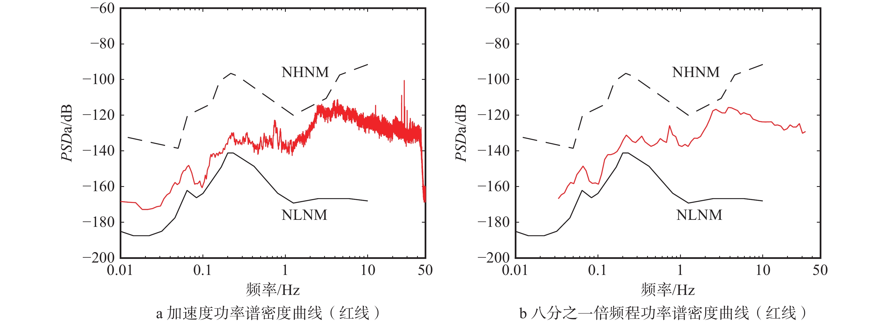

*图3：地震功率谱密度数据示例图。该图展示了典型地震台站记录的功率谱密度随频率的变化特征，为理解PPSD分箱概念提供了基础数据参考。图中显示的PSD值将通过分箱过程离散化到预定义的dB区间中，形成PPSD概率密度矩阵的基础数据。*

### 3.3.1 分箱基本概念

**分箱（Binning）** 是PPSD计算中的核心概念，它将连续的功率谱密度值离散化到预定义的区间中，类似于制作直方图的过程。这个过程对于构建概率密度函数矩阵至关重要。

### 3.3.2 分箱工作原理

#### A. 分箱参数解析
以配置文件中的 `db_bins = [-200.0, -50.0, 0.25]` 为例：

```
最小值：-200.0 dB  (最低功率谱密度边界)
最大值：-50.0 dB   (最高功率谱密度边界)  
步长：0.25 dB      (分箱精度/分辨率)
```

#### B. 分箱计算
- **分箱数量**: ((-50.0) - (-200.0)) / 0.25 = 600个分箱
- **总动态范围**: 150 dB
- **分箱边界**: [-200.0, -199.75, -199.5, ..., -50.25, -50.0]
- **边界点数**: 601个边界点，形成600个分箱区间

#### C. PSD值分配机制
每个计算得到的PSD值会被分配到相应的分箱中：

```
示例分配过程：
PSD值 -120.3 dB → 分箱索引 281 → 分箱中心 -120.125 dB
PSD值 -85.7 dB  → 分箱索引 457 → 分箱中心 -85.625 dB
PSD值 -250.0 dB → 分箱索引 0   → 边界分箱（超出下限）
PSD值 -30.0 dB  → 分箱索引 599 → 边界分箱（超出上限）
```

### 3.3.3 PPSD矩阵构建

#### A. 矩阵结构
PPSD的核心是一个二维概率密度矩阵：
- **行（频率轴）**: 不同频率/周期点（由 `period_limits` 和 `period_step_octaves` 确定）
- **列（振幅轴）**: 600个dB分箱（由 `db_bins` 确定）
- **矩阵元素**: 每个(频率,dB)组合的出现概率

#### B. 概率计算过程
1. **数据收集**: 对每个频率点，收集所有时间窗口的PSD值
2. **分箱统计**: 统计PSD值落入各分箱的次数
3. **概率归一化**: 将计数转换为概率密度
4. **矩阵填充**: 构建完整的2D概率密度矩阵

### 3.3.4 分箱精度的影响

#### A. 高精度分箱（小步长）
```
优点：
- 能捕捉细微的PSD变化
- 提供更详细的噪声特征
- 适合精密分析

缺点：
- 计算时间更长
- 内存占用更大
- 可能产生稀疏矩阵
```

#### B. 低精度分箱（大步长）
```
优点：
- 计算速度快
- 内存占用少
- 统计更稳定

缺点：
- 可能丢失细节信息
- 分辨率有限
```

### 3.3.5 分箱设置建议

#### A. 不同应用场景的推荐设置

**高精度研究分析**:
```toml
db_bins = [-200.0, -50.0, 0.25]  # 0.25 dB步长，600个分箱
```

**标准噪声评估**:
```toml
db_bins = [-180.0, -80.0, 0.5]   # 0.5 dB步长，200个分箱
```

**快速初步分析**:
```toml
db_bins = [-180.0, -80.0, 1.0]   # 1.0 dB步长，100个分箱
```

#### B. 范围选择指导

**地震噪声典型范围**:
- 优秀台站：-180 到 -120 dB
- 一般台站：-160 到 -100 dB  
- 高噪声台站：-140 到 -80 dB

**特殊仪器考虑**:
- 宽频带地震仪：[-200, -50, 0.25]
- 短周期地震仪：[-180, -80, 0.5]
- 强震仪：[-160, -60, 0.5]

### 3.3.6 分箱结果的物理意义

#### A. 概率密度解释
- **高概率区域**: 表示该频率点经常出现的噪声水平
- **低概率区域**: 表示偶尔出现的噪声水平
- **概率峰值**: 对应该频率的典型（众数）噪声水平

#### B. PPSD图像解读
- **颜色深浅**: 代表概率密度的高低
- **水平条带**: 表示稳定的噪声源
- **垂直条带**: 表示宽频噪声事件
- **孤立热点**: 表示特定频率的间歇性噪声

### 3.3.7 水平条带详解：稳定噪声源的识别

**A. 基本概念**：
水平条带在PPSD图中表现为在某个特定功率谱密度水平（Y轴值）上，跨越较宽频率范围（X轴范围）的高概率密度区域（较深颜色）。

**B. 物理意义**：
水平条带表示**稳定的噪声源**，具有以下特征：

*宽频特性*：
- 噪声能量分布在较宽的频率范围内
- 由随机过程产生（如风噪声、海浪噪声）
- 多个不相关噪声源的叠加效应
- 非周期性的连续噪声过程

*功率水平稳定*：
- 在长时间内保持相对稳定的功率水平
- 环境条件相对稳定
- 噪声源强度变化不大
- 传播路径基本不变

**C. 典型稳定噪声源实例**：

*海洋微震噪声*：
- 频率范围：0.05-0.5 Hz（2-20秒周期）
- 表现：在-160到-140 dB水平形成水平条带
- 机制：远洋风浪相互作用产生的连续噪声

*风致噪声*：
- 频率范围：1-10 Hz（0.1-1秒周期）
- 表现：在较高频段形成水平条带
- 机制：风与地表、植被、建筑物相互作用产生的湍流噪声

*城市背景噪声*：
- 频率范围：较宽，通常>1 Hz
- 表现：多个功率水平的水平条带
- 机制：交通、工业活动等人类活动的综合效应

**D. 与其他PPSD特征的对比**：

| 特征 | 水平条带 | 垂直条带 | 孤立热点 |
|------|----------|----------|----------|
| **方向** | 沿频率轴延伸 | 沿功率轴延伸 | 局部集中 |
| **噪声源** | 宽频稳定噪声 | 窄频变化噪声 | 特定人工噪声 |
| **时间特性** | 长期稳定 | 间歇性变化 | 周期性或间歇性 |
| **典型例子** | 海洋微震、风噪声 | 地震事件、机械振动 | 电力线干扰(50/60Hz) |

**E. 应用价值**：

*台站质量评估*：
- 优质台站：水平条带位于NLNM附近，连续且平滑
- 问题台站：条带明显高于NHNM，不连续或有突变

*噪声源识别*：
- 自然噪声源：条带符合地球物理噪声模型
- 人为噪声源：条带功率异常高，与人类活动相关

*长期监测*：
- 稳定性指标：条带位置和强度保持稳定
- 变化检测：条带系统性移动可能指示环境变化

### 3.3.8 垂直条带详解：宽频噪声事件的识别

**A. 基本概念**：
垂直条带在PPSD图中表现为在某个特定频率点或窄频率范围（X轴位置）上，跨越较大功率谱密度范围（Y轴范围）的高概率密度区域（较深颜色）。

**B. 物理意义**：
垂直条带表示**间歇性、窄频集中的噪声事件**，具有以下特征：

*窄频集中特性*：
- 能量主要集中在特定频率或窄频带内
- 共振现象产生的噪声
- 周期性机械振动
- 特定频率的人工信号源

*功率水平变化大*：
- 在该频率点上功率水平变化剧烈
- 间歇性噪声源的开启/关闭
- 噪声源强度的周期性变化
- 外部干扰的不规律出现

**C. 典型宽频噪声事件实例**：

*地震事件*：
- 频率范围：0.1-10 Hz
- 表现：地震发生时功率突然增大，背景时回到正常水平
- 机制：地震波能量在特定频率的集中释放

*机械振动噪声*：
- 频率范围：通常>1 Hz
- 表现：设备运行时功率增大，停止时功率降低
- 机制：旋转机械的基频振动及其谐波

*交通噪声*：
- 频率范围：1-20 Hz
- 表现：车辆通过时功率增大，无车辆时功率降低
- 机制：车辆发动机振动、轮胎路面摩擦

*风力发电机噪声*：
- 频率范围：0.5-5 Hz
- 表现：叶片旋转频率及其谐波处的垂直条带
- 机制：叶片通过塔架的周期性扰动

**D. 垂直条带分类**：

*按时间规律*：
- 周期性：规律出现，有固定时间间隔（工业设备、交通模式）
- 随机性：不规律出现，无明显时间模式（地震事件、突发故障）
- 半周期性：有一定规律但存在变化（风力发电、潮汐噪声）

*按频率特性*：
- 单频：仅在特定频率出现（单一设备、电力线干扰）
- 多频：基频及其谐波同时出现（复杂机械系统）
- 宽带：覆盖一定频率范围（冲击性事件、爆破作业）

**E. 应用价值**：

*台站环境评估*：
- 优质台站：垂直条带主要来自地震事件，人为噪声少
- 问题台站：大量人为噪声垂直条带，影响地震信号检测

*噪声源识别*：
- 机械噪声：查找基频及谐波关系，分析转速对应关系
- 电力干扰：50Hz或60Hz及其谐波，功率相对稳定
- 交通相关：与交通高峰对应，频率与车辆类型相关

*监测策略优化*：
- 数据质量控制：识别并排除非地震的垂直条带时段
- 台站维护：根据垂直条带变化诊断设备状态和环境变化

### 3.3.9 分箱优化实例

基于实际数据特性优化分箱设置：

```python
# 检查数据动态范围
实际PSD范围: -175 到 -85 dB
建议分箱设置: [-180, -80, 0.25]
优化理由: 覆盖实际范围+5dB缓冲，保持高精度
```

## 3.4 PSD平滑窗口宽度概念详解

### 3.4.1 倍频程（Octave）基本概念

#### A. 倍频程定义
**倍频程**是频率或周期的对数单位，定义为频率比值的以2为底的对数：

```
倍频程数 = log₂(f₂/f₁)
```

其中：
- f₁ 和 f₂ 是两个频率
- 当 f₂ = 2×f₁ 时，相差1个倍频程

#### B. 倍频程的物理意义
- **1个倍频程** = 频率翻倍关系
- **0.5个倍频程** = 频率增加√2倍（约1.414倍）
- **2个倍频程** = 频率增加4倍

#### C. 周期域的倍频程
在周期域中，倍频程关系是相反的：
```
周期倍频程数 = log₂(T₁/T₂) = -log₂(T₂/T₁)
```

### 3.4.2 PSD平滑的必要性

#### A. 原始PSD的问题
原始功率谱密度估计通常具有：
- **高频率变化**：相邻频率点间的PSD值可能剧烈波动
- **统计噪声**：由于有限数据长度导致的随机波动
- **谱泄漏**：窗函数效应导致的频率扩散

#### B. 平滑的目的
- **降低方差**：减少PSD估计的随机波动
- **提高可读性**：使谱线更平滑，便于识别主要特征
- **增强信噪比**：突出真实的谱特征，抑制噪声

### 3.4.3 平滑窗口宽度的物理意义

#### A. `period_smoothing_width_octaves = 1.0` 的含义

当设置为1.0倍频程时，意味着：

**在周期域**：
- 对于中心周期 T₀，平滑窗口覆盖范围是 [T₀/√2, T₀×√2]
- 例如：中心周期10秒时，窗口覆盖 [7.07秒, 14.14秒]

**在频率域**：
- 对于中心频率 f₀，平滑窗口覆盖范围是 [f₀/√2, f₀×√2]
- 例如：中心频率0.1Hz时，窗口覆盖 [0.071Hz, 0.141Hz]

#### B. 平滑权重分布
平滑通常采用高斯或类似的权重函数：
```
权重 ∝ exp(-0.5 × (Δoctave/σ)²)
```
其中 σ 与 `period_smoothing_width_octaves` 相关。

### 3.4.4 不同宽度值的影响对比

#### A. 窄平滑窗口（如 0.25 倍频程）

**优点**：
- **高频率分辨率**：能保留细微的谱特征
- **尖锐谱峰保持**：窄带信号不会被过度平滑
- **局部特征清晰**：能识别小尺度的频率结构

**缺点**：
- **高统计噪声**：PSD估计仍然较为粗糙
- **可读性差**：谱线可能仍有较多波动
- **计算成本高**：需要更精细的频率网格

**适用场景**：
- 寻找特定频率的窄带信号
- 高精度频率分析
- 仪器响应函数的精确校正

#### B. 标准平滑窗口（如 1.0 倍频程）

**优点**：
- **平衡性好**：在分辨率和平滑度间取得平衡
- **符合感知**：接近人耳的频率感知特性
- **标准做法**：地震学中的常用设置

**特性**：
- **适中分辨率**：能区分主要频率成分
- **良好平滑**：有效降低统计噪声
- **计算效率**：合理的计算复杂度

**适用场景**：
- 标准背景噪声分析
- 台站性能评估
- 与全球噪声模型对比

#### C. 宽平滑窗口（如 2.0 倍频程）

**优点**：
- **极佳平滑度**：PSD曲线非常平滑
- **低统计噪声**：估计方差很小
- **计算快速**：较粗的频率网格

**缺点**：
- **低频率分辨率**：可能丢失重要的谱特征
- **过度平滑**：窄带信号可能被平滑掉
- **细节丢失**：无法识别精细的频率结构

**适用场景**：
- 粗略的噪声水平评估
- 长期趋势分析
- 快速初步分析

### 3.4.5 实际应用示例

#### A. 地震学中的典型设置

```toml
# 高精度分析（研究用）
period_smoothing_width_octaves = 0.5

# 标准分析（常规监测）
period_smoothing_width_octaves = 1.0

# 快速评估（初步筛选）
period_smoothing_width_octaves = 1.5
```

#### B. 不同应用场景的建议

**台站噪声评估**：
```toml
period_smoothing_width_octaves = 1.0  # 标准设置
```

**仪器响应校验**：
```toml
period_smoothing_width_octaves = 0.25  # 高分辨率
```

**长期监测**：
```toml
period_smoothing_width_octaves = 1.5   # 平滑优先
```

**窄带干扰识别**：
```toml
period_smoothing_width_octaves = 0.125 # 极高分辨率
```

### 3.4.6 与其他参数的协调

#### A. 与 `period_step_octaves` 的关系
```toml
# 确保平滑窗口覆盖足够的频率点
period_smoothing_width_octaves = 1.0    # 平滑宽度
period_step_octaves = 0.125             # 频率步长

# 经验法则：平滑宽度应至少是步长的4-8倍
比值 = 1.0 / 0.125 = 8  # 合理的设置
```

#### B. 与 `ppsd_length` 的考虑
```toml
# 长时间窗口可以使用更窄的平滑
ppsd_length = 3600                      # 1小时窗口
period_smoothing_width_octaves = 1.0    # 标准平滑

# 短时间窗口可能需要更宽的平滑
ppsd_length = 900                       # 15分钟窗口  
period_smoothing_width_octaves = 1.5    # 更宽平滑
```

### 3.4.7 数学实现细节

#### A. 平滑核函数
ObsPy中通常使用对数正态分布作为平滑核：

```python
# 伪代码示例
def smoothing_kernel(periods, center_period, width_octaves):
    log_periods = np.log2(periods)
    log_center = np.log2(center_period)
    sigma = width_octaves / 2.355  # 转换为标准差
    
    weights = np.exp(-0.5 * ((log_periods - log_center) / sigma)**2)
    return weights / np.sum(weights)  # 归一化
```

#### B. 平滑过程
```python
# 对每个目标周期点进行平滑
for target_period in target_periods:
    weights = smoothing_kernel(all_periods, target_period, width_octaves)
    smoothed_psd[i] = np.sum(weights * raw_psd)
```

### 3.4.8 实际效果展示

假设我们有一个包含多个频率成分的信号：

**原始PSD特征**：
- 0.1 Hz: 强窄带信号
- 0.2 Hz: 中等宽带信号  
- 0.5 Hz: 弱窄带信号

**不同平滑宽度的效果**：

| 平滑宽度 | 0.1Hz峰保持 | 0.2Hz峰保持 | 0.5Hz峰保持 | 整体平滑度 |
|----------|-------------|-------------|-------------|------------|
| 0.25倍频程| 完全保持    | 完全保持    | 完全保持    | 低         |
| 1.0倍频程 | 轻微降低    | 基本保持    | 轻微降低    | 中等       |
| 2.0倍频程 | 显著降低    | 明显展宽    | 可能丢失    | 高         |

### 3.4.9 平滑窗口宽度选择指南

#### A. 基于分析目标的选择

**精密科学研究**：
- 目标：发现细微的频率特征
- 推荐：0.25 - 0.5 倍频程
- 权衡：高分辨率，但需要更多数据和计算时间

**工程应用评估**：
- 目标：评估台站整体性能
- 推荐：1.0 倍频程（标准设置）
- 权衡：平衡分辨率和稳定性

**快速筛选分析**：
- 目标：快速识别问题台站
- 推荐：1.5 - 2.0 倍频程
- 权衡：快速计算，但可能丢失细节

#### B. 基于数据质量的调整

**高质量数据：**
- 特征：低噪声，长时间序列
- 建议：可使用较窄的平滑窗口（0.5 - 1.0倍频程）

**中等质量数据**：
- 特征：一般噪声水平，中等长度
- 建议：使用标准平滑窗口（1.0倍频程）

**低质量数据**：
- 特征：高噪声，短时间序列
- 建议：使用较宽的平滑窗口（1.5 - 2.0倍频程）

### 3.4.10 总结
**PPSD平滑过程的关键要点：**
1. **目的**： 降低统计噪声，提高PSD估计的稳定性和可读性
2. **方法** ：使用高斯核在对数频率坐标系中进行加权平均
3. **核心参数**：
     - period_smoothing_width_octaves：控制平滑宽度（FWHM）
     - σ = width/2.355：高斯核的标准差
4. **实现步骤**：
    - 构建对数频率网格
    - 为每个目标频率点计算高斯权重
    - 执行加权平均
    - 处理边界条件
5. **衡关系**：
    - 频率分辨率 ↔ 统计稳定性
    - 细节保留 ↔ 噪声抑制
6. **应用指导**：
    - 根据分析目标选择合适的平滑宽度
    - 考虑数据质量进行自适应调整
    - 注意边界效应和计算效率

平滑过程是PPSD计算中的核心环节，正确理解和实现这个过程对获得高质量的PPSD结果至关重要。

`period_smoothing_width_octaves` 参数控制着PPSD估计中频率域平滑的程度：

1. **物理意义**：定义了平滑窗口在对数频率轴上的宽度
2. **典型值**：1.0倍频程是地震学中的标准选择
3. **权衡关系**：频率分辨率 vs 统计稳定性
4. **应用指导**：根据分析目的和数据质量选择合适的宽度值

正确选择这个参数对获得高质量、可解释的PPSD结果至关重要。在实际应用中，建议先使用标准值（1.0倍频程）进行初步分析，然后根据具体需求调整到最适合的值。

## 3.5 period_step_octaves概念详解

### 3.5.1 频率网格的构建原理

#### A. 对数频率坐标系的必要性
地震学中使用对数频率坐标系是因为：
- **地震波传播**：地震波在不同介质中的传播特性在对数频率域呈现规律性
- **仪器响应**：地震仪的频率响应函数在对数坐标下通常是简单的直线或曲线
- **物理过程**：不同地震学物理过程的特征频率往往呈倍数关系
- **人类感知**：类似于音乐中的八度概念，倍频程是自然的频率单位

#### B. period_step_octaves的几何意义
`period_step_octaves`定义了在对数频率轴上相邻采样点之间的"几何距离"：

```
如果 period_step_octaves = 0.125（1/8倍频程）
那么相邻频率点的比值 = 2^0.125 ≈ 1.09

这意味着：
f₁ = 1.0 Hz
f₂ = 1.0 × 1.09 = 1.09 Hz  
f₃ = 1.09 × 1.09 = 1.19 Hz
f₄ = 1.19 × 1.09 = 1.30 Hz
...
```

每一步都是前一个频率的1.09倍，这种等比数列在对数坐标上表现为等间距。

### 3.5.2 在PPSD计算中的物理参与过程

#### A. 第一阶段：频率网格定义
PPSD计算首先需要确定分析的频率范围和密度：

**频率范围确定**：
- 由`period_limits`参数定义，例如[0.01, 1000]秒对应[0.001, 100] Hz
- 这个范围覆盖了从地球自由振荡到高频人为噪声的完整地震学频段

**频率点分布**：
- `period_step_octaves`决定在这个范围内设置多少个分析频率点
- 频率点按对数等间距分布，而不是线性等间距
- 这确保了在每个倍频程内有相同数量的采样点

#### B. 第二阶段：时域到频域的转换
对每个时间窗口的地震数据：

**傅里叶变换**：
- 将时域的地震波形转换为频域的功率谱
- 原始FFT产生线性间距的频率点
- 这些线性频率点与PPSD需要的对数频率点不匹配

**频率重采样**：
- 需要将线性频率网格的功率值映射到对数频率网格
- 这个过程类似于将数据从"直角坐标系"转换到"极坐标系"
- `period_step_octaves`定义的对数网格决定了转换的目标点位置

#### C. 第三阶段：频率域平滑
在对数频率网格上进行平滑处理：

**平滑窗口定义**：
- `period_smoothing_width_octaves`定义平滑窗口的宽度
- 平滑窗口的有效性依赖于`period_step_octaves`提供足够的采样点
- 如果采样点太稀疏，平滑效果会受到影响

**平滑权重分布**：
- 在对数坐标系中，平滑权重通常采用高斯分布
- 每个目标频率点的平滑值是其邻近频率点的加权平均
- 权重的计算基于对数频率距离，而不是线性频率距离

### 3.5.3 物理意义和地震学应用

#### A. 地震噪声的频率特征识别

**微震双峰结构**：
- 海洋微震在4-8秒和10-20秒周期有两个特征峰
- 需要足够密的频率采样来分辨这两个物理上不同的峰值
- 如果`period_step_octaves`太大，可能将两个峰"平均"成一个峰

**仪器响应特征**：
- 地震仪在某些频率可能有共振或反共振
- 这些特征通常表现为窄带的频率异常
- 精确识别这些特征需要高频率分辨率

**地质结构效应**：
- 局地地质结构可能在特定频率产生放大或衰减
- 沉积层的共振频率与其厚度和物理性质相关
- 识别这些地质效应需要适当的频率分辨率

#### B. 噪声源的物理分类

**宽频噪声源**：
- 如风噪声、海浪噪声等自然现象
- 能量分布在较宽的频率范围内
- 在PPSD图中表现为水平条带
- 对频率分辨率要求相对较低

**窄频噪声源**：
- 如电力线干扰（50/60Hz）、机械振动等人为噪声
- 能量集中在特定频率或其谐波
- 在PPSD图中表现为垂直条带
- 需要高频率分辨率来精确定位

### 3.5.4 分辨率选择的物理考虑

#### A. 高分辨率的优势和代价

**优势**：
- 能够识别窄带的物理现象
- 可以精确定位噪声源的特征频率
- 适合仪器响应函数的精确校正
- 有利于地质结构的精细研究

**代价**：
- 每个频率箱的统计样本减少
- 需要更长的观测时间获得稳定结果
- 计算和存储需求增加
- 可能引入更多的统计噪声

#### B. 低分辨率的特点

**优势**：
- 统计稳定性好，噪声水平低
- 计算效率高，适合快速评估
- 对数据质量要求相对较低
- 适合长期趋势分析

**限制**：
- 可能错过重要的窄带特征
- 无法精确定位特定频率的异常
- 对仪器问题的诊断能力有限
- 地质结构的分辨能力降低

### 3.5.5 与其他参数的协调关系

#### A. 与period_smoothing_width_octaves的匹配
两个参数需要协调配合：
- 平滑宽度应该覆盖足够多的频率采样点
- 如果采样点太稀疏，平滑效果会不理想
- 通常建议平滑宽度至少是采样步长的4-8倍

#### B. 与观测时间长度的平衡
频率分辨率与时间分辨率存在物理上的不确定性关系：
- 更高的频率分辨率需要更长的观测时间
- 短时间观测只能获得有限的频率分辨率
- 需要根据研究目标在两者之间找到平衡

### 3.5.6 实际应用中的物理指导

#### A. 台站噪声评估
在评估台站背景噪声时：
- 需要识别主要的噪声源类型（自然vs人为）
- 评估噪声的频率分布特征
- 与全球噪声模型进行对比
- 标准设置（0.125倍频程）通常足够

#### B. 仪器性能诊断
在诊断仪器问题时：
- 需要识别仪器响应的异常
- 检测可能的机械共振或电子噪声
- 可能需要更高的频率分辨率（0.0625倍频程）

#### C. 地质结构研究
在研究局地地质效应时：
- 需要识别地质结构的共振特性
- 分析场地效应的频率依赖性
- 可能需要高分辨率来捕捉精细结构

### 3.5.7 物理意义总结

`period_step_octaves`在PPSD计算中扮演着**频率采样策略制定者**的角色：

1. **几何定义**：确定对数频率轴上采样点的几何间距
2. **物理采样**：决定如何在频率域"切片"地震噪声的能量分布  
3. **分辨率控制**：平衡频率分辨率与统计稳定性
4. **特征识别**：影响对不同物理过程和噪声源的识别能力
5. **应用适配**：需要根据具体的地震学应用目标进行优化选择

这个参数的选择本质上反映了我们对地震噪声物理特性的认知深度和分析需求的精确程度。

## 3.6 Peterson曲线（Peterson Curves）

### 3.6.1 Peterson曲线概述

**Peterson曲线**（Peterson Noise Models）是地震学中用于衡量地球背景噪声极限的标准参考曲线，由Peterson (1993) 在USGS Open-File Report 93-322中提出。这些曲线基于全球地震台网（Global Seismographic Network, GSN）的长期观测数据统计分析，为评估台站噪声水平提供了重要的全球基准。

Peterson曲线包括两条重要的包络曲线：
- **NLNM**（New Low Noise Model，新低噪声模型）：代表全球最安静台站的噪声下限
- **NHNM**（New High Noise Model，新高噪声模型）：代表全球最嘈杂台站的噪声上限

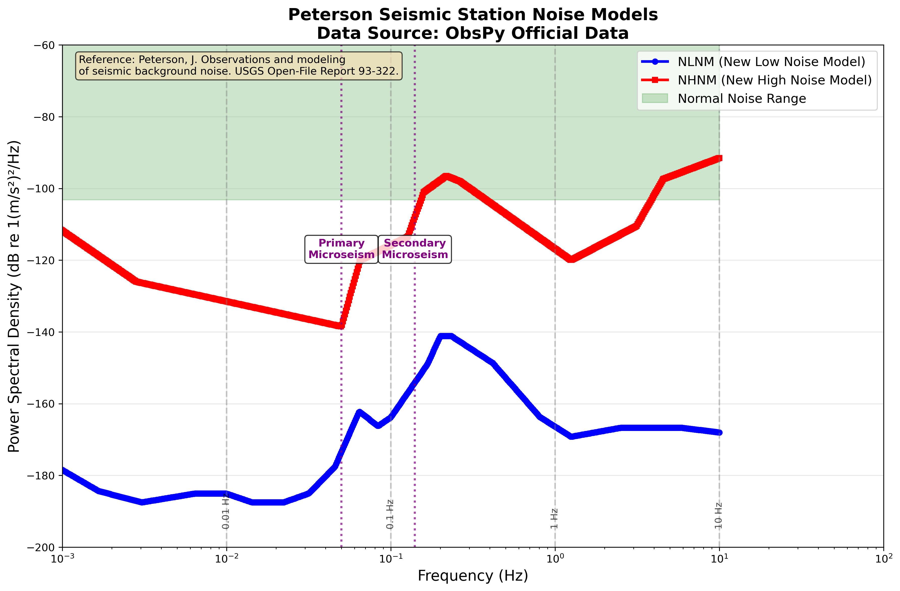

*图4：Peterson标准噪声模型参考曲线图。该图展示了地震学中的两个重要基准：蓝色NLNM曲线代表全球最优台站的噪声下限，红色NHNM曲线代表噪声上限。绿色区域表示正常噪声范围，紫色标记显示微震频率特征。这些曲线为PPSD结果评估提供了国际标准参考。*

### 3.6.2 NLNM（新低噪声模型）详解

#### 3.6.2.1 物理定义
NLNM描述了在非常安静的内陆台站可能观测到的全球最低背景噪声水平的包络线。这个模型代表了：
- **最优台址条件**：远离人类活动、地质稳定、环境安静
- **优秀仪器性能**：低本底噪声、高精度地震仪
- **理想安装条件**：深井安装、良好隔震、温度稳定

#### 3.6.2.2 频段特征分析
NLNM在不同频段反映的主要噪声源：

**高频段（0.1-1 Hz，0.1-1秒周期）**：
- **主要噪声源**：高频文化噪声的下限
- **物理机制**：远距离文化活动的微弱影响
- **典型水平**：-160 到 -180 dB

**中频段（0.05-0.1 Hz，1-20秒周期）**：
- **主要噪声源**：海洋微震噪声的下限
- **物理机制**：全球海浪活动产生的地震噪声
- **典型水平**：-160 到 -170 dB
- **特殊特征**：在6-8秒和10-20秒周期可能出现微震双峰

**低频段（0.001-0.05 Hz，20-1000秒周期）**：
- **主要噪声源**：大气噪声和地球噪声
- **物理机制**：大气压力变化、温度波动、地球潮汐
- **典型水平**：-180 到 -200 dB

#### 3.6.2.3 数学表达
NLNM采用分段线性模型（在对数-对数坐标系中）：
```
NLNM(T) = A + B × log₁₀(T)
```
其中T为周期（秒），A和B为不同周期段的拟合系数。

### 3.6.3 NHNM（新高噪声模型）详解

#### 3.6.3.1 物理定义
NHNM描述了在噪声水平相对较高的台站观测到的背景噪声上限。这个模型反映了：
- **高噪声环境**：海岛台站、城市台站、高噪声地区
- **环境干扰影响**：风噪声、海浪噪声、人类活动
- **仪器噪声影响**：较高的仪器本底噪声水平

#### 3.6.3.2 频段噪声源分析

**超高频段（>1 Hz，<1秒周期）**：
- **主要噪声源**：文化噪声（交通、工业活动）
- **典型环境**：城市台站、工业区台站
- **噪声水平**：-100 到 -120 dB

**高频段（0.2-1 Hz，1-5秒周期）**：
- **主要噪声源**：风噪声、建筑物振动
- **影响因素**：地表风速、台站建筑、地形效应
- **噪声水平**：-120 到 -140 dB

**中频段（0.05-0.2 Hz，5-20秒周期）**：
- **主要噪声源**：海浪噪声（海岸线影响）
- **影响因素**：距海岸距离、海浪强度、地质传播
- **噪声水平**：-130 到 -150 dB

**低频段（0.01-0.05 Hz，20-100秒周期）**：
- **主要噪声源**：大气扰动、温度变化
- **影响因素**：气象条件、地表温度变化
- **噪声水平**：-140 到 -160 dB

**超低频段（0.001-0.01 Hz，100-1000秒周期）**：
- **主要噪声源**：地球潮汐、大气潮汐
- **影响因素**：月球引力、太阳引力、大气质量分布
- **噪声水平**：-160 到 -180 dB

### 3.6.4 Peterson曲线的频率范围限制

#### 3.6.4.1 原始设计限制
Peterson曲线具有明确的频率范围限制：
- **周期范围**：0.1 - 100,000秒
- **对应频率范围**：10 Hz - 0.00001 Hz
- **高频截止**：10 Hz（0.1秒周期）

#### 3.6.4.2 10Hz限制的科学原理

**历史设计背景**：
- Peterson (1993) 基于当时的全球地震台网数据
- 主要关注地震学相关的频率范围
- 传统地震学应用很少涉及>10Hz的频段

**物理学考虑**：
- **>10Hz噪声特性**：主要是人文噪声和仪器噪声
- **地域差异巨大**：高频噪声受局地因素影响强
- **标准化困难**：难以建立全球统一的高频噪声模型

**地震学应用原因**：
- **自然地震信号**：大部分能量集中在<10Hz
- **地球物理过程**：长周期地球物理现象更为重要
- **仪器设计**：传统地震仪优化频段通常<10Hz

#### 3.6.4.3 高频段的处理策略
对于>10Hz的高频噪声评估：
- **局地参考**：建立特定地区或台站类型的高频噪声模型
- **相对比较**：与同类型台站或同一台站的历史数据比较
- **专门研究**：针对特定应用（如核爆监测、工程地震学）建立专用模型

### 3.6.5 Peterson曲线在PPSD中的应用

#### 3.6.5.1 台站噪声水平评估
Peterson曲线在PPSD分析中的主要用途：

**绝对噪声水平评估**：
- **优秀台站**：PPSD主要分布在NLNM附近或略高
- **良好台站**：PPSD分布在NLNM和NHNM之间
- **问题台站**：PPSD系统性高于NHNM

**相对性能比较**：
- **台站间比较**：使用Peterson曲线作为统一基准
- **时间演化分析**：监测台站噪声水平的长期变化
- **仪器性能评估**：诊断仪器问题或环境变化

#### 3.6.5.2 在配置文件中的控制
在PPSD绘图配置中，Peterson曲线通过以下参数控制：

```toml
[standard]
show_noise_models = true                # 是否显示Peterson曲线

[standard.peterson]
nlnm_color = "blue"                     # NLNM曲线颜色
nhnm_color = "red"                      # NHNM曲线颜色
linewidth = 1.0                         # 曲线线宽
linestyle = "--"                        # 曲线样式
alpha = 0.8                             # 曲线透明度
```

#### 3.6.5.3 坐标系统适配
Peterson曲线在不同坐标系统中的显示：

**周期坐标模式**（`xaxis_frequency = false`）：
- Peterson曲线直接使用原始周期数据
- X轴显示周期（秒），符合原始模型定义

**频率坐标模式**（`xaxis_frequency = true`）：
- 自动将周期转换为频率：`frequency = 1/period`
- X轴显示频率（Hz），适合工程应用

### 3.6.6 PPSD结果解读指南

#### 3.6.6.1 正常噪声模式识别

**理想台站特征**：
- PPSD分布主要在NLNM和NHNM之间
- 中位数曲线接近NLNM
- 高概率区域（深色区域）连续且平滑
- 在地脉动频段可见微震双峰结构

**可接受台站特征**：
- 大部分PPSD分布在NLNM和NHNM之间
- 个别频段可能略高于NHNM
- 整体噪声水平稳定

#### 3.6.6.2 问题识别与诊断

**高噪声问题**：
- **现象**：PPSD系统性高于NHNM
- **可能原因**：台址环境噪声大、仪器故障、安装问题
- **解决方向**：检查环境、仪器维护、重新安装

**异常低噪声**：
- **现象**：PPSD系统性低于NLNM
- **可能原因**：仪器响应问题、数据处理错误
- **解决方向**：检查仪器响应文件、验证数据处理流程

**窄频异常**：
- **现象**：特定频率显著偏离Peterson曲线
- **可能原因**：电力线干扰、机械振动、仪器共振
- **解决方向**：噪声源识别、屏蔽措施、仪器调整

#### 3.6.6.3 长期监测应用

**趋势分析**：
- 监测台站噪声水平相对于Peterson曲线的长期变化
- 识别环境变化或仪器老化的影响
- 建立台站性能退化的预警机制

**质量控制**：
- 建立基于Peterson曲线的自动化质量评估
- 设置噪声水平阈值和报警机制
- 支持台站网络的统一质量管理

### 3.6.7 Peterson曲线的局限性与发展

#### 3.6.7.1 原始模型的局限性

**时代局限性**：
- 基于1993年的台网数据，台站密度和质量有限
- 仪器技术和安装技术的进步
- 全球环境噪声的变化

**地理覆盖局限性**：
- 主要基于发达国家的台站数据
- 海岛、极地、海底台站代表性不足
- 不同地质环境的代表性差异

**频率范围局限性**：
- 高频段（>10Hz）缺乏覆盖
- 超长周期段（>1000秒）的不确定性

#### 3.6.7.2 现代发展与补充

**区域性噪声模型**：
- 针对特定地区建立更精确的噪声模型
- 考虑地理、地质、气候等局地因素

**专用噪声模型**：
- 海底地震仪噪声模型
- 钻孔地震仪噪声模型
- 便携式地震仪噪声模型

**高频噪声模型**：
- 针对工程地震学和核监测应用
- 建立>10Hz频段的参考标准

### 3.6.8 实际应用示例

#### 3.6.8.1 台站评估应用
使用Peterson曲线进行台站性能认证：
```
评估标准示例：
- 0.1-1 Hz: 中位数噪声 ≤ NLNM + 10 dB
- 1-10 Hz: 中位数噪声 ≤ NLNM + 15 dB  
- 90%分位数噪声 ≤ NHNM
- 特定频率无明显异常峰值
```

#### 3.6.8.2 网络比较分析
```
台站网络性能评估：
1. 计算每个台站的Peterson曲线偏差
2. 统计网络整体噪声水平分布
3. 识别性能异常的台站
4. 制定改进优先级列表
```

#### 3.6.8.3 时间演化监测
```
长期监测策略：
- 月度：与Peterson曲线比较，识别短期异常
- 季度：分析季节性噪声变化模式
- 年度：评估台站性能长期趋势
- 多年：建立台站老化预测模型
```

## 4. 结果输出说明

`run_cp_ppsd.py`脚本的核心功能是计算和可视化PPSD。脚本根据提供的配置文件类型（计算型或绘图型）来决定执行哪些操作和生成哪些输出。
所有输出文件通常保存在相应配置文件中`output_dir`参数指定的目录下。此外，该目录还会包含一个通用的日志文件（如 `ppsd_processing_YYYYMMDD_HHMMSS.log`）记录处理过程。

### 4.1 绘图输出
-   **触发条件**: 当使用绘图型配置文件 (例如 `config_plot.toml`) 时，图像将**始终**被生成和保存。
-   **功能**: 根据绘图型配置文件`[args]`中的绘图参数（如 `plot_type`, `period_lim`, `npz_merge_strategy` 等）生成PPSD的可视化图像。
-   **主要输出**: PNG或PDF格式的图像文件。文件名由绘图配置文件中的 `output_filename_pattern` (如果提供) 或默认规则确定。
-   **绘图策略影响**:
    *   **false模式** (默认): 每个NPZ文件生成一张独立图像。示例文件名模式：
        *   `{plot_type}_{datetime}_{network}.{station}.{location}.{channel}.png`
    *   **true模式**: 相同通道的多个NPZ文件合并到一张图像。示例文件名模式：
        *   `{plot_type}_merged_{start_datetime}-{end_datetime}_{network}.{station}.{location}.{channel}.png`
        *   或 `{plot_type}_longterm_{network}.{station}.{location}.{channel}.png`
-   **文件名时间信息**: **重要更新** - 从2025年5月27日开始，图像文件名中的时间信息来自MiniSEED数据的开始时间，而不是处理时间。这确保文件名能准确反映数据的实际时间范围。在合并模式下，时间信息将反映合并数据的时间范围。
-   **`plot_type` 可选值 (详见3.2节参数详解)**:
    *   `"standard"`: 标准PPSD图。该图显示了在不同周期（或频率）下，噪声功率谱密度（PSD）的概率分布。通常，颜色深浅表示特定PSD值出现的概率，帮助用户识别最常见的噪声水平（众数）、中位数以及噪声的变化范围。它常用于与全球噪声模型（如NLNM/NHNM）对比，评估台站的整体背景噪声特性。
    *   `"temporal"`: 特定周期PSD值随时间变化的曲线图。用户可以选择一个或多个感兴趣的周期点，此图会展示这些周期点上的PSD值如何随着数据记录时间的变化而波动。这有助于识别噪声水平的日变化、周变化或季节性变化，以及特定事件对噪声的影响。
    *   `"spectrogram"`: PPSD的整体时频谱图。此图以类似瀑布图或热力图的形式，展示了在整个分析时间段内，所有周期（或频率）的PSD值。颜色通常代表PSD的强度。它提供了一个全面的视角，可以快速发现噪声在时间和频率域的整体特征，例如特定频率的持续噪声源或随时间变化的宽带噪声事件。

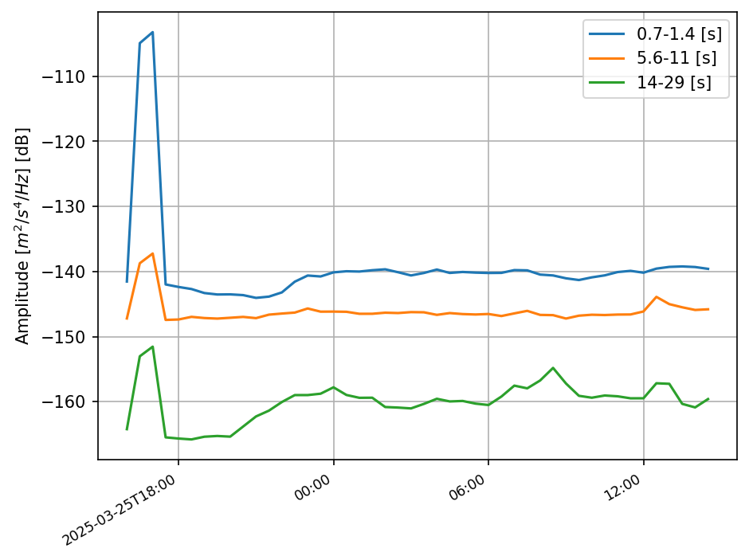

*图5a：PPSD时间演化图（temporal类型）真实输出示例。该图展示了BHZ通道在多个特定周期（1秒、8秒、20秒等）的功率谱密度随时间的实际变化曲线，清晰显示了噪声水平的时间变化模式、日周期性波动以及异常事件的影响。这是软件实际生成的时间演化分析结果。*

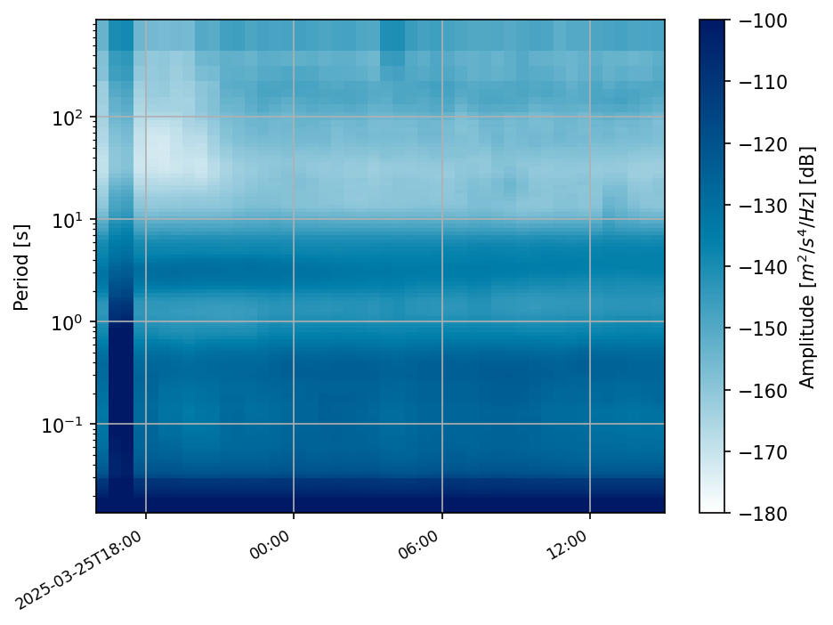

*图5b：PPSD频谱图（spectrogram类型）真实输出示例。该图以时频热力图的形式展示了BHZ通道完整分析时间段内所有频率的PSD值实际分布，颜色表示功率强度。通过这种可视化方式可以直观识别持续性噪声源、间歇性干扰以及频率域的噪声特征。这是软件实际生成的频谱图分析结果。*

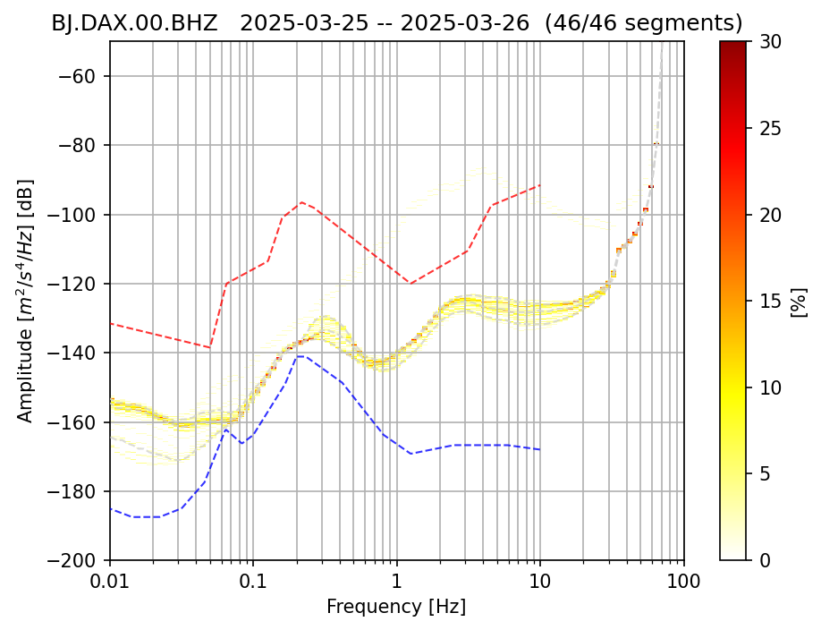

*图5c：PPSD标准图（standard类型）真实输出示例。该图展示了BHZ通道功率谱密度的概率分布特征，包括Peterson噪声模型参考曲线（蓝色NLNM和红色NHNM）、百分位数统计线以及概率密度颜色图。这是软件最常用的标准PPSD分析输出，为台站噪声评估提供了完整的统计分析视图。*

### 5.2 NPZ数据文件输出
-   **触发条件**: 当使用计算型配置文件 (例如 `config.toml`) 时，NPZ数据文件将**始终**被计算并保存。
-   **功能**: 将计算得到的PPSD核心数据保存为NumPy的NPZ格式文件。
-   **主要输出**: NPZ文件。文件名由计算配置文件中的 `output_npz_filename_pattern` (如果提供) 或默认规则确定。示例模式：
    *   `PPSD_{network}.{station}.{location}.{channel}_{datetime}.npz`
-   **文件名时间信息**: **重要更新** - 从2025年5月27日开始，NPZ文件名中的时间信息来自MiniSEED数据的开始时间，而不是处理时间。这确保文件名能准确反映数据的实际时间范围。
-   **内容**: NPZ文件通常包含PPSD对象的主要属性，如概率密度函数矩阵、周期/频率轴、dB轴、处理过的时窗数量等，便于后续通过Python (ObsPy, NumPy) 进行加载和进一步分析。
-   **适用场景**: 适用于批量处理、数据预处理，或当用户希望后续使用自定义脚本进行高级分析或绘图，以及希望避免重复计算PPSD的场景。

#### 5.2.1 NPZ文件内部结构详解

基于[ObsPy PPSD官方文档](https://docs.obspy.org/master/packages/autogen/obspy.signal.spectral_estimation.PPSD.html)，NPZ文件包含以下核心数据结构：

**A. 台站标识信息**
- **`network`**: 台网代码（如 "BJ"）
- **`station`**: 台站代码（如 "BBS"）  
- **`location`**: 位置代码（如 "00"）
- **`channel`**: 通道代码（如 "BHZ"）

**B. 频率/周期轴定义**
- **`period_bin_centers`**: 周期分箱中心值数组（秒），定义PPSD分析的周期点
- **`period_bin_left_edges`**: 周期分箱左边界数组（秒）
- **`period_bin_right_edges`**: 周期分箱右边界数组（秒）
- **`psd_frequencies`**: 对应的频率数组（Hz），与周期数组互为倒数关系
- **`psd_periods`**: 功率谱密度对应的周期数组（秒）

**C. 振幅轴定义**
- **`db_bin_centers`**: dB分箱中心值数组，定义功率谱密度的振幅分箱
- **`db_bin_edges`**: dB分箱边界数组，包含所有分箱的边界点
- **`db_bin_left_edges`**: dB分箱左边界数组
- **`db_bin_right_edges`**: dB分箱右边界数组

**D. PPSD核心数据矩阵**
- **`current_histogram`**: PPSD概率密度直方图矩阵（2D数组）
  - 形状：`(n_periods, n_db_bins)`
  - 行：不同周期/频率点
  - 列：不同dB分箱
  - 数值：每个(周期,dB)组合的出现概率
  - 矩阵元素和应接近1.0（归一化概率）

**E. 时间信息**
- **`times_processed`**: 已处理时间段的时间戳数组（Unix时间戳）
- **`times_data`**: 包含有效数据的时间段信息
- **`times_gaps`**: 数据间隙的时间段信息
- **`current_times_used`**: 当前PPSD计算中实际使用的时间段

**F. 计算参数记录**
- **`ppsd_length`**: 时间窗口长度（秒）
- **`overlap`**: 窗口重叠比例
- **`period_smoothing_width_octaves`**: 周期平滑宽度（倍频程）
- **`period_step_octaves`**: 周期步长（倍频程）
- **`period_limits`**: 周期范围限制
- **`skip_on_gaps`**: 是否跳过数据间隙的设置

**G. 统计信息**
- **`current_histogram_count`**: 当前直方图的总计数
- **`current_times_used_count`**: 使用的时间段总数
- **`spec_count`**: 谱估计的总数量

#### 5.2.2 NPZ文件数据验证

**数据完整性检查**：
- 概率矩阵总和应接近1.0：`np.sum(current_histogram) ≈ 1.0`
- 周期和频率的一致性：`period_bin_centers * psd_frequencies ≈ 1.0`
- 分箱数量匹配：`len(db_bin_centers) == current_histogram.shape[1]`
- 时间段数量：`len(times_processed) > 0`

**典型数据范围**：
- 周期范围：0.01 - 1000秒（取决于`period_limits`设置）
- dB范围：-200 到 -50 dB（取决于`db_bins`设置）
- 直方图形状：通常为 (几百个周期点, 几百个dB分箱)
- 处理时间段：几十到几千个时间窗口

#### 5.2.3 NPZ文件加载和使用

**Python加载示例**：
```python
import numpy as np
from obspy.signal.spectral_estimation import PPSD

# 加载NPZ文件
npz_data = np.load('PPSD_example.npz', allow_pickle=True)

# 访问核心数据
periods = npz_data['period_bin_centers']
db_bins = npz_data['db_bin_centers'] 
histogram = npz_data['current_histogram']
times = npz_data['times_processed']

# 重建PPSD对象（需要原始inventory）
# ppsd = PPSD.load_npz('PPSD_example.npz')
```

**数据分析应用**：
- 提取特定周期的噪声水平分布
- 计算百分位数统计
- 时间序列分析和趋势检测
- 与其他台站或时期的对比分析
- 自定义可视化和报告生成

### 5.3 CSV统计数据导出
-   **触发条件**: 当计算型配置文件或绘图型配置文件的 `[args]` 表中定义了CSV导出相关参数 (主要是 `percentiles`，通常也需要 `cumulative=true`) 时，CSV文件将被导出。
    *   对于计算型配置：在PPSD计算完成后，从新计算的数据中导出。
    *   对于绘图型配置：在加载PPSD数据后，从加载的数据中导出。
-   **功能**: 将PPSD的统计特性（如不同周期的百分位数噪声水平）导出为CSV（逗号分隔值）文件。
-   **主要输出**: CSV文件。文件命名模式示例：
    *   `PPSD_statistics_{network}.{station}.{location}.{channel}.csv` (脚本可能会基于NPZ文件名或PPSD元数据自动生成)
-   **内容**: CSV文件通常包含每个周期点对应的不同百分位数的功率谱密度值（dB）。
-   **依赖参数**: `[args]` 中的 `percentiles` 列表和通常的 `cumulative = true`。
-   **适用场景**: 适用于需要将PPSD统计结果导入电子表格软件（如Excel, Google Sheets）、其他统计分析工具，或进行快速的数据对比和报告。

## 5. 性能优化建议

### 5.1 内存优化
当处理非常大的数据集或在内存受限的环境中运行时，可以调整以下参数以减少内存占用：
```toml
[args]
ppsd_length = 1800          # 减少窗口长度 (会影响低频分辨率)
period_step_octaves = 0.25  # 增加周期步长 (降低频率点密度)
db_bins = [-180, -80, 0.5]  # 减少dB分箱的范围或增大步长 (降低功率分辨率)

```
同时，如果主要目的是计算NPZ，确保不传递绘图配置文件，反之亦然，以避免不必要的操作消耗内存。

### 5.2 计算速度优化
为提高PPSD的计算速度，可以考虑（主要适用于计算型配置文件）：
```toml
[args]
skip_on_gaps = true         # 跳过有数据间断的窗口，避免处理不完整数据
overlap = 0.25              # 减少窗口重叠比例 (可能牺牲一些统计平滑度)
period_limits = [0.1, 100]  # 限制PPSD计算的周期/频率范围，仅分析感兴趣的频段
# time_of_weekday = [1,2,3] # (如果适用) 减少分析的天数或时段
```
此外，如果PPSD数据已经计算并保存为NPZ文件，后续仅执行绘图操作（通过提供绘图配置文件）会快得多，因为它们可以直接加载NPZ数据，避免重复计算。

### 5.3 代码质量与维护性 (2025年5月29日新增)
本项目持续关注代码质量和可维护性的提升：

#### A. 最新代码质量改进
1.  **函数命名优化**: 将 `plot_ppsd_with_custom_percentiles` 重命名为 `plot_ppsd_with_custom_statistical_lines`
    *   **影响**: 如果使用了 `cp_ppsd/custom_ppsd_plot.py` 模块的自定义绘图功能，需要更新import语句
    *   **建议**: 使用新的函数名以获得更准确的功能描述
2.  **代码规范**: 全面修复Flake8代码规范问题
    *   **收益**: 提高代码可读性、可维护性和开发效率
    *   **影响**: 对最终用户无直接影响，但提升了项目质量
3.  **参数功能审查**: 识别并文档化配置参数的实际作用情况
    *   **发现**: 某些参数（如`enable_chinese_fonts`）在配置文件中定义但主程序中未实际使用
    *   **建议**: 使用前验证参数是否生效，必要时查阅最新文档或源代码

#### B. 开发者建议
1.  **代码引用**: 使用最新的函数和模块名称
2.  **参数验证**: 在生产环境使用前测试新参数的实际效果
3.  **文档查阅**: 优先参考项目内部文档了解最新的功能和限制
4.  **质量监控**: 关注项目的代码质量改进报告以了解最新变化

## 6. 常见问题与解决方案

### 6.1 内存不足错误 (MemoryError)
-   **问题**: 在处理大数据集或长时间序列时，脚本因内存耗尽而崩溃。
-   **解决方案**:
    1.  应用 **5.1 内存优化** 中提到的参数调整。
    2.  分块处理数据：如果可能，将大的时间范围或大量台站分批处理。
    3.  增加系统可用内存或使用具有更多内存的机器。
    4.  确保系统中没有其他内存密集型程序同时运行。

### 6.2 计算时间过长
-   **问题**: PPSD计算过程非常耗时。
-   **解决方案**:
    1.  应用 **5.2 计算速度优化** 中提到的参数调整。
    2.  利用已计算的NPZ文件：首次计算时，使用计算型配置文件。后续仅绘图或基于已计算数据导出CSV时，使用绘图型配置文件，脚本应能自动加载之前生成的NPZ文件。
    3.  在多核CPU上，如果脚本或ObsPy内部支持并行处理（需查证ObsPy PPSD的并行特性），可以利用此优势。但当前`cp_ppsd/cp_psd.py`核心模块本身可能需要额外修改以支持多文件并行。
    4.  检查数据读取效率，确保数据存储在快速磁盘上。

### 6.3 输出的周期/频率范围不符合预期
-   **问题**: PPSD图或导出的数据未覆盖期望的周期或频率。
-   **解决方案**:
    1.  检查核心计算参数 `[args].period_limits`：确保它定义了您希望PPSD对象本身包含的完整周期范围。
    2.  如果问题出在绘图上，检查绘图参数 `[args].period_lim`：这个参数控制绘图时显示的X轴范围，可能需要调整以匹配或专注于 `period_limits` 内的某个子集。
    3.  确认输入数据的采样率是否足够高以解析您期望的最短周期（最高频率）。根据奈奎斯特采样定理，最高可解析频率是采样率的一半。

### 6.4 PPSD结果异常或与预期不符
-   **问题**: 计算出的PPSD形状奇怪，噪声水平异常高或低，或者与已知参考（如Peterson模型）差异巨大。

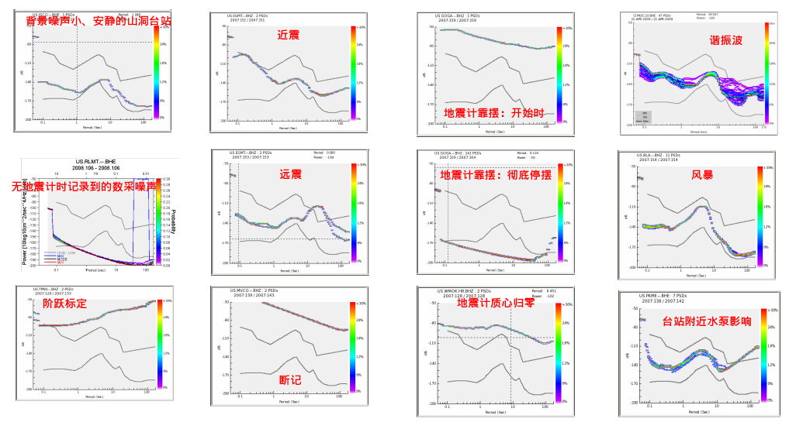

*图6：地震台站噪声分类与识别参考图。该图展示了不同类型噪声源在频率域的典型分布特征，包括文化噪声、风噪声、海洋噪声、大气噪声和地球噪声等主要类别。通过对比PPSD结果与这些噪声模式，可以有效识别台站环境中的主要噪声源，为问题诊断和台站优化提供重要参考。*

### 6.5 输出文件名时间信息问题
-   **问题**: 输出文件名中的时间信息不正确，或与预期的数据时间不符。
-   **解决方案**:
    1.  **时间来源变更**: 从2025年5月27日的更新开始，输出文件名中的时间信息来自MiniSEED数据的开始时间，而不是处理时间。这确保文件名能准确反映数据的实际时间范围。
    2.  **检查数据时间**: 如果文件名时间看起来不对，请检查原始MiniSEED文件的时间戳是否正确。可以使用ObsPy读取数据并查看 `trace.stats.starttime`。
    3.  **时区问题**: MiniSEED数据通常使用UTC时间。确认您的预期时间是否考虑了时区差异。
    4.  **文件名模式**: 检查配置文件中的 `output_npz_filename_pattern` 或 `output_filename_pattern` 是否使用了正确的时间占位符（如 `{datetime}`, `{year}`, `{month}` 等）。

### 6.6 仪器响应问题导致单位或量级错误
-   **问题**: 功率谱密度的单位不正确（例如，期望速度谱却得到原始计数值的谱），或者PPSD的整体电平与预期（例如，与Peterson噪声模型或其他参考台站相比）有数量级差异。
-   **解决方案**:
    *   **核心在于 `inventory_path`**: 绝大多数此类问题源于仪器响应文件。
        *   确保 `inventory_path` 指向的 FDSN StationXML 文件或 SEED Dataless 文件准确描述了正在处理的数据通道的仪器特性。
        *   对于**速度地震计**，响应应能将原始数据转换为速度单位（如 m/s）。PPSD结果的单位将是 (m/s)²/Hz。
        *   对于**加速度地震计**，响应应能将原始数据转换为加速度单位（如 m/s²）。PPSD结果的单位将是 (m/s²)²/Hz。
        *   ObsPy的PPSD函数会根据提供的响应来处理数据并确定输出单位。**不需要**特殊的 `special_handling` 参数来区分速度或加速度计，关键在于Inventory的准确性。
    *   **检查内容**:
        *   **增益(Gain/Sensitivity)**: 这是最常出错的地方。确认总增益是否正确。
        *   **极点和零点 (Poles and Zeros)** 或 **系数 (Coefficients)**: 确保这些参数准确。
        *   **单位**: 响应中定义的输入单位（通常是 'COUNTS'）和输出单位（'M/S', 'M/S**2'）必须正确。
        *   **有效时间**: 确保仪器响应的有效期覆盖了正在处理的数据的时间段。
    *   **验证**:
        *   使用ObsPy的 `read_inventory()` 加载文件，并检查通道的 `response` 属性。
        *   可以将计算出的PPSD与同一地区、相似仪器的其他已知可靠结果进行对比。
        *   与Peterson噪声模型对比时，注意模型本身是以加速度 (m/s²)²/Hz 为单位的。如果您的仪器是速度计，ObsPy在绘图时通常会自动处理单位转换以进行比较，但您需要确保自己的PPSD计算结果确实是物理单位。

### 6.7 配置参数功能问题 (2025年5月29日新增)
-   **问题**: 某些配置参数在配置文件中定义，但在程序中没有实际起作用或效果与预期不符。
-   **典型案例 - `enable_chinese_fonts`参数**:
    *   **现象**: 在配置文件中设置了 `enable_chinese_fonts = true`，但图像中的中文字体显示没有改变
    *   **问题分析**: 通过代码质量审查发现，此参数虽然被配置适配器正确解析，但在主程序 `cp_psd.py` 中没有实际使用
    *   **实际情况**: 真正的中文字体支持在 `plot_psd_values.py` 模块中实现，该模块在导入时自动设置中文字体，与主程序的配置参数完全独立
    *   **影响范围**: 仅影响主程序的PPSD绘图功能，独立的 `plot_psd_values.py` 工具不受影响
-   **解决方案**:
    1.  **确认参数范围**: 查阅最新的项目文档，确认参数的实际作用范围和限制
    2.  **使用替代方案**: 对于中文字体需求，可以直接使用 `run_plot_psd.py` 或 `plot_psd_values.py` 独立工具
    3.  **代码验证**: 如需确认参数是否生效，可以查看源代码中的实际实现逻辑
    4.  **反馈报告**: 如发现配置参数与实际功能不匹配，建议向开发团队反馈以便修复
-   **预防措施**:
    *   在使用新参数前，先进行小规模测试验证其效果
    *   关注项目更新日志中关于参数变更的说明
    *   对于关键功能，建议使用多种验证方法确认配置生效

## 7. 最佳实践

### 7.1 数据预处理阶段
1.  **数据质量检查**: 在批量运行PPSD计算之前，建议先抽样检查部分原始波形数据的质量，注意是否存在明显的仪器故障、数据污染或时间标记错误。
2.  **时间同步**: 确保所有参与计算的地震数据时间戳准确且同步。**重要**: 输出文件名中的时间信息直接来自MiniSEED数据的开始时间，因此数据时间戳的准确性对文件管理至关重要。
3.  **仪器响应验证**: 这是获得可信PPSD结果的最关键步骤。
    *   务必使用与数据严格对应的最新、最准确的仪器响应文件。
    *   对于每个台站通道，仔细核对台网、台站、位置、通道代码 (SEED ID) 是否与数据完全匹配。
    *   检查响应的有效起止时间是否覆盖数据记录时段。
    *   如果可能，将从仪器响应中提取的理论传递函数与已知的参考进行比较。

### 7.2 参数选择策略
1.  **`npz_merge_strategy` (NPZ合并策略)**:
    *   **false模式** (推荐用于):
        *   独立分析特定时间段的噪声特性
        *   比较不同时间段的噪声差异
        *   详细检查单个时间窗口的PPSD特征
        *   初步数据质量评估
    *   **true模式** (推荐用于):
        *   长期噪声水平监测和趋势分析
        *   季节性噪声变化研究
        *   台站性能的年际对比
        *   多时段数据的统计分析
        *   生成综合性的台站噪声报告
    *   **选择建议**: 如果有多个时间段的NPZ文件且关注长期趋势，设置为true；如果需要详细分析每个时间段，设置为false。

2.  **`ppsd_length` (窗口长度)**:
    *   标准背景噪声分析: `3600` 秒 (1小时) 是良好起点。
    *   关注低频/长周期: 可适当增加，如 `7200` 秒，但注意时间分辨率下降。
    *   关注高频/短时变化: 可适当减少，如 `1800` 秒，但注意低频分辨率下降。
3.  **`overlap` (重叠比例)**:
    *   `0.5` (50%) 是计算效率和统计平滑度之间的常用平衡点。
    *   数据量非常有限时，可适当增加至 `0.75` 以改善统计性，但计算成本增加。
4.  **`period_limits` (计算周期范围)**:
    *   根据分析目标（如微震、地脉动、长周期噪声）和数据采样率（奈奎斯特频率）合理设定，避免不必要的计算。
5.  **`db_bins` (功率分箱)**:
    *   `[-200, -50, 0.25]` 适用于大多数宽频带地震仪。如果噪声特别高或特别低，或者只关注特定功率范围，可以调整范围 `[min_db, max_db]`。步长 `0.25` dB 通常足够精细。
6.  **`time_of_weekday` (时间选择)**:
    *   根据是否需要排除或专门分析特定时间（如工作日/周末，白天/夜晚）的文化噪声来设定。
    *   分析整体背景噪声时，通常不设置此参数或包含所有天。
7.  **`skip_on_gaps` (数据间断处理)**:
    *   数据质量较好、间断少: `false` 可以利用更多数据。
    *   数据间断较多或对PPSD纯净度要求极高: `true` 可以确保每个PSD基于完整窗口数据。

### 7.3 skip_on_gaps参数设置最佳实践
**参数作用**: `skip_on_gaps`控制当数据存在时间间断（gaps）时的处理策略：
*   **`false`** (默认): 在数据间断处补零，将多个数据段合并为连续的时间序列进行PPSD计算
*   **`true`**: 跳过包含数据间断的时间窗口，仅使用完整连续的数据段

#### A. 推荐使用 `skip_on_gaps = false` 的情况：
1.  **数据间断较少且短暂** (< 10% 的窗口长度)：
    *   间断通常由仪器短暂故障、数据传输中断等引起
    *   补零不会显著影响PPSD的统计特性
    *   能够最大化数据利用率，获得更好的统计稳定性

2.  **遵循McNamara & Buland (2004) 标准方法**：
    *   原始PPSD方法论中采用补零策略处理数据间断
    *   便于与文献中的标准PPSD结果进行对比
    *   在PPSD图中，补零产生的异常PSD线条是可识别和可接受的

3.  **长期噪声水平监测**：
    *   关注整体噪声水平趋势而非精细的频谱特征
    *   需要尽可能多的数据来建立可靠的统计分布
    *   补零对长期统计特性的影响相对较小

#### B. 推荐使用 `skip_on_gaps = true` 的情况：
1.  **数据间断频繁且较长** (> 20% 的窗口长度)：
    *   大量补零会在PPSD中产生明显的人工谱线
    *   可能掩盖真实的地球物理信号特征
    *   影响频谱形状的准确性

2.  **高精度频谱分析需求**：
    *   研究特定频率的噪声特征（如地脉动双峰结构）
    *   需要精确的频谱形状用于科学研究
    *   对PPSD的"纯净度"要求极高

3.  **仪器性能评估**：
    *   评估地震仪的本底噪声水平
    *   需要排除所有可能的人工干扰
    *   确保PPSD结果仅反映仪器和环境的真实特性

4.  **数据质量控制严格的应用**：
    *   台站认证和标准化测试
    *   与国际标准或参考台站的精确对比
    *   科学发表要求的高质量PPSD结果

#### C. 实际应用策略：
1.  **初步分析阶段**：
    *   建议先使用 `skip_on_gaps = false` 进行快速评估
    *   观察PPSD图中是否出现明显的人工谱线
    *   评估数据间断对结果的影响程度

2.  **数据质量评估**：
    *   统计数据间断的频率和持续时间
    *   如果间断数据 > 总数据的15-20%，考虑使用 `skip_on_gaps = true`
    *   检查间断是否集中在特定时间段（如仪器维护期）

3.  **对比验证**：
    *   对同一数据集分别使用两种设置进行计算
    *   比较结果差异，特别关注：
        *   整体噪声水平的变化
        *   特定频率峰值的变化
        *   与Peterson噪声模型的符合程度

4.  **文档记录**：
    *   在分析报告中明确记录所使用的`skip_on_gaps`设置
    *   说明选择该设置的理由和数据质量状况
    *   便于结果的重现和科学交流

#### D. 特殊考虑：
-   **计算效率**: `skip_on_gaps = true` 可能显著减少处理的数据量，提高计算速度
-   **统计稳定性**: `skip_on_gaps = false` 通常能提供更好的统计稳定性，特别是在数据量有限时
-   **频率依赖性**: 低频部分对补零更敏感，高频部分相对不敏感
-   **台站特性**: 某些台站由于环境或技术原因可能经常出现数据间断，需要根据具体情况调整策略

#### E. 极端情况处理：数据间断过多导致无法生成PPSD
当数据质量极差，存在大量时间间断时，使用 `skip_on_gaps = true` 可能会遇到以下问题：

**问题表现**：
-   **无有效数据窗口**: 所有时间窗口都包含间断，导致没有完整的 `ppsd_length` 长度的连续数据段
-   **PPSD对象为空**: 计算完成后PPSD对象不包含任何有效的PSD估计
-   **无法生成图像**: 绘图时出现错误或生成空白图像
-   **NPZ文件异常**: 保存的NPZ文件缺少关键数据或无法正常加载

**判断标准**：
-   数据间断占总时间的 > 50-70%
-   连续数据段长度普遍 < `ppsd_length` 设置值
-   仪器长期故障或维护导致的大段数据缺失
-   数据传输问题造成的频繁中断

**解决策略**：

1.  **降级到 `skip_on_gaps = false`**：
    *   接受补零带来的人工谱线，确保能够生成基本的PPSD结果
    *   在分析报告中明确说明数据质量问题和处理方法
    *   将结果标记为"数据质量受限"的初步分析

2.  **调整时间窗口参数**：
    *   减小 `ppsd_length` 值（如从3600秒减至1800秒或900秒）
    *   增加 `overlap` 比例（如从0.5增至0.75）
    *   寻找更短但连续的数据段进行分析

3.  **时间段筛选**：
    *   使用 `processing_time_window` 参数选择数据质量相对较好的时间段
    *   避开已知的仪器维护期或故障期
    *   分段处理，对不同时期分别进行PPSD计算

4.  **数据预处理**：
    *   检查原始数据，确认间断是否为真实的数据缺失
    *   排除明显的仪器故障时段
    *   考虑使用其他台站的同期数据进行对比分析

5.  **降低分析要求**：
    *   接受较低的统计稳定性，使用有限的有效数据
    *   专注于数据质量较好时段的噪声特征
    *   将分析结果作为定性参考而非定量标准

**预防措施**：
-   在批量处理前，先对数据进行质量评估
-   建立数据完整性检查流程
-   设置合理的数据质量阈值，自动识别问题数据
-   建立备用分析策略，应对不同质量等级的数据

**实际应用建议**：
对于数据质量极差的情况，建议采用"分层分析"策略：
1. 首先尝试 `skip_on_gaps = true` 获得最高质量的结果
2. 如果无法生成有效PPSD，降级到 `skip_on_gaps = false`
3. 同时调整其他参数（窗口长度、时间筛选等）
4. 在最终报告中详细说明数据质量状况和分析限制

### 7.4 结果验证与解读


*图8：PPSD结果质量评估示例图。该图展示了如何评估PPSD分析结果的质量，包括与Peterson噪声模型的对比、频谱特征的识别（如地脉动双峰、文化噪声特征）以及异常信号的检测。通过这种综合评估可以判断PPSD结果的可靠性，为后续的科学分析和台站性能评估提供质量保证。*

1.  **与全球噪声模型对比**:
    *   将生成的PPSD图（特别是启用了 `show_noise_models = true`）与Peterson新低噪声模型 (NLNM) 和新高噪声模型 (NHNM) 进行比较。
    *   健康的台站噪声水平通常应位于NLNM和NHNM之间。持续高于NHNM可能表示台址环境噪声大或仪器问题；持续低于NLNM可能表示仪器响应问题或异常安静的环境（需谨慎确认）。
2.  **与邻近或相似台站对比**:
    *   如果条件允许，将目标台站的PPSD与同一区域、相似地质条件、相似仪器的其他台站进行对比，检查是否存在显著的、无法合理解释的差异。
3.  **时间稳定性检查**:
    *   如果数据跨度足够长，可以分时段（如按年、按季节）计算PPSD，检查噪声水平是否存在长期趋势或周期性变化，这可能与环境变化、仪器老化等因素有关。
    *   使用 `plot_type = "temporal"` 或 `"spectrogram"` 可以帮助识别噪声随时间的变化模式。
4.  **关注特定频段特征**:
    *   **地脉动峰 (Microseismic Peaks)**: 在0.1-1 Hz (1-10秒周期) 范围内通常能观察到由全球海浪活动引起的地脉动双峰结构。检查这些峰的幅度和形态是否合理。
    *   **人为噪声**: 在较高频率（>1 Hz）注意是否存在窄带的、稳定的谱峰，这通常指示特定频率的人为噪声源（如电力线、机械振动）。
    *   **长周期噪声**: 在较长周期（>10-20秒）检查噪声水平是否符合预期，有无异常抬升。

## 8. 参考文档

-   **ObsPy PPSD官方文档**: [https://docs.obspy.org/packages/autogen/obspy.signal.spectral_estimation.PPSD.html](https://docs.obspy.org/packages/autogen/obspy.signal.spectral_estimation.PPSD.html)
-   **Peterson (1993) 噪声模型**: USGS Open-File Report 93-322, "Observations and Modeling of Seismic Background Noise". (这是NLNM/NHNM的原始文献)
-   **McNamara & Buland (2004)**: "Ambient Noise Levels in the Continental United States", Bulletin of the Seismological Society of America (BSSA), Vol. 94, No. 4, pp. 1517-1527. (PPSD方法在地震学中广泛应用的论文)
