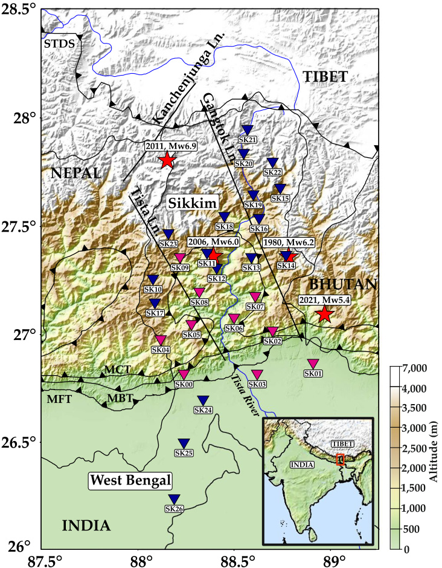
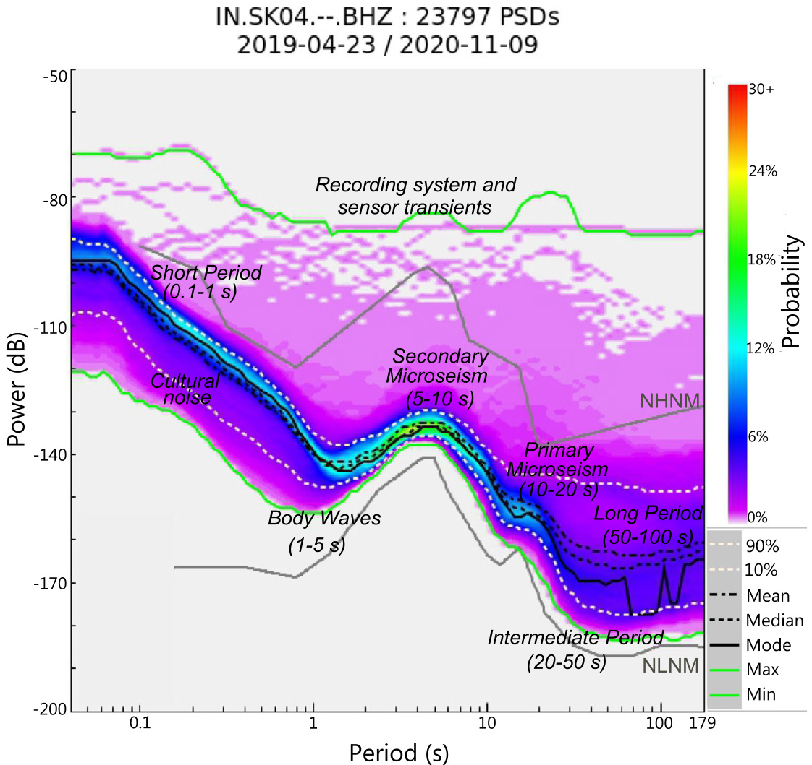
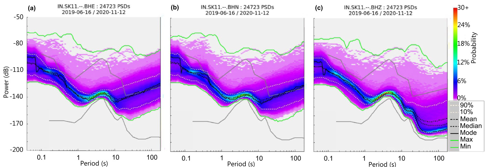
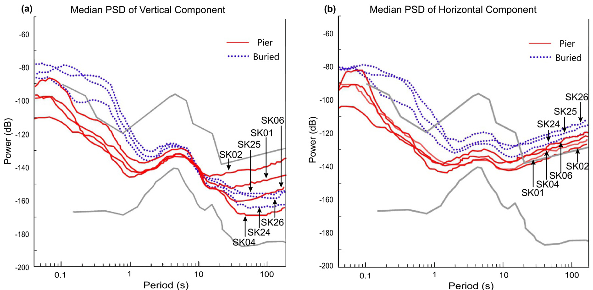
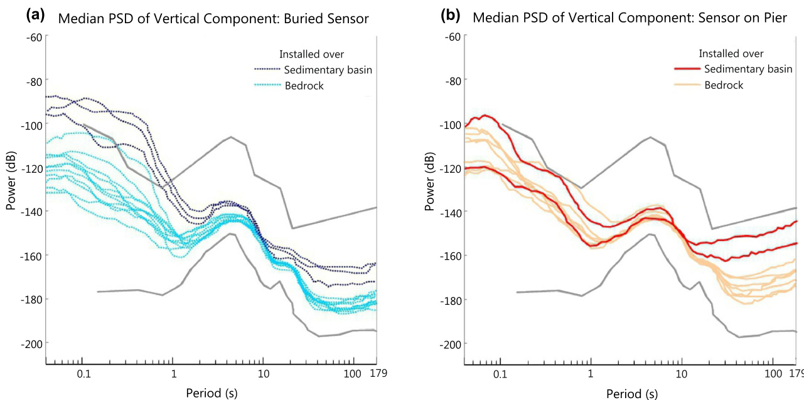
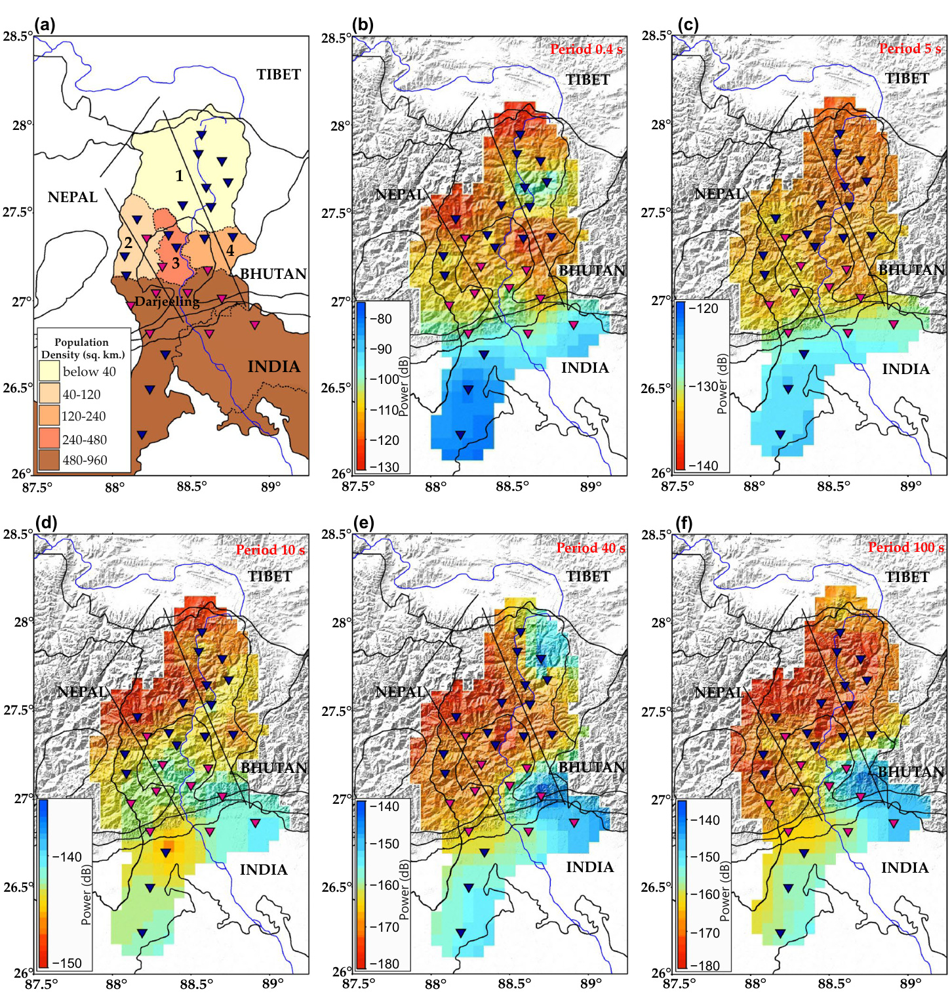
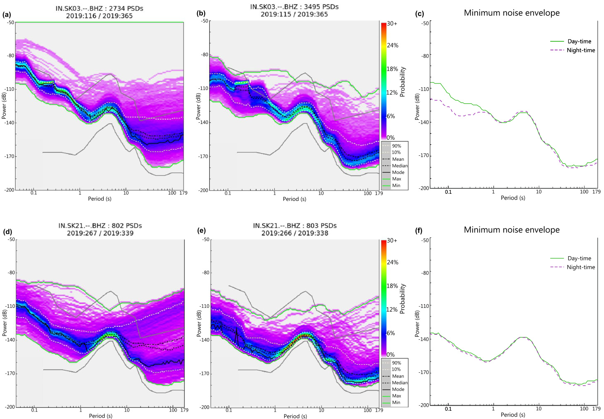
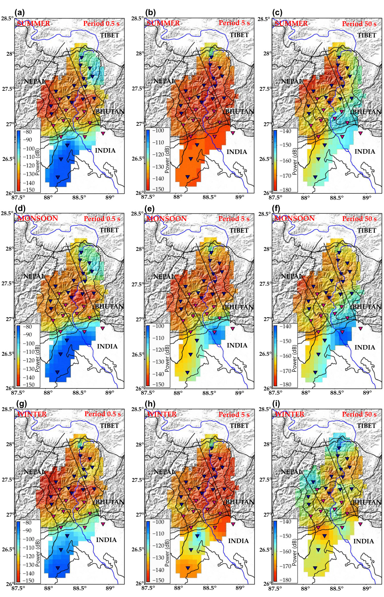
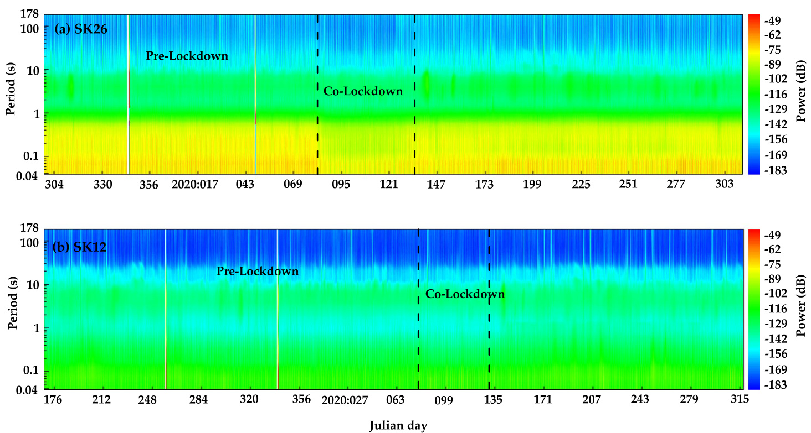

# 锡金喜马拉雅地区环境噪声的时空变化研究

**作者：** Mita Uthaman, Chandrani Singh, Arun Singh, Niptika Jana, Arun Kumar Dubey, Sukanta Sarkar & Ashwani Kant Tiwari

---

## 研究背景与目标

### 研究区域
- **锡金喜马拉雅及邻近喜马拉雅前陆盆地**
- 新建27个宽频带地震台站
- 研究地震成因和地下结构

### 研究目的
- 评估地震台站性能
- 分析环境噪声特征
- 验证台站稳定性和性能

**图1：锡金喜马拉雅地震台网分布图**
- **台站标识：**
  - 粉色倒三角：墩台安装的台站（SK00-SK09，Trillium 120系列）
  - 蓝色倒三角：埋地安装的台站（SK10-SK26，Trillium Horizon）
- **地震分布：**
  - 红色五角星：锡金及周边地区主要历史地震震中（来源：ISC地震目录）
- **主要构造线：**
  - STDS：南藏拆离系统（South Tibet Detachment System）
  - MFT：主前缘逆冲断层（Main Frontal Thrust）
  - MBT：主边界逆冲断层（Main Boundary Thrust）
  - MCT：主中央逆冲断层（Main Central Thrust）
- **地理信息：**
  - 海拔范围：24m（平原地区）至4402m（高山地区）
  - 插图：印度地图及研究区域位置标识
- **科学意义：** 展示了复杂构造环境下地震台网的空间布局，为理解区域地震活动模式提供基础

---

## 主要发现

### 噪声水平评估
- **垂直分量噪声水平**：在全球噪声限值范围内
- **水平分量噪声**：由于倾斜效应略微超出限值
- **10th和90th百分位线**：均在NLNM和NHNM限值内

**图2：地震背景噪声功率谱密度(PSD)特征图**
- **基本参数：**
  - 颜色条：显示每个频率噪声的概率分布（暖色表示高概率，冷色表示低概率）
  - X轴：周期（秒），范围0.01-1000秒
  - Y轴：功率谱密度（dB相对于1 (m/s²)²/Hz）
- **全球噪声模型：**
  - NHNM：新高噪声模型（上边界）
  - NLNM：新低噪声模型（下边界）
- **统计线条：**
  - 白色上下虚线：分别代表90th和10th百分位数
  - 黑色虚线：均值
  - 黑色点线：中位数
  - 黑色实线：众数
  - 上下绿色实线：PSD的最大值和最小值包络线
- **频率带划分：**
  - 短周期带（0.1-1秒）：主要为文化噪声
  - 微震带（1-20秒）：海洋波浪产生的噪声
  - 长周期带（50-100秒）：大气和固体地球的自由振荡
- **科学意义：** 验证台站数据质量符合国际标准，为后续地震学研究奠定基础

---

## 台站安装方法对比

### 安装方式影响
- **直接埋地安装**：长周期噪声较低
- **墩台安装**：噪声水平相对较高
- **水平分量噪声**：易受热变化、气压和强风影响

**图3：不同分量的功率谱密度对比图（台站SK11，2019年6月-2020年11月）**
- **分量对比：**
  - (a) E分量（东西分量）：显示较高的长周期噪声
  - (b) N分量（南北分量）：噪声特征与E分量相似
  - (c) Z分量（垂直分量）：长周期噪声明显低于水平分量
- **噪声特征分析：**
  - 水平分量在长周期带（>10秒）噪声水平比垂直分量高约10-20dB
  - 微震带（5-10秒）所有分量噪声水平相当
  - 短周期带（<1秒）垂直分量表现最佳
- **物理机制：**
  - 水平分量对倾斜噪声敏感（温度变化、气压变化、风力影响）
  - 垂直分量主要受地面振动影响，长周期倾斜效应较小
- **工程意义：** 为地震学研究中选择合适的分量提供参考

### 安装效果对比

**图4：基于安装技术的噪声水平对比**
- **数据来源：** 7个台站的长周期噪声超过NHNM限值的情况对比
- **线条说明：**
  - 红色实线：墩台安装台站的中位数PSD
  - 蓝色虚线：埋地安装台站的中位数PSD
- **子图分析：**
  - (a) 垂直分量：埋地安装比墩台安装低约5-10dB
  - (b) 水平分量平均值：两种安装方式差异较小，但均超过NHNM
- **技术优势：**
  - 埋地安装有效隔离地表风力和温度变化
  - 墩台安装虽有空气间隙缓冲，但仍受地表效应影响
- **实际应用：** 为台站建设选择最优安装方式提供科学依据

**图5：基于地表类型的噪声水平对比**
- **地质背景：**
  - 沉积盆地：喜马拉雅前陆盆地的松散沉积物
  - 基岩：锡金地区的坚硬岩石（小喜马拉雅和大喜马拉雅序列）
- **子图详解：**
  - (a) 埋地安装传感器垂直分量对比
    - 深蓝色虚线：沉积盆地台站（噪声约-150dB）
    - 浅蓝色虚线：基岩台站（噪声约-175dB）
  - (b) 墩台安装传感器垂直分量对比
    - 红色实线：沉积盆地台站（噪声约-135dB）
    - 粉色实线：基岩台站（噪声约-150dB）
- **关键发现：**
  - 基岩台站比沉积台站噪声低15-25dB
  - 埋地安装比墩台安装低约20dB
  - 地质条件对噪声水平影响显著
- **选址指导：** 优先选择基岩地区进行台站建设

---

## 地理和人为因素影响

### 空间分布特征
- **南部地区**（喜马拉雅前陆盆地）：人口密度高，文化噪声显著
- **中部地区**（锡金中部）：人口稀少，噪声水平低
- **北部地区**（高海拔）：受强风影响，长周期噪声增加

**图6：人口密度和不同周期环境噪声空间分布图**
- **人口分布特征(a)：**
  - 南部前陆盆地：622人/平方公里（高密度）
  - 大吉岭喜马拉雅：586人/平方公里
  - 南锡金：117人/平方公里
  - 北锡金：10人/平方公里（极低密度）
- **噪声空间分布：**
  - (b) 0.4秒短周期噪声：南部高（-90±10dB），北部低（-115dB）
  - (c) 5秒次级微震：前陆盆地较高（>-130dB）
  - (d) 10秒初级微震：沉积区噪声增强
  - (e) 40秒中等周期：地表安装台站噪声较高（-155dB）
  - (f) 100秒长周期：中部地区极低（-170dB），可记录地球"嗡鸣"
- **影响因素分析：**
  - 文化噪声与人口密度正相关
  - 微震噪声受地质结构控制
  - 长周期噪声受安装方式和海拔影响
- **区域划分：** 1-北锡金，2-西锡金，3-南锡金，4-东锡金
- **科学价值：** 揭示环境因素对地震观测的定量影响

---

## 时间变化规律

### 昼夜变化
- **白天**：文化噪声水平高
- **夜间**：文化噪声显著降低
- **人口密度影响**：人口密集区昼夜差异明显

**图7：台站SK03和SK21昼夜噪声变化对比**
- **时间定义：**
  - 白天：05:00-11:00（当地时间）
  - 夜间：23:00-05:00（当地时间）
- **SK03台站分析（南部，人口密集区）：**
  - (a) 白天PSD：短周期带噪声较高
  - (b) 夜间PSD：整体噪声水平下降
  - (c) 最小噪声包络对比：文化噪声带（0.2-0.8秒）夜间比白天低约15dB
- **SK21台站分析（北部，高海拔偏远区）：**
  - (d) 白天PSD：噪声水平稳定
  - (e) 夜间PSD：与白天基本相同
  - (f) 最小噪声包络对比：昼夜差异极小
- **社会学意义：**
  - 人为活动对地震观测的直接影响
  - 偏远地区不受人类活动周期影响
- **监测价值：** 可用于评估台站周边环境变化

### 季节变化
- **夏季**：文化活动增加，短周期噪声升高
- **季风期**：微震噪声增强
- **冬季**：北部高海拔地区长周期噪声升高

**图8：夏季、季风期和冬季的噪声水平季节变化**
- **季节划分：**
  - 夏季：3-6月
  - 季风期：7-9月  
  - 冬季：11-2月
- **分析周期：**
  - 0.4秒：代表文化噪声
  - 4秒：代表微震噪声
  - 40秒：代表长周期噪声
- **季节特征分析：**
  - **夏季(a)(d)(g)：** 南部文化噪声增强（-85dB），微震噪声低（-150至-130dB）
  - **季风期(b)(e)(h)：** 微震噪声明显增强（-125dB），地下水位变化影响
  - **冬季(c)(f)(i)：** 北部长周期噪声增加（>-150dB），风暴活动频繁
- **气候影响机制：**
  - 夏季：人类活动增加，热变化引起倾斜
  - 季风：降水影响地下水，增强瑞利波传播
  - 冬季：强风和暴风雪影响高海拔台站
- **台站标识：** 粉色倒三角（墩台），蓝色倒三角（埋地）
- **预测价值：** 为不同季节的数据质量控制提供参考

---

## COVID-19疫情影响

### 封锁效应
- **2020年3月22日-5月10日**：全国封锁期间
- **短周期噪声显著下降**：人为活动减少
- **前陆盆地台站影响明显**：SK24、SK25、SK26等

**图9：COVID-19封锁期间噪声变化**
- **研究背景：**
  - 印度全国封锁：2020年3月21日宣布，3月22日实施
  - 朱利安日换算：81日=3月22日，130日=5月10日
- **SK26台站详细分析(a)：**
  - **地理位置：** 西孟加拉邦北部，居民区附近
  - **环境特征：** 周边有政府办公室、商店、市场，距国道和铁路仅1公里
  - **噪声变化：** 短周期噪声在封锁期间突然下降并持续低水平
  - **时间精度：** 变化与封锁实施时间完全吻合
- **SK12台站对比分析(b)：**
  - **地理位置：** 锡金中部偏远山区
  - **环境特征：** 远离人类活动，周边无重要交通设施
  - **噪声变化：** 封锁期间无明显变化
- **全球对比研究：**
  - 与世界各地封锁期间噪声下降现象一致
  - 为人为活动对地震观测影响提供直接证据
- **科学价值：**
  - 验证了人为噪声源识别的准确性
  - 为未来台站选址避开人为干扰提供参考
  - 展示了地震台网作为环境监测工具的潜力

### 影响差异
- **人口密集区台站**：噪声显著下降
- **偏远山区台站**：变化不明显

---

## 技术方法

### 数据处理流程
- **PPSD计算**：功率谱密度概率分布
- **数据时间范围**：2019年4月-2020年11月
- **工具软件**：PQLX (USGS开发)

### 技术参数详解
- **数据采样率：** 50 Hz
- **窗口长度：** 1小时
- **重叠度：** 50%
- **去趋势：** 移除均值和长周期趋势
- **窗口函数：** 10%正弦锥化
- **频率分析：** 快速傅里叶变换(FFT)

### 台站信息总览

| 台站代码 | 仪器类型 | 安装方式 | 安装阶段 | 纬度(°) | 经度(°) | 海拔(m) |
|---------|----------|----------|----------|---------|---------|---------|
| SK00-SK09 | Trillium 120P/Q/Compact | 墩台 | 第一阶段(2019.4-5) | 26.82-27.36 | 88.11-88.91 | 157-1969 |
| SK10-SK26 | Trillium Horizon | 埋地 | 第二-四阶段(2019.6-10) | 26.25-27.96 | 88.08-88.77 | 24-4402 |

---

## 主要结论

### 台站性能评估
1. **噪声水平优良**：所有台站均在全球噪声限值(NLNM-NHNM)内
2. **安装方式重要**：埋地安装比墩台安装长周期噪声低约20dB
3. **台站稳定性好**：安装后快速稳定，无明显性能衰减

### 环境影响因素
1. **地质条件**：基岩台站比沉积物台站噪声低15-25dB
2. **人为活动**：人口密度与文化噪声呈正相关，昼夜差异可达15dB
3. **气象条件**：风力、温度变化主要影响长周期噪声（>50秒）

### 空间分布规律
1. **南北梯度**：从前陆盆地到高喜马拉雅，噪声水平逐渐降低
2. **高度效应**：高海拔台站受风力影响，长周期噪声增加
3. **构造影响**：活跃构造带附近台站噪声略有增加

### 时间变化特征
1. **昼夜周期**：人口密集区文化噪声昼夜差异显著
2. **季节周期**：夏季文化噪声高，季风期微震噪声强，冬季长周期噪声增
3. **突发事件**：COVID-19封锁证实了人为活动的直接影响

### 实际应用价值
1. **验证台站性能**：为后续地震学研究提供高质量数据基础
2. **噪声模式识别**：建立区域噪声特征数据库，优化数据处理算法
3. **选址指导**：为未来台站建设提供最佳实践经验
4. **环境监测**：地震台网可作为环境变化的敏感探测器

---

## 致谢

感谢印度地球科学部资助此项研究（项目编号：MoES/P.O.(Seismo)/1(318)/2017）。感谢团队成员G. Kumar和A. Dutta在野外工作中的大力支持。 