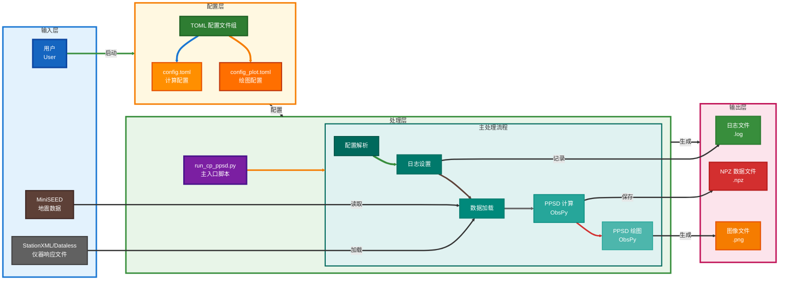
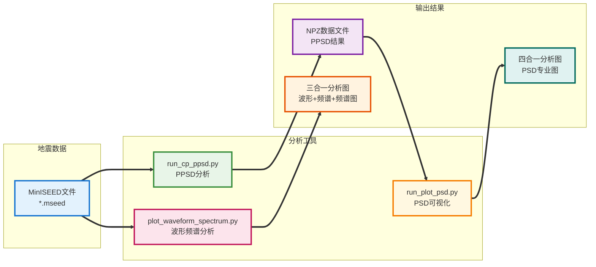

# 00_PROJECT_OVERVIEW.md - 项目概述

本文档旨在提供 `cp_ppsd` 项目的高层次概述，包括其主要目标、范围、整体架构和核心组件。

## 1. 项目目标

*   **主要目标**: 开发一个基于Python的工具 (`run_cp_ppsd.py`)，用于高效、批量地计算地震背景噪声的概率功率谱密度 (PPSD)。
*   **具体目标**:
    *   通过TOML配置文件实现灵活的参数配置。
    *   支持从MiniSEED格式的地震数据和StationXML仪器响应文件读取数据。
    *   能够执行PPSD核心计算，并输出结果为 `.npz` 文件。
    *   能够根据配置生成多种类型的PPSD图 (standard, temporal, spectrogram) 并保存为图像文件。
    *   提供清晰的日志记录功能。
    *   允许用户通过组合不同的配置文件（计算型、绘图型）灵活控制计算和绘图任务。
    *   (请参考项目根目录下的 `项目需求文档.md` 获取更详细和权威的目标描述，并确保此处内容与其一致。)

## 2. 项目范围

*   **核心功能**:
    *   PPSD计算 (基于ObsPy的 `PPSD` 类)。
    *   PPSD结果可视化。
    *   通过配置文件进行参数化控制。
    *   地震数据 (MiniSEED) 和元数据 (StationXML/Dataless) 的读取与处理。
    *   结果输出 (NPZ数据文件, 图像文件)，文件名基于数据时间而非处理时间。
    *   支持多种特殊仪器处理模式 (ringlaser, hydrophone, 默认地震仪)。
*   **主要交付物**:
    *   `run_cp_ppsd.py`: Python主入口脚本。
    *   `cp_ppsd/cp_psd.py`: 核心PPSD处理模块。
    *   配置文件示例 (`config.toml`, `config_plot.toml`)。
    *   项目知识库文档 (如本文件, `产品说明文档：PDF计算软件.md` 等)。
    *   **重要文档更新**: `产品说明文档：PDF计算软件.md` 已进行深度技术优化，新增PPSD分箱概念详解、图像解读详解、PSD平滑窗口宽度概念详解、period_step_octaves参数详解等专业内容，为用户提供更深入的PPSD理论基础和实践指导。
*   **不在此范围内的内容 (Out of Scope)**:
    *   实时数据流处理。
    *   复杂的图形用户界面 (GUI)。
    *   高级地震事件分析功能 (如震相拾取、定位等)。
    *   (请参考项目根目录下的 `项目需求文档.md` 获取更详细和权威的范围定义，并确保此处内容与其一致。)

## 3. 整体架构

`run_cp_ppsd.py` 脚本是项目的主入口，其工作流程主要依赖于用户提供的TOML配置文件来驱动PPSD的计算和/或绘图过程。核心处理逻辑位于 `cp_ppsd/cp_psd.py` 模块中。



**架构说明**:

1.  **用户 (User)**: 提供地震数据、仪器响应文件，并通过命令行指定一个或多个TOML配置文件。
2.  **TOML配置文件**:
    *   **计算型配置文件 (如 `config.toml`)**: 主要定义PPSD计算相关的参数、输入数据路径、NPZ输出规则。
    *   **绘图型配置文件 (如 `config_plot.toml`)**: 主要定义PPSD绘图相关的参数、NPZ输入路径、图像输出规则。
3.  **`run_cp_ppsd.py` (主入口脚本)** 和 **`cp_ppsd/cp_psd.py` (核心模块)**:
    *   **配置解析模块**: 读取并解析TOML配置文件中的参数。
    *   **日志模块**: 初始化并管理日志记录。
    *   **数据加载模块**: 根据配置读取MiniSEED波形数据和StationXML仪器响应文件。
    *   **PPSD计算模块**:
        *   利用ObsPy库的 `PPSD` 对象执行核心计算。
        *   使用计算型配置文件中的参数 (`ppsd_length`, `overlap`, `period_limits` 等)。
    *   **PPSD绘图模块**:
        *   利用ObsPy库的PPSD对象的绘图方法 (`plot`, `plot_temporal`, `plot_spectrogram`)。
        *   加载预计算的NPZ数据或使用内存中的PPSD对象。
        *   使用绘图型配置文件中的参数 (`plot_type`, `period_lim`, `show_noise_models` 等)。
    *   **输出模块**:
        *   将计算结果保存为 `.npz` 文件 (由计算型配置驱动)。
        *   将生成的图像保存为文件 (如 `.png`) (由绘图型配置驱动)。
        *   (如果配置了CSV导出，也会在此处处理)。

## 4. 主要组件说明

基于 `PDF计算软件功能设计文档.md` 和上述架构，主要组件包括：

1.  **`run_cp_ppsd.py` (Python主入口脚本)** 和 **`cp_ppsd/cp_psd.py` (核心模块)**
    *   **描述**: `run_cp_ppsd.py` 是项目的主入口脚本，负责导入和调用核心模块。`cp_ppsd/cp_psd.py` 包含了参数解析、日志处理、数据读取、PPSD计算调用、PPSD绘图调用以及结果保存的逻辑。
    *   **核心功能**:
        *   根据配置文件类型（计算型/绘图型）决定操作流程。
        *   与ObsPy库紧密集成以执行核心的地震学分析。
    *   **主要依赖**: `ObsPy`, `toml`, `logging`, `glob`, `os`.

2.  **TOML配置文件 (`config.toml`, `config_plot.toml`)**
    *   **描述**: 用户定义PPSD计算和绘图行为的接口。采用TOML格式，易于阅读和编辑。
    *   **核心功能**: 提供一种结构化的方式来指定所有可配置参数，包括输入/输出路径、PPSD算法参数、绘图选项等。
    *   **结构**:
        *   全局参数 (如 `log_level`, `output_dir`)。
        *   输入数据参数 (如 `mseed_pattern`, `inventory_path`, `input_npz_dir`)。
        *   输出文件名模式 (`output_npz_filename_pattern`, `output_filename_pattern`)。
        *   `[args]` 表: 包含传递给PPSD计算或绘图函数的特定参数。

3.  **输入数据**:
    *   **MiniSEED 文件 (`*.mseed`, `*.msd`, etc.)**: 存储地震波形数据。
        *   通过 `mseed_pattern` 在计算型配置中指定。
    *   **StationXML 文件 (`*.xml`)**: 存储仪器响应和台站元数据。
        *   通过 `inventory_path` 在计算型和绘图型配置中指定。
    *   **NPZ 文件 (`*.npz`)**: (可选输入，主要用于绘图) 存储预计算的PPSD对象数据。
        *   通过 `input_npz_dir` 在绘图型配置中指定。

4.  **输出数据**:
    *   **NPZ 文件 (`*.npz`)**: 存储计算后的PPSD对象，便于后续加载和分析。
        *   文件名由计算型配置的 `output_npz_filename_pattern` 控制。
        *   始终由计算型配置生成。
    *   **图像文件 (`*.png`, `*.pdf`, etc.)**: PPSD的可视化结果。
        *   文件名由绘图型配置的 `output_filename_pattern` 控制。
        *   始终由绘图型配置生成。
        *   类型包括 "standard", "temporal", "spectrogram"。
    *   **日志文件 (`*.log`)**: 记录脚本运行过程中的信息、警告和错误。
        *   存储在 `output_dir` 中。
    *   **CSV 文件 (`*.csv`)**: (可选输出) 存储PPSD的统计特性（如百分位数）。
        *   当配置了相关参数时生成。

5.  **ObsPy 库 (外部依赖)**
    *   **描述**: 一个开源的Python库，用于地震学研究。
    *   **核心功能**: 提供PPSD计算 (`obspy.signal.spectral_estimation.PPSD`)、数据读取 (`read`, `read_inventory`)、绘图等核心地震学功能。
    *   **重要性**: 本项目强依赖于ObsPy提供的算法和工具。

---

## 5. 最新更新记录

### 2025年1月 - 知识库深度技术优化
- **产品说明文档重大更新**: 对 `产品说明文档：PDF计算软件.md` 进行了全面的技术内容深化
- **新增专业内容**:
  - **3.3节 PPSD分箱概念详解**: 详细的分箱工作原理、PPSD矩阵构建过程、分箱精度影响分析
  - **3.3.7-3.3.8节 图像解读详解**: 水平条带和垂直条带的详细物理意义解释，包括稳定噪声源和宽频噪声事件的识别方法
  - **3.4节 PSD平滑窗口宽度概念详解**: 倍频程概念、平滑必要性、不同宽度值影响对比等深度技术内容
  - **3.5节 period_step_octaves参数详解**: 从地震学物理角度深入解释频率网格构建原理、PPSD计算参与过程、物理意义和实际应用指导
- **技术特色**: 所有新增内容均专注于地震学物理原理和实际应用价值，避免程序代码解释
- **应用价值**: 为用户提供更深入的PPSD理论基础和实践指导，显著提升文档的专业性和实用性

### 2025年5月27日 - 输出文件名时间信息优化
- **重要功能改进**: 修改了文件名生成逻辑，使输出文件名中的时间信息来自MiniSEED数据的开始时间，而不是处理时间
- **影响范围**: NPZ数据文件和图像文件的命名规则
- **优势**: 文件名能够准确反映数据的实际时间范围，便于数据管理和分析

### 最新更新 - NPZ合并策略参数优化
- **参数简化**: 将 `npz_merge_strategy` 参数从字符串类型改为布尔值类型，提升配置简洁性
- **参数变更**:
  - **旧值**: `"individual"` (单独绘制) / `"merge_by_channel"` (合并绘制)
  - **新值**: `false` (单独绘制) / `true` (合并绘制)
- **功能保持**: 参数功能完全不变，仅简化了配置语法
- **文档同步**: 更新了产品说明文档和实际配置文件中的所有相关描述

### 2025年5月29日 - 代码质量全面提升
- **函数重命名优化**: 将 `plot_ppsd_with_custom_percentiles` 重命名为 `plot_ppsd_with_custom_statistical_lines`
  - **原因**: 原函数名仅强调百分位数，但实际支持百分位数、众数、均值三种统计线条的自定义
  - **价值**: 函数名更准确反映完整功能，提高代码自文档化程度
- **Flake8代码规范修复**: 全面修复代码规范问题
  - **行长度**: 将超过79字符的长行进行合理分割
  - **缩进规范**: 修复函数参数的缩进对齐问题
  - **类型安全**: 改进类型注解，避免类型冲突
- **参数功能有效性分析**: 发现并分析了配置参数的实际作用情况
  - **enable_chinese_fonts**: 发现此参数在配置文件中定义但主程序中未实际使用
  - **plot_psd_values.py**: 确认该独立工具不读取配置文件，采用硬编码设置
- **代码质量成果**: 显著提升了代码的可维护性、规范性和准确性

---

## 5. 新增工具组件

### 5.1 波形频谱绘图工具 (`plot_waveform_spectrum.py`)

*   **描述**: 专门用于BJ台网MinISEED数据的波形和频谱分析可视化工具。
*   **核心功能**:
    *   三重分析视图：时域波形图（上）、频域频谱图（中）、时频频谱图（下）
    *   智能数据采样优化，支持快速模式和质量模式
    *   自动Gap检测和零填充处理
    *   频谱图频率范围限制 (0.1-50Hz)
    *   精确的颜色条布局对齐
*   **主要特性**:
    *   **性能模式**: 快速模式（默认）和质量模式（-q参数）
    *   **Gap处理**: 使用`Stream.merge(method=0, fill_value=0)`自动处理数据间隙
    *   **优化绘图**: 数据采样、FFT优化、光栅化渲染
    *   **命令行友好**: 灵活的参数配置和输出控制
    *   **简洁命名**: 统一的文件名格式，无模式标识后缀
*   **输出格式**: PNG图像文件，文件名格式 `{网络}_{台站}_{通道}_{时间}.png`
*   **主要依赖**: `ObsPy`, `matplotlib`, `numpy`, `mpl_toolkits.axes_grid1`
*   **使用场景**: 地震数据质量评估、噪声分析、频域特征研究

### 5.2 工具集成架构



**工具协同说明**:

1. **数据流向**: MinISEED数据可以同时被PPSD分析工具和波形频谱工具处理
2. **功能互补**: 
   - `run_cp_ppsd.py`: 专注于长期噪声统计分析
   - `run_plot_psd.py`: 专注于PSD数据的专业可视化
   - `plot_waveform_spectrum.py`: 专注于单文件的多维度快速分析
3. **输出互补**: 
   - PPSD工具输出适合科学研究的统计分析图
   - 波形频谱工具输出适合数据质量检查和快速诊断的详细视图

本文档应随着项目的进展而更新。特别注意确保项目目标和范围与根目录下的 `项目需求文档.md` 保持一致。

## 测试与开发工具

### tests/ 目录结构
项目包含完整的测试框架，位于 `tests/` 目录：

#### 核心测试程序
- **基础功能测试**: `test_basic.py`, `test_config_params.py` - 验证核心功能正确性
- **特殊处理测试**: `test_special_handling_*.py` - 验证不同仪器类型的处理逻辑
- **配置测试**: `test_unified_config_adapter.py` - 验证配置系统功能

#### 示例与演示程序
- **配置示例**: `example_read_grouped_config.py`, `example_use_grouped_config.py` - 配置文件使用演示
- **NPZ合并演示**: `example_merge_npz.py` - 展示ObsPy的PPSD.add_npz()方法正确使用
- **数据分析工具**: `analyze_npz_content.py`, `check_data_info.py` - 数据内容分析

#### 可视化工具
- **配色方案对比**: `custom_colormap_comparison.py`, `ppsd_colormap_comparison.py` - 配色方案选择
- **样式测试**: `test_percentile_line_styles.py` - 百分位数线样式验证

#### 统一测试入口
- **批量运行**: `run_all_tests.py` - 自动化测试套件

### 开发最佳实践
1. **模块化设计**: 每个功能模块都有对应的测试程序
2. **配置示例**: 提供丰富的配置文件使用示例
3. **错误处理**: 包含完整的错误处理和数据验证示例
4. **文档同步**: 测试程序与功能文档保持同步更新 

## 配置文件系统

### 配置文件类型
项目支持两种类型的配置文件：

#### 计算型配置文件
- **作用**: 控制PPSD计算过程和NPZ文件生成
- **典型文件名**: `config.toml`, `*_calc.toml`
- **关键参数**: `mseed_pattern`, `inventory_path`, `output_dir`
- **输出**: NPZ格式的PPSD数据文件

#### 绘图型配置文件  
- **作用**: 控制从NPZ文件生成可视化图像
- **典型文件名**: `config_plot.toml`, `*_plot.toml`
- **关键参数**: `input_npz_dir`, `plot_type`, `output_dir`
- **输出**: PNG/PDF格式的图像文件

### 配置文件识别机制

程序采用智能识别机制自动区分配置文件类型，支持**文件名约定**和**内容检测**两种方式：

#### 文件名约定识别
- **计算型**: `config.toml` 或 `*_calc.toml`
- **绘图型**: `config_plot.toml` 或 `*_plot.toml`

#### 内容特征检测
**计算型配置文件特征**（满足任一条件）：
- 包含 `mseed_pattern` 参数（必需的输入数据路径）
- 包含完整的PPSD计算参数（`ppsd_length`, `overlap` 等）

**绘图型配置文件特征**（满足任一条件）：
- 包含 `input_npz_dir` 参数（NPZ文件输入目录）
- 在 `[args]` 或 `[plotting]` 中包含 `plot_type` 参数
- 包含分组配置结构（`[global]`, `[paths]`, `[plotting]` 等）

#### 识别算法实现
```python
def _is_calculation_config(self, config: Dict) -> bool:
    file_path = config.get('_file_path', '')
    return (file_path.endswith('_calc.toml') or 
            file_path.endswith('config.toml') or
            'mseed_pattern' in config)

def _is_plot_config(self, config: Dict) -> bool:
    file_path = config.get('_file_path', '')
    return (file_path.endswith('_plot.toml') or 
            'input_npz_dir' in config or
            'plot_type' in config.get('args', {}))
```

### 混合使用支持
程序支持在同一命令中混合使用多个配置文件：
```bash
# 计算+绘图
python run_cp_ppsd.py config.toml config_plot.toml

# 多文件处理
python run_cp_ppsd.py data1_calc.toml data2_calc.toml plot1_plot.toml plot2_plot.toml
```

**执行顺序**: 程序自动将配置文件分类，先执行所有计算型配置，再执行所有绘图型配置。

## 最新重大更新记录

### 2025年6月7日 - 配色方案系统重大更新 🎨

#### 新增功能特性
- **7个全新专业配色方案**: 涵盖科学期刊、强对比、季节主题、地理环境等多个方向
- **科学可视化标准体系**: 建立完整的配色设计原则和应用指南
- **标准化比例分布**: 统一8色方案的颜色分布比例，确保跨方案一致性
- **PQLX配色优化**: 优化刺眼蓝色为柔和钢蓝色，提升视觉舒适度

#### 技术改进
- **代码质量提升**: 添加Flake8规范，移除废弃配色方案
- **目录结构优化**: 新增`cmap/`预览目录，组织输出目录结构
- **文档全面更新**: 详细的配色方案选择指南和最佳实践建议
- **配置文件优化**: 更新配色方案列表，优化默认设置

#### 应用价值
- **期刊发表级可视化**: `science_custom`专为学术发表设计
- **多领域专业支持**: 海洋学、生态学、极地研究等领域专用配色
- **用户体验提升**: 丰富的配色选择满足不同可视化需求
- **标准化输出**: 统一的可视化标准提升分析结果的专业性

#### 统计数据
- **代码变更**: 新增321行代码，修改86个文件
- **配色方案**: 总计19个可用方案，包含7个新增8色标准化方案
- **版本升级**: 项目版本升级至1.1.0

此次更新显著提升了PPSD可视化的专业性、美观性和适用性，为不同科学研究领域提供了专业级的数据可视化解决方案。 